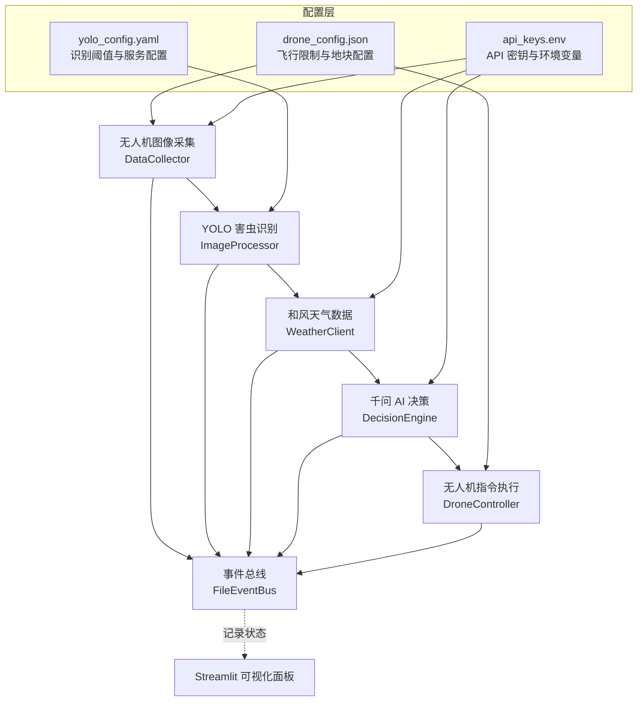

牧野智能农业害虫防治系统是一个基于 Python 的智能化农业管理平台，专为精准农业场景设计。系统通过**无人机图像采集**、**YOLO 深度学习识别**、**和风天气数据融合**、**千问 AI 决策引擎**和**精准喷洒控制**的完整链路，实现了从害虫发现到治理执行的全自动化流程。项目采用异步任务流架构，模块间通过事件总线通信，对外部 API 进行严格校验与容错处理，确保系统在生产环境中的稳定性与可维护性。

Sources: [README.md](README.md#L1-L9)

## 核心架构设计

系统采用**事件驱动的异步架构**，将图像采集、害虫识别、气象数据获取、AI 决策和无人机执行五大环节串联为完整的业务闭环。所有模块通过 JSONL 格式的事件总线进行跨进程通信，支持实时状态追踪和可视化展示。主流程使用 `asyncio` 协调异步任务，避免并发场景下的资源竞争，并通过内嵌服务（本地 YOLO API、虚拟无人机 API）提供开箱即用的演示环境。



系统架构遵循**单一职责原则**，每个模块仅负责一个明确的业务能力：数据采集模块监听图像目录变化，图像处理模块调用 YOLO API 并校验识别结果，天气模块完成地理编码与实况数据获取，决策模块组装结构化提示词并验证 JSON 响应，控制模块校验气象限制与地理围栏后执行喷洒任务。这种设计使得各模块可独立测试、独立演进，并为后续接入真实硬件接口预留了扩展点。

Sources: [README.md](README.md#L34-L85), [main.py](main.py#L1-L48), [modules/event_bus.py](modules/event_bus.py#L14-L48)

## 技术栈与依赖

项目基于 Python 3.9+ 构建，采用现代化的异步 Web 框架与深度学习推理引擎，核心依赖经过生产环境验证，版本锁定确保环境一致性。以下是关键技术组件的详细说明：

| 技术组件 | 版本要求 | 功能说明 | 应用场景 |
|---------|---------|---------|---------|
| **FastAPI** | ≥0.115.0 | 现代异步 Web 框架 | 本地 YOLO API、虚拟无人机 API 服务 |
| **Uvicorn** | ≥0.30.0 | ASGI 服务器 | 运行内嵌 API 服务，支持异步请求处理 |
| **Ultralytics** | ≥8.3.0 | YOLO 模型推理库 | 加载 `best.pt` 权重文件，执行目标检测 |
| **Streamlit** | ≥1.44.0 | 可视化框架 | 构建演示面板，实时展示识别结果与任务状态 |
| **httpx** | ≥0.27.0 | 异步 HTTP 客户端 | 调用外部 API（天气、千问、无人机） |
| **PyYAML** | ≥6.0.1 | YAML 解析器 | 加载 `yolo_config.yaml` 配置文件 |
| **python-dotenv** | ≥1.0.1 | 环境变量管理 | 从 `api_keys.env` 加载敏感配置 |
| **watchdog** | ≥4.0.0 | 文件系统监听 | 实时监控 `data/images/` 目录新增图片 |
| **jsonschema** | ≥4.22.0 | JSON Schema 验证 | 校验千问 API 返回的决策 JSON 结构 |
| **pytest** | ≥8.2.0 | 测试框架 | 单元测试与异步测试支持 |

系统通过 `requirements.txt` 统一管理依赖，开发者只需执行 `pip install -r requirements.txt` 即可完成环境初始化。项目支持在虚拟环境中运行，推荐使用 `.venv` 目录隔离项目依赖，避免与系统 Python 环境冲突。

Sources: [requirements.txt](requirements.txt#L1-L14), [README.md](README.md#L90-L104)

## 核心功能模块

系统按照数据流方向划分了十个核心业务模块，每个模块封装了独立的功能边界与错误处理逻辑，以下表格展示了模块职责与关键特性：

| 模块名称 | 核心职责 | 关键特性 | 配置依赖 |
|---------|---------|---------|---------|
| **data_collector.py** | 图像采集与监听 | 24小时定时采图 + watchdog 实时监听 | `monitoring.capture_interval_hours` |
| **image_processor.py** | YOLO API 调用与结果校验 | 置信度过滤 + 异步批量推理 | `yolo_config.yaml` |
| **local_yolo_api.py** | 本地 YOLO HTTP 服务 | Bearer Token 鉴权 + IP 白名单 + 速率限制 | `YOLO_LOCAL_*` 环境变量 |
| **weather_integration.py** | 和风天气数据接入 | 地理编码两步调用 + 字段映射 | `QWEATHER_API_KEY` |
| **ai_decision.py** | 千问 AI 决策引擎 | 结构化提示词 + JSON Schema 强制校验 | `QWEN_API_*` 环境变量 |
| **drone_controller.py** | 无人机指令执行 | 气象限制校验 + 地理围栏验证 | `drone_config.json` |
| **virtual_drone_api.py** | 虚拟无人机模拟服务 | 状态机流转（排队→起飞→喷洒→返航） | `VIRTUAL_DRONE_*` 环境变量 |
| **event_bus.py** | 跨进程事件通信 | JSONL 文件锁 + 原子写入 | `data/logs/demo_events.jsonl` |
| **common.py** | 公共工具函数 | 日志轮转 + 路径管理 + 多边形判断 | 项目全局配置 |
| **app.py** | Streamlit 演示面板 | 图片上传 + 原图/识别图对比 + 实时日志 | 依赖事件总线 |

模块间通过**显式接口**通信，避免了循环依赖，同时利用 Python 的类型注解（Type Hints）提升代码可读性与静态检查能力。系统在运行时通过 `FileEventBus` 将关键节点事件写入 JSONL 文件，前端 Streamlit 面板轮询同一文件实现实时状态同步，这种设计避免了数据库依赖，简化了部署流程。

Sources: [README.md](README.md#L34-L85), [modules/common.py](modules/common.py#L10-L45)

## 项目目录结构

项目采用标准化的目录布局，将配置文件、运行时数据、核心模块、测试代码分层组织，确保新开发者能快速定位代码位置。以下是顶层目录的功能说明：

```
muye/
├── app.py                      # Streamlit 可视化演示面板
├── main.py                     # 后端主入口与一键演示调度器
├── yolo_api.py                 # 本地 YOLO API 启动入口
├── drone_api.py                # 虚拟无人机 API 启动入口
├── requirements.txt            # Python 依赖清单
├── .env.example                # 环境变量模板
├── config/                     # 配置文件目录
│   ├── drone_config.json       # 无人机飞行限制、地块围栏
│   ├── yolo_config.yaml        # YOLO 推理服务配置
│   └── api_keys.env            # API 密钥与环境变量（需自行配置）
├── data/                       # 运行时数据目录
│   ├── images/                 # 无人机采集图像与演示上传图片
│   └── logs/                   # 系统日志与事件总线文件
├── models/                     # 本地模型权重目录
│   └── best.pt                 # YOLO 权重文件（需自行放置）
├── modules/                    # 核心业务模块
│   ├── ai_decision.py          # 千问决策引擎
│   ├── data_collector.py       # 图像采集服务
│   ├── image_processor.py      # YOLO 识别流程
│   ├── drone_controller.py     # 无人机控制模块
│   ├── weather_integration.py  # 和风天气接入
│   ├── event_bus.py            # 事件总线实现
│   ├── local_yolo_api.py       # 本地 YOLO HTTP 服务
│   ├── virtual_drone_api.py    # 虚拟无人机 API
│   └── common.py               # 公共工具函数
└── tests/                      # 单元测试目录
    ├── test_ai_decision.py     # 决策引擎测试
    ├── test_image_processor.py # 图像处理测试
    └── ...                     # 其他模块测试
```

关键目录说明：**config/** 存放所有配置文件，其中 `api_keys.env` 需开发者根据 `.env.example` 模板自行创建；**data/** 目录在首次运行时自动创建，包含运行时生成的图片与日志；**models/** 目录需放置训练好的 YOLO 权重文件 `best.pt`；**tests/** 目录采用 pytest 框架，测试文件与模块文件一一对应，命名遵循 `test_<module_name>.py` 规范。

Sources: [README.md](README.md#L11-L53)

## 运行模式与灵活性

系统支持多种运行模式，可根据硬件条件与测试需求灵活切换真实服务与模拟服务，以下是三种典型运行模式：

| 运行模式 | YOLO 服务 | 天气服务 | 千问服务 | 无人机服务 | 适用场景 |
|---------|---------|---------|---------|-----------|---------|
| **真实全链路** | 本地 `best.pt` | 和风天气真实 API | 千问真实 API | 虚拟无人机 API | 生产环境演示 |
| **混合模式** | 本地 `best.pt` | 和风天气真实 API | 模拟千问响应 | 虚拟无人机 API | 无千问密钥时的开发调试 |
| **纯模拟模式** | 模拟 YOLO | 模拟天气 | 模拟千问 | 本地模拟执行 | 无网络环境的单元测试 |

运行模式通过环境变量控制，在 `config/api_keys.env` 中设置 `QWEN_USE_MOCK="true"` 即可启用千问模拟模式。系统提供了一键启动命令 `python main.py --with-demo-stack`，自动启动本地 YOLO API（端口 8010）和虚拟无人机 API（端口 9010），无需手动管理多进程。添加 `--once` 参数可执行单次完整链路后退出，适合 CI/CD 流水线集成。

Sources: [README.md](README.md#L129-L188), [main.py](main.py#L165-L230)

## 配置文件体系

项目采用三层配置架构：**JSON 格式的无人机配置**、**YAML 格式的 YOLO 配置**、**环境变量格式的 API 密钥**，三者职责清晰分离，便于版本控制与安全管理。

**无人机配置 (drone_config.json)** 定义了地块信息、地理围栏、飞行限制参数，示例关键字段：

```json
{
  "monitoring": {
    "capture_interval_hours": 24,     // 采图间隔
    "simulate_capture": true          // 是否模拟采图
  },
  "field": {
    "name": "牧野示范田",
    "weather_location": "上海",       // 和风天气查询地点
    "geofence": [[121.4728, 31.2298], ...]  // 地理围栏坐标点
  },
  "flight_constraints": {
    "altitude_range_m": [2.0, 8.0],   // 允许飞行高度范围
    "max_safe_wind_speed_mps": 8.0    // 最大安全风速
  }
}
```

**YOLO 配置 (yolo_config.yaml)** 控制识别阈值与服务参数：

```yaml
confidence_threshold: 0.25      # 识别置信度阈值
timeout_seconds: 20             # API 超时时间
batch_size: 4                   # 批量推理数量
local_api:
  host: 127.0.0.1
  port: 8010
  model_path: models/best.pt    # 权重文件路径
```

**环境变量文件 (api_keys.env)** 存储敏感信息，需根据 `.env.example` 模板创建，切勿提交至版本控制系统。关键字段包括 `YOLO_API_URL`、`QWEN_API_KEY`、`QWEATHER_API_KEY`、`DRONE_API_URL` 等。

Sources: [config/drone_config.json](config/drone_config.json#L1-L39), [config/yolo_config.yaml](config/yolo_config.yaml#L1-L13), [README.md](README.md#L106-L154)

## 下一步阅读建议

完成项目概述后，建议按照以下顺序深入理解系统细节：

1. **[快速启动指南](2-kuai-su-qi-dong-zhi-nan)** - 掌握一键启动命令与环境准备步骤
2. **[环境配置与依赖安装](3-huan-jing-pei-zhi-yu-yi-lai-an-zhuang)** - 详细了解 API 密钥获取与配置文件创建
3. **[运行模式与演示流程](4-yun-xing-mo-shi-yu-yan-shi-liu-cheng)** - 学习不同运行模式的切换方法
4. **[系统架构设计](5-xi-tong-jia-gou-she-ji)** - 深入理解异步任务流与模块交互机制
5. **[异步任务流与事件总线](6-yi-bu-ren-wu-liu-yu-shi-jian-zong-xian)** - 掌握事件驱动架构的实现原理

通过以上文档的学习，您将能够独立部署系统、调试问题并扩展新功能。如需了解特定模块的实现细节，可跳转至对应专题页面（如 [YOLO害虫识别流程](9-yolohai-chong-shi-bie-liu-cheng)、[千问AI决策引擎](12-qian-wen-aijue-ce-yin-qing)）。