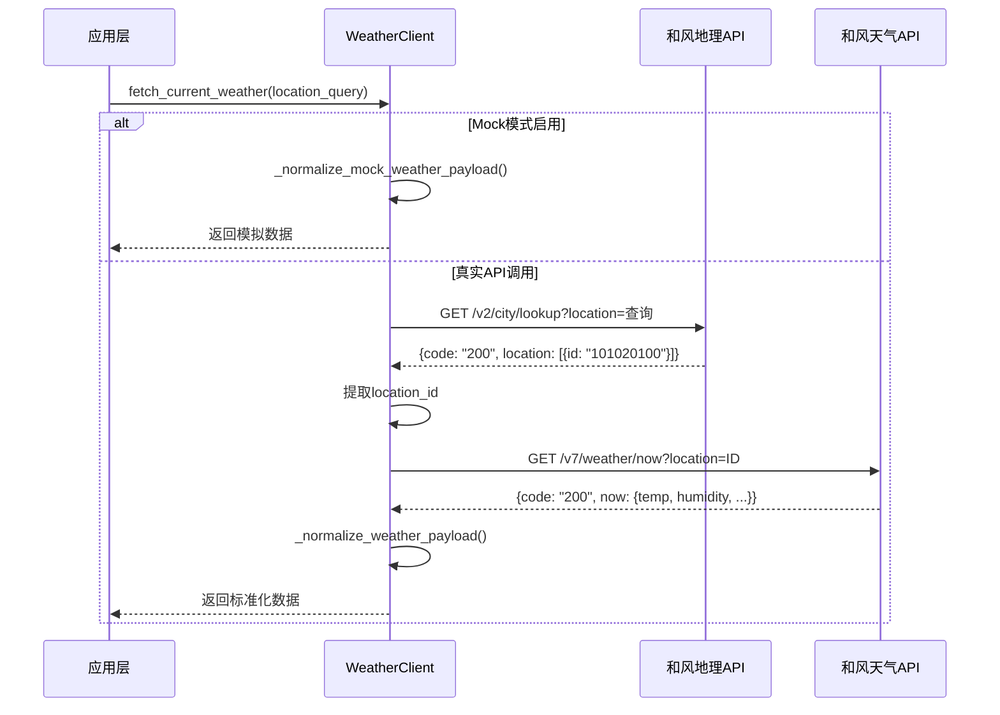

本模块负责与和风天气（QWeather）API 对接，为无人机作业提供实时气象数据支持。系统采用两阶段查询策略：首先通过地理位置查询获取城市 ID，再通过天气实况接口获取当前天气数据，所有返回数据经过标准化处理后供[千问AI决策引擎](12-qian-wen-aijue-ce-yin-qing)和[无人机指令校验](14-wu-ren-ji-zhi-ling-xiao-yan-yu-zhi-xing)使用。

Sources: [weather_integration.py](modules/weather_integration.py#L16-L34)

## 架构设计与数据流

和风天气接入模块采用**异步 HTTP 客户端 + 两阶段查询**的架构模式，通过 `WeatherClient` 类封装所有 API 交互逻辑。核心设计遵循**职责单一原则**：地理位置解析与天气数据获取分离，确保每个方法仅处理一个明确的业务目标。系统支持 Mock 模式运行，允许在无网络环境或开发调试时使用预设天气数据，该设计通过 `use_mock` 参数和 `mock_weather` 字典实现运行时切换，为[单元测试框架](22-dan-yuan-ce-shi-kuang-jia)提供了稳定的测试基础。

两阶段查询流程确保了系统的**灵活性与容错性**：第一阶段通过城市名称（如"上海"）查询获取和风天气系统的内部城市 ID，该 ID 用于第二阶段的天气实况查询。此设计避免了城市名称歧义问题（如"朝阳区"在多个城市存在），同时允许系统在地理查询失败时提供明确错误提示。所有 HTTP 请求通过 `httpx.AsyncClient` 执行，支持自定义超时配置和传输层注入，为测试环境提供了 Mock Transport 能力。

Sources: [weather_integration.py](modules/weather_integration.py#L39-L92)

## 环境变量配置

和风天气接入依赖六个环境变量完成初始化，涵盖 API 密钥、接口地址、Mock 模式开关及预设天气数据。配置项遵循**开发友好原则**：生产环境配置真实 API Key，开发测试环境启用 Mock 模式并自定义天气参数。以下表格详细说明每个配置项的作用与取值范围：

| 环境变量 | 类型 | 必填 | 默认值 | 说明 |
|---------|------|------|--------|------|
| `QWEATHER_API_KEY` | String | 是* | - | 和风天气 API 密钥，Mock 模式下可省略 |
| `QWEATHER_GEO_URL` | String | 是 | `https://api.qweather.com/geo/v2/city/lookup` | 地理位置查询接口地址 |
| `QWEATHER_WEATHER_URL` | String | 是 | `https://api.qweather.com/v7/weather/now` | 天气实况查询接口地址 |
| `QWEATHER_USE_MOCK` | Boolean | 否 | `false` | 启用 Mock 模式，跳过真实 API 调用 |
| `QWEATHER_MOCK_TEMPERATURE` | Number | 否 | `26` | Mock 模式下的温度值（摄氏度） |
| `QWEATHER_MOCK_HUMIDITY` | Number | 否 | `58` | Mock 模式下的湿度值（百分比，0-100） |
| `QWEATHER_MOCK_SUMMARY` | String | 否 | `多云` | Mock 模式下的天气概况 |
| `QWEATHER_MOCK_WIND_DIRECTION` | String | 否 | `东南风` | Mock 模式下的风向描述 |
| `QWEATHER_MOCK_WIND_SCALE` | String | 否 | `2` | Mock 模式下的风力等级 |
| `QWEATHER_MOCK_WIND_SPEED` | Number | 否 | 自动推算 | Mock 模式下的风速，未配置时根据风力等级推算 |

\* 当 `QWEATHER_USE_MOCK="true"` 时，API Key 非必填项

Sources: [.env.example](.env.example#L15-L25)

## 数据标准化与风力等级映射

和风天气 API 返回的原始数据结构与系统内部使用的天气数据模型存在差异，`WeatherClient` 通过 `_normalize_weather_payload()` 方法实现数据转换。标准化过程包含**字段重命名**（`temp` → `temperature`）、**类型转换**（字符串转数值）、**缺失字段校验**三个阶段，确保下游模块接收的数据格式统一且类型安全。

风力等级处理是标准化的核心逻辑之一。和风天气返回的 `windScale` 字段可能是单一数值（如 `"3"`）或范围表示（如 `"2-3"`），系统通过 `_parse_wind_scale()` 方法解析并提取**上限值**，代表当前风力可能达到的最大等级。解析后的风力等级进一步通过 `_wind_scale_to_speed_mps()` 方法映射为风速上限，使用蒲福风级标准表，该设计为无人机飞行安全校验提供了量化指标。

| 风力等级 | 风速上限 | 风力特征 | 无人机飞行建议 |
|---------|-------------------|---------|--------------|
| 0 | 0.2 | 无风 | 适宜飞行 |
| 1 | 1.5 | 软风 | 适宜飞行 |
| 2 | 3.3 | 轻风 | 适宜飞行 |
| 3 | 5.4 | 微风 | 谨慎飞行 |
| 4 | 7.9 | 和风 | 限制飞行 |
| 5 | 10.7 | 清风 | 禁止飞行 |
| 6+ | 13.8+ | 强风及以上 | 禁止飞行 |

Sources: [weather_integration.py](modules/weather_integration.py#L161-L223)

## 异常处理与容错机制

天气数据获取过程可能遇到网络故障、API 限流、无效城市名称、数据格式异常等多种错误情况，系统通过**异常层次化设计**和**结构化日志**实现全面的错误追踪。所有天气相关错误封装为 `WeatherIntegrationError` 异常类，继承自 `RuntimeError`，确保调用方能够精确捕获天气模块异常而不影响其他子系统。

异常处理遵循**快速失败原则**：在 `_lookup_location_id()` 阶段，若城市查询返回空列表或 API 响应码非 200，立即抛出异常并终止后续流程；在 `_normalize_weather_payload()` 阶段，对湿度值进行范围校验（0-100），对必需字段进行存在性检查，任何不符合预期的数据均触发异常。每个异常发生时，系统通过 `log_event()` 记录完整的上下文信息，包括请求 ID、客户端 IP、耗时、错误原因及原始查询参数，这些日志数据为[事件日志与状态追踪](21-shi-jian-ri-zhi-yu-zhuang-tai-zhui-zong)提供了基础数据。

Sources: [weather_integration.py](modules/weather_integration.py#L12-L14)

## 与决策引擎的集成

天气数据作为无人机作业决策的关键输入，通过 `DecisionEngine` 类集成到 AI 决策流程中。`fetch_current_weather()` 方法返回的标准化数据包含温度、湿度、风向、风速四个维度，这些数据传入千问 AI 模型后，模型根据[多源数据融合策略](13-duo-yuan-shu-ju-rong-he-ce-lue)生成包含气象限制的飞行指令。决策引擎的 JSON Schema 定义了 `气象限制` 对象结构，包含最大风速、温度范围、湿度上限三个约束条件，确保生成的飞行计划符合安全规范。

集成流程体现了**数据驱动决策**的设计理念：天气模块负责数据获取与标准化，决策引擎负责数据解读与指令生成，两者通过明确定义的数据接口解耦。这种设计允许天气数据源在未来扩展（如接入其他气象服务商）而无需修改决策引擎逻辑，同时也支持 Mock 模式下的端到端测试，验证决策逻辑在各种天气条件下的正确性。

Sources: [ai_decision.py](modules/ai_decision.py#L74-L84)

## 测试策略与 Mock 传输层

单元测试覆盖了天气模块的核心场景，包括 Mock 模式验证、两阶段 API 调用流程、异常情况处理三类测试用例。测试策略采用**依赖注入模式**：通过 `httpx.MockTransport` 注入自定义 HTTP 响应处理器，模拟和风天气 API 的各种返回情况，包括正常响应、空城市列表、异常湿度值等边界条件，这种设计避免了真实网络调用，提升了测试执行速度与可重复性。

测试文件展示了 `WeatherClient` 的完整生命周期管理：初始化时注入配置参数、执行异步查询操作、最终调用 `close()` 方法释放 HTTP 客户端资源。所有测试用例使用 `pytest.mark.asyncio` 装饰器标记，确保在异步测试环境中正确执行。测试断言验证了标准化数据的完整性与类型正确性，特别是风力等级解析与风速推算逻辑的准确性，这些测试为[集成测试与端到端测试](23-ji-cheng-ce-shi-yu-duan-dao-duan-ce-shi)奠定了基础。