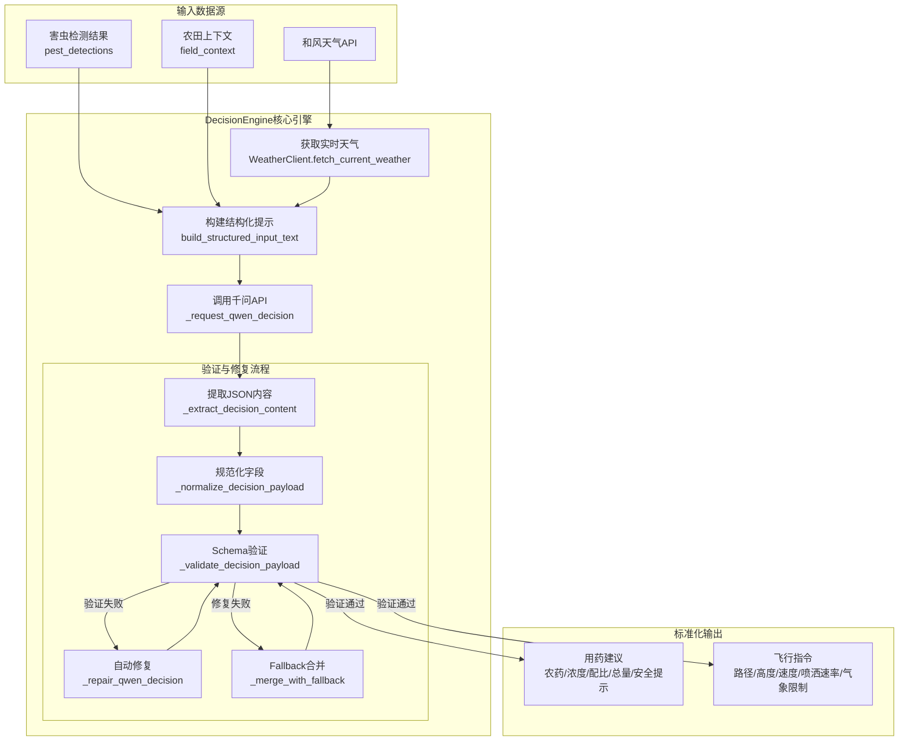
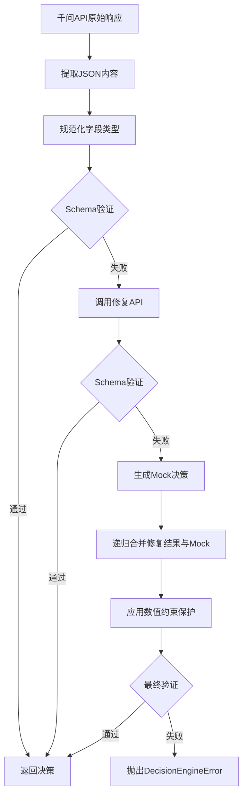

千问AI决策引擎是牧野系统的核心智能决策模块，基于阿里云千问大语言模型，将害虫检测结果、实时天气数据与农田地理信息融合，生成标准化的植保作业决策。该引擎通过严格的结构化输出验证、多层次的容错修复机制和事件驱动的状态追踪，确保决策结果的可靠性与可追溯性，为无人机精准施药提供科学依据。

## 架构设计概览

千问AI决策引擎采用**结构化输入-验证输出**的架构模式，核心流程包含数据聚合、提示构建、API调用、结果验证和容错修复五个阶段。引擎通过`DecisionEngine`类封装全部逻辑，依赖`WeatherClient`获取实时气象数据，通过`FileEventBus`发布处理状态，使用JSON Schema验证输出格式的完整性。该设计遵循"防御性编程"原则，在千问API返回异常或格式不符合预期时，自动触发修复机制并融合Mock决策作为兜底方案。



Sources: [ai_decision.py](modules/ai_decision.py#L95-L116)

## 核心接口与初始化

`DecisionEngine`类的初始化接收API配置、依赖服务和运行参数，通过构造函数注入实现松耦合设计。关键依赖包括天气客户端、事件总线和HTTP传输层，支持Mock模式用于测试环境。引擎在`main.py`中通过环境变量配置初始化，API密钥和URL通过`QWEN_API_URL`、`QWEN_API_KEY`、`QWEN_MODEL`等环境变量注入，默认使用`qwen-max`模型，超时设置为30秒。

```python
# main.py中的初始化示例
self.decision_engine = DecisionEngine(
    api_url=os.getenv("QWEN_API_URL", ""),
    api_key=os.getenv("QWEN_API_KEY", ""),
    model=os.getenv("QWEN_MODEL", "qwen-max"),
    weather_client=self.weather_client,
    use_mock=os.getenv("QWEN_USE_MOCK", "false").lower() in {"1", "true", "yes", "on"},
    timeout_seconds=30,
    logger=self.logger,
    event_bus=self.event_bus,
)
```

**初始化参数说明表**：

| 参数名 | 类型 | 必填 | 说明 |
|--------|------|------|------|
| api_url | str | 是 | 千问API端点URL，支持DashScope兼容模式 |
| api_key | str | 是 | 千问API密钥 |
| model | str | 是 | 模型名称，默认qwen-max |
| weather_client | WeatherClient | 是 | 天气数据客户端实例 |
| use_mock | bool | 否 | 是否使用Mock模式，默认False |
| timeout_seconds | float | 否 | API调用超时时间，默认30秒 |
| logger | Logger | 否 | 日志记录器，默认创建模块专属logger |
| event_bus | FileEventBus | 否 | 事件总线实例，用于状态追踪 |
| transport | AsyncBaseTransport | 否 | HTTP传输层，用于测试Mock |

Sources: [ai_decision.py](modules/ai_decision.py#L96-L116) [main.py](main.py#L253-L262)

## 决策生成流程

核心方法`generate_decision`实现完整的决策生成流程，该方法为异步方法，接收害虫检测结果、农田上下文和请求标识，返回包含天气数据、决策结果和结构化输入文本的字典。方法首先通过`weather_client.fetch_current_weather`获取实时天气，调用时自动发布"weather"阶段的事件用于状态追踪；随后构建结构化输入文本，通过`build_structured_input_text`方法将害虫检测、天气数据和农田信息格式化为千问可理解的提示文本；最终调用千问API生成决策，若启用Mock模式则直接返回预设决策。

**结构化输入文本格式**：引擎通过`build_structured_input_text`方法将多源数据转换为标准化的文本提示，包含地块名称、地理坐标、实时天气（温度、湿度、风向、风速）、地理围栏坐标、害虫检测结果列表等关键信息。文本采用"键值对"格式，便于大语言模型解析，例如"温度=27.5℃，湿度=58%，风向=东南风，风力等级=3"，害虫检测结果以序号列表形式呈现，如"1. 害虫类型=aphid，置信度=0.95，位置={...}"。该格式设计遵循"结构化优先"原则，减少模型生成歧义。

Sources: [ai_decision.py](modules/ai_decision.py#L120-L211) [ai_decision.py](modules/ai_decision.py#L232-L268)

## 千问API调用机制

引擎通过`_invoke_qwen`方法实现与千问API的HTTP通信，使用`httpx.AsyncClient`发起POST请求，请求头包含Bearer Token认证和请求ID追踪。API调用采用OpenAI兼容模式，设置`temperature=0.1`降低随机性，`response_format={"type": "json_object"}`强制JSON格式输出。系统提示明确约束"必须只输出一个JSON对象，顶层只能包含'用药'和'指令'两个字段，所有字段名必须使用中文"，用户提示包含完整的结构化输入文本。引擎自动处理URL路径解析，若API URL不以`/chat/completions`结尾，自动拼接该路径。

**API请求结构**：

```json
{
  "model": "qwen-max",
  "temperature": 0.1,
  "response_format": {"type": "json_object"},
  "messages": [
    {
      "role": "system",
      "content": "你是农业植保决策助手。必须只输出一个JSON对象..."
    },
    {
      "role": "user",
      "content": "请基于以下农田结构化信息输出严格JSON..."
    }
  ]
}
```

Sources: [ai_decision.py](modules/ai_decision.py#L331-L351) [ai_decision.py](modules/ai_decision.py#L647-L658)

## JSON Schema验证与结构约束

引擎定义严格的JSON Schema用于验证决策输出，Schema声明`DECISION_SCHEMA`包含`用药`和`指令`两个顶层对象，所有字段均为必填项。**用药对象**包含农药名称、浓度、配比、总量（均为非空字符串）和安全提示（至少一项的字符串数组）；**指面对象**包含飞行路径（至少2个坐标点的数组）、高度/速度/喷洒速率（正数）、覆盖区域（GeoJSON格式，至少3个坐标点）和气象限制（最大风速、温度范围、最大湿度）。验证通过`jsonschema.validate`方法执行，若校验失败抛出`DecisionEngineError`异常。

**关键Schema约束表**：

| 字段路径 | 类型约束 | 验证规则 |
|---------|---------|---------|
| 用药.农药名称 | string | minLength=1，不能为空 |
| 用药.安全提示 | array | minItems=1，至少一条提示 |
| 指令.飞行路径 | array | minItems=2，每个坐标点为[lon, lat] |
| 指令.高度/速度 | number | minimum=0.1，必须为正数 |
| 指令.覆盖区域.coordinates | array | minItems=3，多边形至少3点 |
| 指令.气象限制.最大湿度 | number | minimum=0，maximum=100 |

业务逻辑层补充额外校验：气象限制中最低温度不得大于最高温度，若违反此规则抛出`DecisionEngineError`。

Sources: [ai_decision.py](modules/ai_decision.py#L17-L88) [ai_decision.py](modules/ai_decision.py#L455-L463)

## 容错修复与Fallback机制

引擎实现**三层容错机制**确保决策输出的可靠性。第一层为**格式提取与规范化**，通过`_extract_decision_content`方法从千问响应中提取JSON内容，支持OpenAI格式的`choices[0].message.content`和千问原生格式的`output.text`，自动去除Markdown代码围栏；通过`_normalize_decision_payload`方法将字段统一转换为预期类型（字符串规范化、数字转换、坐标数组解析）。第二层为**自动修复**，若Schema验证失败，调用`_repair_qwen_decision`方法重新请求千问API，传入原始上下文、校验错误信息和待修复JSON，系统提示约束"请把输入修复为合法JSON"。第三层为**Fallback合并**，若修复仍失败，调用`_build_mock_decision`生成预设决策，通过`_merge_with_fallback`递归合并修复后的结果与Mock决策，保留非空字段，通过`_apply_schema_guards`方法强制填充关键数值约束（如高度必须为正数、湿度必须在0-100范围内）。



**Mock决策生成逻辑**：`_build_mock_decision`方法基于地理围栏生成飞行路径，根据检测到的害虫类型生成示范药剂名称（如"示范药剂-aphid"），计算农药总量（基准6L + 害虫数量×2.5L），根据实时天气动态调整气象限制（最大风速=实时风速+1.0，取最小值4.0；温度范围=实时温度±8℃；最大湿度=实时湿度+10，取最小值85）。Mock决策确保在API异常时系统仍可输出可执行的植保方案。

Sources: [ai_decision.py](modules/ai_decision.py#L270-L329) [ai_decision.py](modules/ai_decision.py#L384-L421) [ai_decision.py](modules/ai_decision.py#L465-L549) [ai_decision.py](modules/ai_decision.py#L604-L645)

## 标准化输出结构

决策引擎输出严格遵循两层嵌套的JSON结构，顶层包含`用药`和`指令`两个对象。用药对象提供农药选择与安全指导，指令对象提供无人机作业参数与环境约束。所有字段均使用中文命名，符合农业植保领域的语义习惯，便于前端展示与操作人员理解。

**完整输出示例**：

```json
{
  "用药": {
    "农药名称": "吡虫啉",
    "浓度": "20%",
    "配比": "1:1200",
    "总量": "12L",
    "安全提示": [
      "作业人员佩戴防护服和护目镜",
      "喷洒期间远离水源和人畜活动区域"
    ]
  },
  "指令": {
    "飞行路径": [[121.4729, 31.2300], [121.4740, 31.2308]],
    "高度": 3.5,
    "速度": 2.4,
    "喷洒速率": 1.2,
    "覆盖区域": {
      "type": "polygon",
      "coordinates": [[121.4729, 31.2300], [121.4740, 31.2300], [121.4740, 31.2308]]
    },
    "气象限制": {
      "最大风速": 4.5,
      "最低温度": 15,
      "最高温度": 33,
      "最大湿度": 85
    }
  }
}
```

**字段语义说明**：飞行路径为坐标点数组，每个坐标点为[经度, 纬度]格式，表示无人机的巡航航点；覆盖区域采用GeoJSON Polygon格式，coordinates数组定义施药作业区域的边界；气象限制定义作业环境阈值，当实时气象数据超过限制时，系统应暂停或取消作业。返回结果还包含`weather`字段（实时天气原始数据）和`structured_input_text`字段（发送给千问的完整提示文本），用于审计与调试。

Sources: [ai_decision.py](modules/ai_decision.py#L207-L211) [tests/test_ai_decision.py](tests/test_ai_decision.py#L88-L113)

## 事件追踪与状态管理

引擎深度集成`FileEventBus`事件总线，在决策生成的关键阶段自动发布事件，实现全流程可观测性。每个阶段事件包含`request_id`、`stage`、`status`、`message`和`payload`字段，事件按时间顺序追加写入`data/logs/demo_events.jsonl`文件，支持Streamlit面板实时展示处理进度。**天气获取阶段**发布`stage="weather"`事件，状态从"running"（正在获取天气信息）转变为"completed"（天气信息获取完成），payload包含查询地点和天气数据；**决策生成阶段**发布`stage="decision"`事件，状态从"running"（正在生成千问决策）转变为"completed"（千问决策生成完成），payload包含最终决策JSON。若任一阶段发生异常，发布`status="error"`事件并记录错误信息。

**事件发布时序表**：

| 阶段 | 状态 | 消息 | Payload内容 |
|-----|------|------|-----------|
| weather | running | 正在获取天气信息 | {"location_query": "上海"} |
| weather | completed | 天气信息获取完成 | {"location_query": "上海", "weather": {...}} |
| decision | running | 正在生成千问决策 | {} |
| decision | completed | 千问决策生成完成 | {"decision": {...}} |
| decision | error | AI 决策生成失败 | {"error": "异常信息"} |

事件总线通过文件锁（`fcntl.flock`）保证并发写入安全，支持多Worker进程同时运行。前端面板通过`build_task_views`函数聚合事件，按`request_id`分组构建任务视图，实时展示当前阶段、状态和处理结果。

Sources: [ai_decision.py](modules/ai_decision.py#L141-L161) [ai_decision.py](modules/ai_decision.py#L167-L197) [modules/event_bus.py](modules/event_bus.py#L24-L47) [modules/event_bus.py](modules/event_bus.py#L81-L138)

## Mock模式与测试支持

引擎提供Mock模式用于离线测试和演示场景，通过初始化参数`use_mock=True`启用。在Mock模式下，引擎跳过千问API调用，直接通过`_build_mock_decision`方法生成预设决策，大幅降低测试复杂度与API调用成本。Mock决策基于输入参数动态生成，包含害虫类型识别（生成对应示范药剂）、地理围栏解析（提取飞行路径坐标）、天气数据计算（动态调整气象限制），确保Mock输出与真实场景逻辑一致。

测试套件`test_ai_decision.py`验证核心功能，包括URL路径解析测试（验证DashScope兼容模式的路径自动拼接）、Mock决策生成测试（验证输出结构与Schema符合性）、真实API调用测试（使用`httpx.MockTransport`模拟千问API响应）、Schema修复测试（验证无效JSON的自动修复能力）。测试覆盖正常流程、异常处理和边界条件，确保引擎在各种输入场景下的稳定性。

Sources: [ai_decision.py](modules/ai_decision.py#L175-L180) [tests/test_ai_decision.py](tests/test_ai_decision.py#L23-L157)

## 相关主题

千问AI决策引擎作为数据整合层，承接上游的害虫检测与天气数据，输出下游的无人机控制指令。了解相关模块有助于掌握完整的数据流：

- **[和风天气数据接入](11-he-feng-tian-qi-shu-ju-jie-ru)**：`WeatherClient`如何获取实时气象数据并规范化输出
- **[多源数据融合策略](13-duo-yuan-shu-ju-rong-he-ce-lue)**：如何将害虫检测、天气数据与地理围栏融合为结构化输入
- **[无人机指令校验与执行](14-wu-ren-ji-zhi-ling-xiao-yan-yu-zhi-hang)**：决策引擎输出的指令如何传递给无人机控制器
- **[事件日志与状态追踪](21-shi-jian-ri-zhi-yu-zhuang-tai-zhui-zong)**：事件总线的实现细节与前端展示机制
- **[单元测试框架](22-dan-yuan-ce-shi-kuang-jia)**：如何为异步决策引擎编写测试用例