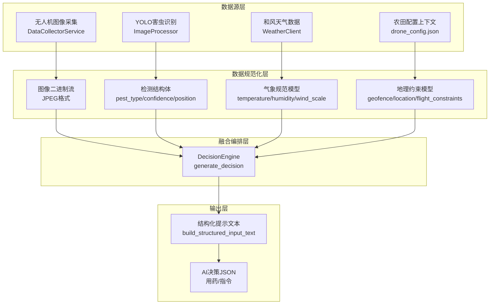

多源数据融合策略是牧野智能农业系统的核心编排机制，负责将无人机图像采集、YOLO害虫识别、和风天气数据和农田地理上下文四大异构数据源进行时空对齐、语义融合与结构化整合，最终为千问AI决策引擎提供完整、准确的决策上下文。该策略通过事件总线实现全链路状态追踪，确保数据融合过程的可观测性与可追溯性。

## 数据源架构与特征分析

系统采用分层架构管理四类核心数据源，每类数据源具有不同的采集频率、更新策略和可靠性保障机制。图像数据来自无人机定时巡航采集，通过文件系统监听机制实时触发处理流程；气象数据通过和风天气API实时获取，采用位置编码与风力等级规范化处理；YOLO检测结果包含害虫类型、置信度和空间定位信息；农田上下文数据来自配置文件，提供地理围栏、坐标位置等静态约束条件。

各数据源的特征差异决定了融合策略的设计原则：图像数据具有高频性（可配置采集间隔）和大体积性（二进制流），需要异步队列缓冲与文件就绪状态检测；气象数据具有时效性（实时天气）和外部依赖性（网络请求），需要超时控制与模拟降级机制；检测结果具有不确定性（置信度阈值）和空间性（边界框坐标），需要格式规范化与语义对齐；配置数据具有静态性和约束性，需要校验机制与安全边界保障。

Sources: [data_collector.py](modules/data_collector.py#L73-L100), [weather_integration.py](modules/weather_integration.py#L39-L92), [image_processor.py](modules/image_processor.py#L40-L127), [drone_config.json](config/drone_config.json#L8-L20)

## 融合流程编排与事件驱动机制

数据融合流程采用事件驱动架构，通过FileEventBus实现阶段状态追踪与错误隔离。整个融合链路分为五个关键阶段：队列排队、YOLO识别、气象获取、AI决策和无人机执行，每个阶段通过统一的请求ID（request_id）串联，形成完整的处理轨迹。事件总线采用JSONL格式持久化，通过文件锁保障并发写入安全。

| 阶段标识 | 触发条件 | 输入数据 | 输出数据 | 状态流转 |
|---------|---------|---------|---------|---------|
| queue | 图像文件创建事件 | image_path | filename, queue_size | queued |
| yolo | 队列任务开始 | image_path | detections[] | running → completed |
| weather | YOLO检测到害虫 | location_query | temperature, humidity, wind_scale | running → completed |
| decision | 天气数据就绪 | pest_detections, weather_data, field_context | decision JSON | running → completed |
| drone | AI决策生成完成 | decision, current_weather | mission_result | running → completed |

融合流程的核心编排逻辑位于主处理管道中，通过异步Worker模式并发处理多个图像任务。当YOLO检测到超过置信度阈值的害虫目标时，系统自动触发天气数据获取与AI决策生成，否则直接标记为"未发现害虫"并结束流程。这种条件触发机制避免了不必要的API调用开销，体现了按需融合的设计理念。

Sources: [main.py](main.py#L370-L475), [event_bus.py](modules/event_bus.py#L24-L47), [ai_decision.py](modules/ai_decision.py#L120-L230)

## 结构化数据整合策略

数据融合的关键环节是将异构数据转换为结构化的提示文本，供千问AI理解与决策。`build_structured_input_text`方法采用声明式模板拼接策略，将农田元数据、实时天气、害虫检测结果和地理围栏约束整合为语义完整的提示文本。该策略强调数据的可解释性：每个数据字段都配有中文标签，确保AI能够准确理解数据含义。

整合过程遵循三条原则：第一，**字段完备性**，强制包含地块名称、坐标、天气查询地点、地理围栏、实时天气参数（温度、湿度、风向、风力等级、风速上限、天气概况）和害虫检测结果（类型、置信度、位置）；第二，**数值规范性**，温度强制转换为整数，湿度限定在0-100范围，风速通过风力等级推算上限值；第三，**约束前置性**，在提示文本中明确输出Schema要求，引导AI生成符合结构约束的JSON响应。

Sources: [ai_decision.py](modules/ai_decision.py#L232-L268), [weather_integration.py](modules/weather_integration.py#L161-L190), [drone_config.json](config/drone_config.json#L10-L18)

## 数据质量保障与降级策略

多源数据融合面临的核心挑战是数据源的不可靠性：网络请求可能超时、外部API可能返回异常、检测结果可能缺失字段。系统采用三层防护策略：第一层为**实时校验层**，在数据获取阶段通过异常捕获与日志记录快速失败；第二层为**模拟降级层**，通过环境变量开关启用模拟数据（`QWEATHER_USE_MOCK`、`QWEN_USE_MOCK`），确保系统在无外部依赖时仍可运行；第三层为**Schema校验层**，对AI生成的决策JSON进行严格校验，若校验失败则触发修复流程或回退到Mock决策。

气象数据质量保障通过规范化处理实现：风力等级字段支持多种格式（"3"或"2-3"），通过`_parse_wind_scale`方法统一提取最大等级值；风速数据通过`_wind_scale_to_speed_mps`方法从风力等级推算风速上限，避免直接依赖API返回的风速字段；湿度数据强制校验范围有效性，超出0-100范围时抛出异常阻断流程。检测结果通过`_validate_detections`方法过滤低置信度目标，只保留超过阈值的检测结果参与后续决策。

Sources: [weather_integration.py](modules/weather_integration.py#L94-L116), [ai_decision.py](modules/ai_decision.py#L303-L329), [image_processor.py](modules/image_processor.py#L159-L185)

## 任务视图构建与状态聚合

事件总线持久化的原始事件流需要聚合为任务视图才能供前端展示与分析。`build_task_views`函数通过request_id分组，按时间顺序重建任务状态：最新事件的stage和status字段覆盖当前阶段与状态，payload中的结构化数据（image_path、detections、weather、decision、drone）累积到对应字段，形成完整的任务快照。任务视图采用增量更新模式，新事件到达时只更新对应字段，避免全量重建。

任务视图的数据结构设计体现了融合结果的多维度呈现：顶层字段包括request_id、created_at、updated_at、current_stage、status、message等元数据；嵌套字段包括image_path（图像路径）、detections（检测结果数组）、weather（气象数据字典）、decision（AI决策字典）、drone（无人机执行结果字典）和events（原始事件列表）。这种扁平化与嵌套相结合的结构既便于前端渲染，又保留了完整的事件轨迹供调试分析。

Sources: [event_bus.py](modules/event_bus.py#L81-L138)

## 融合时序与性能优化

数据融合的时序设计直接影响系统响应延迟与资源利用率。系统采用流水线模式：图像采集（DataCollectorService）与文件监听并行运行，图像就绪后进入队列；Worker从队列取出任务，依次执行YOLO检测、天气获取、AI决策和无人机执行；各阶段间通过事件总线松耦合，支持独立失败与重试。关键性能优化点包括：图像批量检测（通过batch_size参数控制）、气象请求超时控制（默认15秒）、AI决策请求超时控制（默认30秒）和异步IO并发（通过httpx AsyncClient实现）。

融合策略的下一个演进方向是引入并行数据获取：当前实现中天气数据仅在YOLO检测到害虫后才获取，可优化为在图像入队时预取天气数据，若最终未检测到害虫则丢弃预取结果。这种投机执行策略可减少约50%的融合延迟，但会增加API调用成本。另一个优化方向是引入本地缓存：天气数据具有分钟级时效性，可在短时间内复用；农田配置数据具有小时级稳定性，可避免重复解析JSON文件。