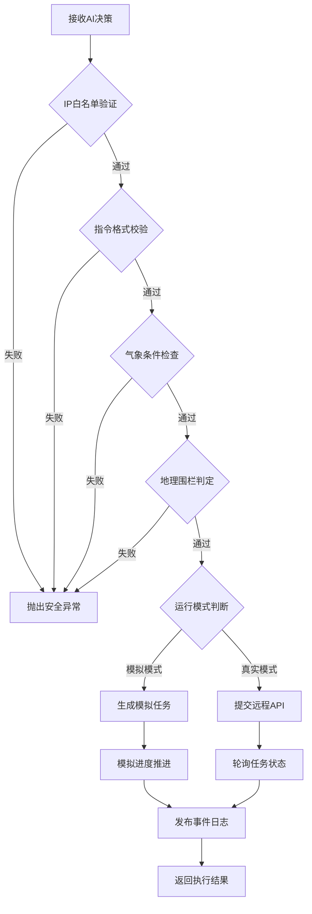

DroneController 模块作为无人机喷洒任务的最终执行网关，承担着从 AI 决策到实际飞行操作的转换职责。该模块在接收到千问 AI 生成的用药决策后，会执行四层安全校验——IP 白名单验证、指令参数格式校验、气象条件约束检查、地理围栏边界判定——确保任务在合法、安全、可行的前提下提交至无人机控制系统。系统支持两种运行模式：模拟模式用于开发测试与演示场景，真实模式通过 HTTP API 与实体无人机通信并持续追踪任务状态，整个生命周期通过事件总线记录至日志系统，为运维监控提供完整追踪链路。
Sources: [drone_controller.py](modules/drone_controller.py#L1-L302), [drone_config.json](config/drone_config.json#L1-L39)

## 指令校验架构与执行流程

无人机指令执行遵循"先校验后执行"的防御式设计模式，所有决策数据在抵达执行层前必须通过严格的安全审计。DroneController 的核心方法 `execute_spray_mission` 在接收到决策字典、气象数据、请求标识后，首先调用 `validate_decision` 触发四阶段校验链，任一环节失败都会抛出 DroneExecutionError 异常终止流程，校验通过后根据配置选择模拟执行或远程提交，两种模式均会通过事件总线发布进度事件，最终返回任务执行结果。

DroneController 初始化时注入多个依赖组件：drone_config 字典携带无人机硬件参数与飞行限制，api_url 和 api_key 用于远程服务鉴权，timeout_seconds 控制网络请求超时阈值，event_bus 实例负责事件发布，这些依赖的显式注入使得控制器具备良好的可测试性，测试套件可以通过传入 Mock 对象隔离外部依赖。
Sources: [drone_controller.py](modules/drone_controller.py#L15-L48), [drone_controller.py](modules/drone_controller.py#L50-L100)

## 四层安全校验机制

### 第一层：IP 白名单验证

网络层安全防护通过 IP 白名单机制实现，配置文件中的 `network.ip_whitelist` 数组支持单个 IP 地址和 CIDR 网段两种格式。`_validate_ip_whitelist` 方法使用 Python 标准库 ipaddress 解析客户端地址，逐一匹配白名单条目，CIDR 格式通过 `ip_network` 构建网段对象进行范围匹配，单个 IP 通过 `ip_address` 进行精确比对，匹配成功立即返回，全部失败则抛出异常拒绝访问。当白名单为空时该方法直接放行，适用于开发环境或已部署其他网络隔离措施的场景。

### 第二层：指令格式校验

指令参数校验确保飞行参数在无人机硬件能力范围内，`_validate_instruction_format` 方法从配置中读取高度、速度、喷洒速率三个维度的允许区间，逐一检查决策指令中的对应字段是否落在有效范围内。飞行路径要求至少包含两个航点，覆盖区域坐标列表和飞行路径中的每个点都会调用 `_validate_coordinate` 验证经纬度格式——必须为二元数组，经度范围 -180 至 180 度，纬度范围 -90 至 90 度，任一参数越界都会触发异常，防止无人机执行超出物理限制的危险操作。

### 第三层：气象条件约束

气象校验环节对比 AI 决策中的气象限制与实时天气数据，`_validate_weather_constraints` 从决策中提取最大允许风速、温度区间、最大湿度三个阈值，同时从配置中读取硬件层面的最大安全风速 `max_safe_wind_speed_mps`，实际允许风速取两者较小值以确保双重安全。当前天气的风速、温度、湿度数据从 WeatherClient 实时获取，任一指标超出限制都会抛出异常，例如风速超过阈值时记录"当前风速超过喷洒安全阈值"，这种严格校验避免了恶劣天气下的危险飞行。

### 第四层：地理围栏判定

地理围栏是防止无人机飞出安全区域的最后一道防线，`_validate_geofence` 方法从配置的 `field.geofence` 数组读取多边形顶点坐标，要求至少三个点构成封闭区域。飞行路径中的所有航点和覆盖区域的所有坐标点都需要通过 `point_in_polygon` 函数判定是否落在围栏内部，该函数采用射线法算法——从目标点向右发射水平射线，统计与多边形边界的交点数量，奇数次交点表示点在多边形内，偶数次表示在外，同时处理了点恰好落在边界的特殊情况。任意坐标超出围栏都会立即终止任务执行。
Sources: [drone_controller.py](modules/drone_controller.py#L201-L280), [common.py](modules/common.py#L95-L131)

## 执行模式与任务追踪

### 模拟执行模式

当配置文件的 `execution.simulate_only` 为 true 或 `api_url` 为空时，系统进入模拟执行模式，该模式不发起任何网络请求，直接生成以 `sim-` 前缀的模拟任务 ID 并返回模拟结果。`_simulate_mission_progress` 方法通过异步延时模拟无人机任务的生命周期：排队、起飞、喷洒、完成四个阶段，每个阶段间隔 0.25 秒，通过事件总线发布进度事件，前端面板可以实时显示模拟动画，这种设计为演示场景提供了完整的交互体验。

### 真实执行模式

真实模式下 DroneController 通过 HTTP POST 请求将决策数据提交至无人机控制 API，请求头包含 Bearer Token 鉴权、请求 ID 追踪标识。响应数据通过 `_validate_drone_response` 校验，要求返回 task_id 或 mission_id 字段，accepted 字段不能为 false，status 不能为异常状态。任务提交成功后，`_track_remote_mission` 方法启动轮询协程，每 0.25 秒查询任务状态，15 秒超时内持续通过事件总线发布状态更新，直到任务完成或超时退出，这种异步追踪机制避免了长时间阻塞主流程。

### 任务数据结构

提交至无人机 API 的载荷包含四个核心字段：request_id 用于追踪请求链路，medication 字典携带农药名称和用量，instruction 字典包含飞行路径、高度、速度、喷洒速率等执行参数，weather 字典记录执行时的气象快照用于审计。虚拟无人机服务的 MissionRecord 数据类完整记录任务生命周期——任务 ID、状态、进度百分比、当前航点索引、创建时间、更新时间等字段，为状态查询 API 提供数据源。
Sources: [drone_controller.py](modules/drone_controller.py#L50-L150), [virtual_drone_api.py](modules/virtual_drone_api.py#L15-L100)

## 配置参数与约束边界

无人机运行参数通过 drone_config.json 进行声明式配置，该配置文件分为监控、农田、飞行约束、网络、执行五个逻辑分组，为不同部署环境提供灵活调整能力。监控组控制图像采集频率和启动行为；农田组定义地理位置、天气查询城市、地理围栏多边形；飞行约束组设定硬件安全边界；网络组管理 IP 白名单；执行组控制运行模式选择。

| 配置分组 | 关键参数 | 默认值 | 用途说明 |
|---------|---------|--------|---------|
| monitoring | capture_interval_hours | 24 | 定时采集间隔 |
| field.geofence | 多边形坐标数组 | 上海示范田 | 飞行安全边界 |
| flight_constraints | altitude_range_m | [2.0, 8.0] | 高度区间（米） |
| flight_constraints | speed_range_mps | [1.0, 6.0] | 速度区间（米/秒） |
| flight_constraints | spray_rate_range_lpm | [0.3, 3.0] | 喷洒速率（升/分） |
| flight_constraints | max_safe_wind_speed_mps | 8.0 | 最大安全风速 |
| network.ip_whitelist | IP 地址数组 | ["127.0.0.1"] | 访问控制白名单 |
| execution | simulate_only | true | 模拟模式开关 |

地理围栏配置需要特别注意坐标格式，每个点为 [经度, 纬度] 二元数组，顶点顺序决定多边形边界，实际部署时需使用测绘工具获取农田真实边界坐标。IP 白名单支持 CIDR 格式，例如 "192.168.1.0/24" 可允许整个子网访问，生产环境建议仅允许内网管理主机访问无人机 API。
Sources: [drone_config.json](config/drone_config.json#L1-L39)

## 虚拟无人机测试服务

虚拟无人机 API 服务（VirtualDroneApi）提供了完整的无人机行为模拟，用于开发测试和演示场景。该服务基于 FastAPI 框架实现，监听独立端口（默认 9010），提供任务创建和状态查询两个核心接口，完整的鉴权流程包括 Bearer Token 验证和 IP 白名单检查，确保测试环境与生产环境保持一致的安全策略。任务创建接口 POST /missions 接收标准的 MissionRequest 载荷，返回任务记录；状态查询接口 GET /missions/{task_id} 返回任务当前状态、进度百分比、当前航点索引等详细信息。

VirtualDroneService 类维护内存中的任务字典，create_mission 方法创建 MissionRecord 记录并启动异步协程 `_advance_mission` 推进任务状态，该协程模拟五阶段任务生命周期：起飞（20%）、前往作业区（45%）、喷洒（75%）、返航（92%）、完成（100%），每个阶段间隔 0.35 秒并更新 current_waypoint_index 字段，模拟无人机按航点飞行行为。这种设计使得前端面板可以轮询状态接口展示实时动画，验证整个数据流链路的正确性，而无需连接真实无人机硬件。

主程序通过 EmbeddedDroneApiRunner 类将虚拟无人机服务作为后台进程内嵌启动，该类封装了 uvicorn 服务器生命周期管理，启动后通过健康检查接口等待服务就绪，超时 30 秒未响应则抛出异常，这种内嵌部署模式简化了开发环境搭建，开发者只需运行 `python main.py --mode demo` 即可启动包含图像采集、AI 决策、无人机控制的完整演示链路。
Sources: [virtual_drone_api.py](modules/virtual_drone_api.py#L1-L200), [main.py](main.py#L145-L200)

## 错误处理与日志审计

DroneController 的所有异常都封装为 DroneExecutionError 统一抛出，该异常继承自 RuntimeError，携带具体错误信息便于上层捕获处理。每个校验方法在抛出异常前都会构造清晰的错误消息，例如"客户端 IP {ip} 不在白名单内"、"飞行高度超出无人机允许范围"、"坐标 {point} 超出安全地理围栏"，这些消息会通过 log_event 函数记录到系统日志，包含 request_id、client_ip、duration_ms 等追踪字段，为问题排查提供完整上下文。

日志系统采用结构化格式输出，每条记录包含时间戳、模块名称、日志级别、消息体，消息体通过键值对附加额外字段，例如 `request_id=abc123 client_ip=192.168.1.10 duration_ms=234.56`，这种格式既便于人类阅读，也易于日志分析工具解析。系统日志通过 RotatingFileHandler 滚动存储至 `data/logs/system.log`，单文件上限 2MB，保留 5 个备份，防止长期运行导致磁盘占用过高。
Sources: [drone_controller.py](modules/drone_controller.py#L1-L12), [common.py](modules/common.py#L54-L80)

## 后续阅读建议

完成无人机指令校验与执行的学习后，建议继续阅读 [虚拟无人机API服务](15-xu-ni-wu-ren-ji-apifu-wu) 了解测试服务的详细实现，或阅读 [地理围栏与飞行限制](16-di-li-wei-lan-yu-fei-xing-xian-zhi) 深入理解坐标系统与边界判定算法。若需了解决策数据如何生成，可回溯阅读 [千问AI决策引擎](12-qian-wen-aijue-ce-yin-qing)，查看完整的 AI 决策到无人机执行的数据流转过程。