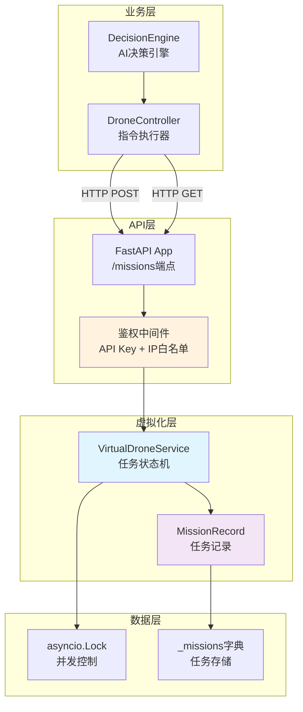
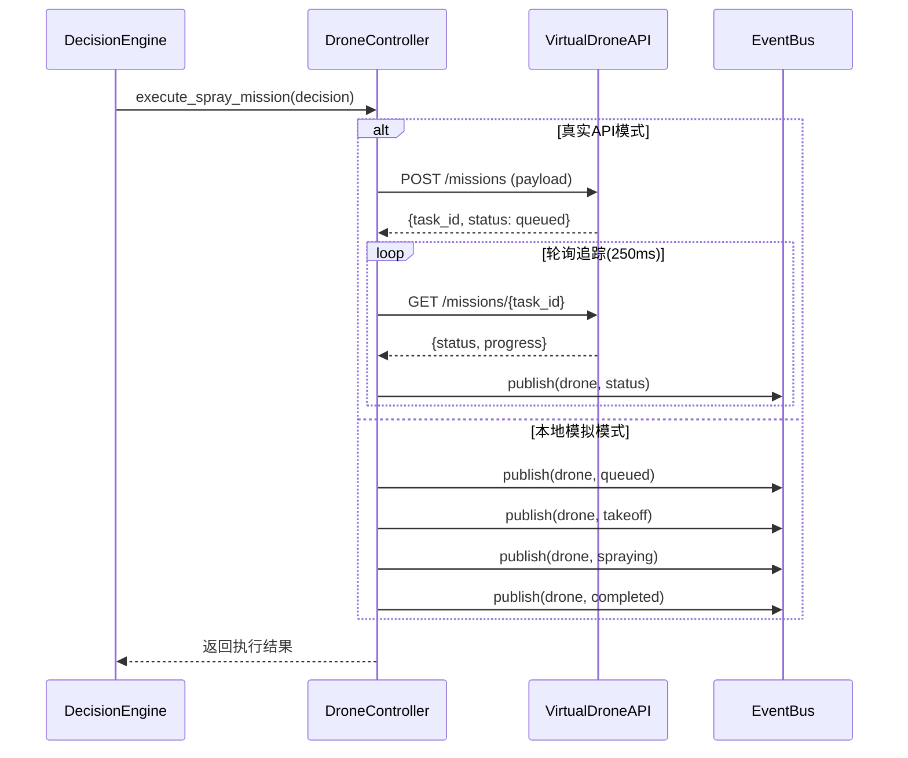

**虚拟无人机API服务** 是牧野系统的无人机任务模拟引擎，通过 FastAPI 提供 RESTful 接口，模拟真实无人机的任务接收、状态流转与执行反馈。该服务为开发、测试与演示场景提供零成本的无人机行为仿真，支持独立部署与嵌入式运行两种模式。

## 架构定位与设计哲学

虚拟无人机API服务遵循 **接口隔离原则**，实现了与真实无人机API完全一致的接口契约，使得 DroneController 模块无需区分后端实现即可执行任务提交与状态追踪。该设计遵循 **依赖倒置原则**，通过抽象的任务状态模型实现模拟逻辑与业务逻辑的解耦。



服务的核心组件包括 **VirtualDroneService** 状态机、**MissionRecord** 数据模型以及 **FastAPI** 端点封装。状态机通过异步任务推进任务流转，每个阶段间隔350毫秒，模拟真实无人机的物理运动时延，同时通过 **asyncio.Lock** 保证并发场景下状态一致性。Sources: [virtual_drone_api.py](modules/virtual_drone_api.py#L48-L102)

## 任务生命周期模拟

虚拟无人机采用 **五阶段状态流转模型**，精确映射真实无人机的任务执行路径。每个任务从创建到完成经历完整的飞行作业周期，状态转换通过异步任务自动推进。

| 阶段 | 状态标识 | 进度值 | 模拟描述 | 时延 |
|------|---------|--------|----------|------|
| 1 | queued | 5% | 任务已排队等待执行 | - |
| 2 | takeoff | 20% | 无人机起飞爬升 | 350ms |
| 3 | enroute | 45% | 前往作业区域飞行 | 350ms |
| 4 | spraying | 75% | 执行农药喷洒作业 | 350ms |
| 5 | returning | 92% | 返航降落 | 350ms |
| 6 | completed | 100% | 任务完成并记录 | - |

状态推进逻辑通过 `_advance_mission` 方法实现，该方法在任务创建后立即启动异步协程，按序更新任务的 status、progress、message 以及 current_waypoint_index 字段。航点索引计算采用保守策略，通过 `min(index, max(len(飞行路径) - 1, 0))` 确保索引不会越界，即使飞行路径为空也能正常流转。Sources: [virtual_drone_api.py](modules/virtual_drone_api.py#L80-L101)

## RESTful API接口规范

服务提供两个核心端点，完全兼容真实无人机API的请求响应格式，支持通过 **Bearer Token** 或 **X-API-Key** 头部进行身份验证。

### 任务创建端点

**POST /missions** 接收包含用药方案、飞行指令与天气数据的任务请求，返回包含任务标识、初始状态与进度信息的响应对象。

```json
{
  "request_id": "req-20250114-a1b2c3",
  "medication": {
    "农药名称": "吡虫啉",
    "浓度": "10%",
    "用量": "150ml/亩"
  },
  "instruction": {
    "飞行路径": [[121.4728, 31.2298], [121.4746, 31.2298]],
    "飞行高度": 4.5,
    "喷洒速率": 1.2
  },
  "weather": {
    "temperature": 26,
    "wind_speed": 3.3,
    "humidity": 58
  }
}
```

服务生成格式为 `vd-{10位随机ID}` 的任务标识符，确保与真实任务ID命名空间隔离。任务创建后立即进入异步流转流程，响应体包含完整的 MissionRecord 序列化数据。Sources: [virtual_drone_api.py](modules/virtual_drone_api.py#L170-L181)

### 任务查询端点

**GET /missions/{task_id** 提供任务状态查询能力，返回包含进度百分比、当前状态、航点索引以及原始请求参数的完整记录。

```json
{
  "task_id": "vd-a1b2c3d4e5",
  "request_id": "req-20250114-a1b2c3",
  "accepted": true,
  "status": "spraying",
  "progress": 75,
  "message": "虚拟无人机喷洒中",
  "current_waypoint_index": 1,
  "instruction": { "飞行路径": [...] },
  "medication": { "农药名称": "吡虫啉" },
  "weather": { "temperature": 26 }
}
```

DroneController 通过该端点实现任务状态轮询，以250毫秒间隔持续追踪任务进展，直至状态达到 `completed` 或超时（默认15秒）。该轮询机制与虚拟服务的状态推进时延（350ms）形成节奏配合，确保每个阶段至少被捕获一次。Sources: [virtual_drone_api.py](modules/virtual_drone_api.py#L183-L197), [drone_controller.py](modules/drone_controller.py#L127-L169)

## 双重安全鉴权机制

虚拟无人机服务实现了 **API密钥验证** 与 **IP白名单过滤** 两层防护，确保模拟环境的安全可控，防止未授权访问或恶意请求。

### API密钥验证

服务支持两种鉴权头部传递方式：`Authorization: Bearer {token}` 与 `X-API-Key: {token}`，密钥通过环境变量 `DRONE_API_KEY` 配置。验证逻辑通过 `_ensure_authorized` 函数实现，当密钥为空时跳过验证（支持无鉴权模式），密钥匹配任意一种头部格式即通过验证。Sources: [virtual_drone_api.py](modules/virtual_drone_api.py#L118-L126)

### IP白名单过滤

请求客户端IP地址通过 `Request.client.host` 获取，白名单支持单IP（`127.0.0.1`）与CIDR网段（`192.168.1.0/24`）两种格式。验证逻辑通过 `ipaddress` 标准库实现精确匹配与网段包含检查，同时兼容IPv4与IPv6地址。当客户端IP不在白名单时，服务返回 HTTP 403 错误并记录详细的拒绝原因。Sources: [virtual_drone_api.py](modules/virtual_drone_api.py#L129-L139)

## 运行模式与部署方式

虚拟无人机服务支持 **独立进程部署** 与 **嵌入式内嵌运行** 两种模式，适应不同的架构场景与资源约束。

### 独立进程部署

通过 `drone_api.py` 入口启动独立的 FastAPI 服务，使用 Uvicorn 作为 ASGI 服务器。该模式适合分布式架构或容器化部署场景，服务监听地址与端口通过命令行参数覆盖环境变量配置。

```bash
python drone_api.py --host 0.0.0.0 --port 9010
```

独立模式下的服务通过 `/health` 端点提供健康检查，返回 `{"status": "ok", "port": 9010}` 格式响应，支持负载均衡器或监控系统探活。Sources: [drone_api.py](drone_api.py#L10-L21)

### 嵌入式内嵌运行

`EmbeddedDroneApiRunner` 类实现了在主进程中启动虚拟无人机服务的能力，该模式避免了进程间通信开销，简化了开发环境配置。启动流程包括：创建 FastAPI 应用实例 → 配置 Uvicorn 服务器 → 启动异步服务任务 → 健康检查轮询确认就绪。

内嵌模式下的服务启动超时设置为30秒，健康检查间隔200毫秒，服务异常退出时会抛出 `RuntimeError` 并包含详细的错误堆栈信息。该机制确保主应用在依赖服务未就绪时快速失败，避免静默运行。Sources: [main.py](main.py#L123-L194)

## 配置管理与环境变量

服务的配置通过 `VirtualDroneSettings` 数据类封装，支持环境变量注入与默认值回退，配置加载遵循 **显式优于隐式** 原则。

| 环境变量 | 默认值 | 描述 |
|---------|--------|------|
| VIRTUAL_DRONE_HOST | 127.0.0.1 | 服务监听地址 |
| VIRTUAL_DRONE_PORT | 9010 | 服务监听端口 |
| DRONE_API_KEY | virtual-drone-token | API鉴权密钥 |
| VIRTUAL_DRONE_ALLOWED_IPS | 127.0.0.1,::1 | IP白名单（逗号分隔） |

配置加载函数 `load_virtual_drone_settings` 自动解析IP列表，支持空格容错处理与空值过滤。IP白名单的空列表配置会被验证逻辑视为"允许所有"，实现配置的向后兼容。Sources: [virtual_drone_api.py](modules/virtual_drone_api.py#L104-L115), [.env.example](.env.example#L27-L31)

## 集成模式与调用链路

虚拟无人机服务通过 `DroneController` 模块集成到牧野系统的任务执行流程中。当配置项 `execution.simulate_only` 为 `true` 或 `DRONE_API_URL` 为空时，DroneController 调用虚拟API端点；否则直接在内存中模拟任务状态流转并发布事件到 EventBus。



该集成模式实现了 **策略模式** 的运行时切换，DroneController 无需感知后端实现细节，只需关注任务提交接口与状态查询协议。虚拟服务通过标准的 HTTP 协议与事件发布机制，确保模拟环境与生产环境的语义一致性。Sources: [drone_controller.py](modules/drone_controller.py#L40-L125)

## 测试覆盖与质量保证

虚拟无人机服务的测试套件通过 `pytest-asyncio` 验证异步行为正确性，核心测试用例覆盖任务创建、状态推进与并发安全性。

测试策略包括：创建初始任务并验证 `queued` 状态 → 异步等待1.8秒（覆盖完整流转周期） → 查询最终状态确认为 `completed` → 验证进度值达到100% → 检查航点索引更新正确。该测试通过时间控制而非模拟时钟，确保真实异步环境下的行为一致性。Sources: [test_virtual_drone_api.py](tests/test_virtual_drone_api.py#L20-L36)

## 与其他模块的协作关系

虚拟无人机服务与 **DroneController** 形成调用者-被调用者关系，与 **EventBus** 通过事件发布间接集成，与 **DecisionEngine** 通过决策指令数据结构实现松耦合。

- **[无人机指令校验与执行](14-wu-ren-ji-zhi-ling-xiao-yan-yu-zhi-xing)**：DroneController 负责调用虚拟API并处理响应
- **[事件日志与状态追踪](21-shi-jian-ri-zhi-yu-zhuang-tai-zhui-zong)**：任务状态变更通过 EventBus 发布到日志系统
- **[配置文件详解](17-pei-zhi-wen-jian-xiang-jie)**：drone_config.json 定义虚拟服务的启用策略

虚拟服务作为 **测试替身**，在持续集成流水线中替代真实无人机硬件，实现端到端测试的自动化执行。Sources: [drone_controller.py](modules/drone_controller.py#L171-L200)