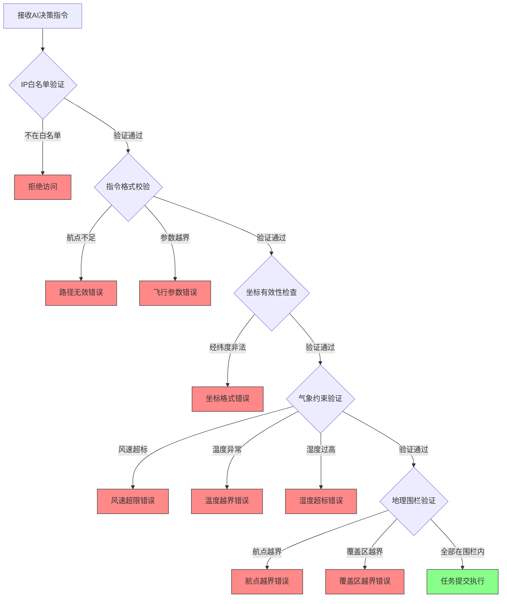
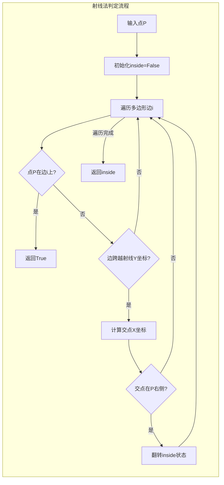

地理围栏与飞行限制系统是牧野无人机控制架构的核心安全防护层，采用**多层防御策略**实现空间边界管控、飞行参数约束与网络访问控制的协同校验。该系统通过配置驱动的约束规则与计算几何算法，在任务执行前完成全维度的安全验证，确保无人机作业始终处于物理与逻辑双重安全边界之内，从根本上杜绝越界飞行与危险操作。

## 约束架构与验证流程

系统采用**五层递进式验证模型**，从网络接入层到空间几何层逐级收紧安全边界。网络层通过IP白名单机制过滤访问源，指令层校验飞行参数格式与取值范围，坐标层验证经纬度有效性，气象层检查实时天气是否符合作业要求，最终在空间层通过射线法判定所有航点与覆盖区域是否位于地理围栏内部。这种分层架构实现了**快速失败（fail-fast）原则**，任何层级的违规都会立即终止任务执行，避免无效计算与潜在风险。



验证入口位于 `DroneController.validate_decision()` 方法，该方法接收AI决策字典、实时气象数据与客户端IP地址作为输入，依次调用五个独立的校验子方法完成验证链。每个子方法在检测到违规时抛出 `DroneExecutionError` 异常，携带明确的错误描述信息，便于上层日志记录与用户反馈。

Sources: [drone_controller.py](modules/drone_controller.py#L202-L213)

## 地理围栏算法原理

地理围栏的核心是**点在多边形内判定算法**，系统采用经典的射线法实现高效准确的空间包含关系计算。该算法从待判定点向任意方向（通常选择X轴正方向）发射一条射线，统计射线与多边形边界的交点数量：交点数为奇数表示点在多边形内部，偶数表示在外部。这种方法的时间复杂度为O(n)，其中n为多边形顶点数，适用于任意复杂度的简单多边形（无自相交）。



实现代码位于 `modules/common.py` 的 `point_in_polygon()` 函数，该函数首先处理边界情况：如果点恰好位于多边形边上，直接返回True。随后遍历多边形的每一条边，利用叉积判断点是否在边的延长线上，同时计算射线与边的交点X坐标。当交点位于点P的右侧时，说明射线穿过了这条边，需要翻转内部状态标志。最终返回的布尔值即表示点是否在围栏内部。

Sources: [common.py](modules/common.py#L99-L133)

### 边界处理与数值稳定性

射线法的实现中包含两个关键的数值稳定性优化。首先是**共线检测**：通过计算向量叉积判断点是否在边的延长线上，叉积绝对值小于1e-9时视为共线，随后检查点是否在线段范围内。其次是**零除保护**：当边的Y轴跨度为零时（水平边），分母设为极小值1e-12避免浮点异常。这些优化确保了算法在处理实际GPS坐标时的数值稳定性，避免因浮点精度问题导致的判定错误。

Sources: [common.py](modules/common.py#L118-L132)

## 地理围栏配置规范

地理围栏通过 `config/drone_config.json` 配置文件定义，采用**顶点序列**表示封闭多边形区域。配置中 `field.geofence` 字段存储一个二维数组，每个元素为 `[经度, 纬度]` 形式的坐标点，至少包含三个顶点形成封闭区域。系统会自动连接首尾顶点，形成完整的边界环路。

```json
{
  "field": {
    "name": "牧野示范田",
    "location": {
      "city": "上海",
      "latitude": 31.2304,
      "longitude": 121.4737
    },
    "geofence": [
      [121.4728, 31.2298],
      [121.4746, 31.2298],
      [121.4748, 31.2312],
      [121.4729, 31.2314]
    ]
  }
}
```

上述配置定义了位于上海市的一块示范田，围栏边界为四边形，覆盖约0.02平方公里的作业区域。验证逻辑在 `_validate_geofence()` 方法中实现，首先检查围栏配置是否包含至少三个顶点，随后遍历AI决策中的所有航点与覆盖区域坐标，逐一调用 `point_in_polygon()` 判定是否越界。任何坐标点超出围栏都会触发异常，拒绝执行任务。

Sources: [drone_config.json](config/drone_config.json#L10-L18), [drone_controller.py](modules/drone_controller.py#L271-L281)

## 飞行参数约束体系

除空间边界外，系统还对飞行物理参数实施严格限制，防止无人机在极端工况下作业。这些约束同样通过配置文件定义，在 `_validate_instruction_format()` 方法中完成校验。约束体系涵盖四个维度：高度、速度、喷洒速率与路径复杂度，形成完整的飞行安全边界。

| 约束维度 | 配置字段 | 默认范围 | 校验逻辑 | 错误类型 |
|---------|---------|---------|---------|---------|
| 飞行高度 | `altitude_range_m` | [2.0, 8.0]米 | 指令高度在范围内 | 超出允许范围 |
| 飞行速度 | `speed_range_mps` | [1.0, 6.0]米/秒 | 指令速度在范围内 | 超出允许范围 |
| 喷洒速率 | `spray_rate_range_lpm` | [0.3, 3.0]升/分钟 | 指令速率在范围内 | 超出允许范围 |
| 航点数量 | - | ≥2个 | 路径包含至少两个航点 | 路径无效错误 |

高度约束确保无人机在作物冠层上方安全高度作业，避免碰撞或气流扰动过度影响作物；速度约束平衡作业效率与飞行稳定性，低速保证喷洒精度，高速提升覆盖效率；喷洒速率约束防止药液浪费或覆盖不足，确保单位面积施药量符合农艺要求；航点数量约束保证飞行路径的有效性，单点无法形成飞行轨迹。

Sources: [drone_controller.py](modules/drone_controller.py#L232-L250)

## 气象条件约束机制

气象条件直接影响喷洒效果与飞行安全，系统通过双重阈值机制实施动态约束。配置文件中的 `flight_constraints.max_safe_wind_speed_mps` 定义了无人机硬件层面的最大安全风速，AI决策中的气象限制字段定义了当前作业场景的风速要求。系统取两者中的较小值作为实际阈值，体现**安全优先原则**：硬件限制与场景限制中更严格的约束生效。

```python
max_safe_wind = float(flight_constraints.get("max_safe_wind_speed_mps", 8.0))
allowed_wind = min(float(restrictions["最大风速"]), max_safe_wind)
```

温度与湿度约束同样来自AI决策的气象限制字段，通常由农业专家根据药剂特性与作物生长阶段设定。温度过低影响药液雾化效果，温度过高加速挥发降低药效；湿度过高导致药液不易干燥，可能引发病害传播。系统在 `_validate_weather_constraints()` 方法中完成三重校验：风速、温度范围、湿度上限，任一指标超标即拒绝执行。

Sources: [drone_controller.py](modules/drone_controller.py#L252-L269)

## 网络访问控制策略

网络层安全通过IP白名单机制实现，配置文件中的 `network.ip_whitelist` 字段定义允许发起无人机控制请求的客户端地址列表。白名单支持两种格式：单个IP地址（如 `192.168.1.10`）与CIDR网段（如 `192.168.1.0/24`），前者精确匹配特定主机，后者允许整个子网访问。这种设计适应不同部署场景：单机演示模式开放本地回环地址，生产环境仅允许控制中心网段访问。

```python
client_address = ipaddress.ip_address(client_ip)
for item in whitelist:
    if "/" in item:
        network = ipaddress.ip_network(item, strict=False)
        if client_address in network:
            return  # 验证通过
    elif client_address == ipaddress.ip_address(item):
        return  # 验证通过
raise DroneExecutionError(f"客户端 IP {client_ip} 不在白名单内")
```

验证逻辑在 `_validate_ip_whitelist()` 方法中实现，利用Python标准库 `ipaddress` 模块完成地址解析与子网包含判定。当配置的白名单项为CIDR格式时，构建 `ip_network` 对象并检查客户端地址是否属于该网络；当为单地址格式时，直接比较IP对象相等性。若白名单为空列表，系统跳过验证，允许任意地址访问，这种设计便于开发环境快速迭代。

Sources: [drone_controller.py](modules/drone_controller.py#L214-L230)

## 坐标系统与有效性验证

地理围栏系统采用WGS84坐标系统（GPS标准坐标系），坐标格式为 `[经度, 纬度]` 二元数组。经度有效范围为[-180, 180]，正值表示东经，负值表示西经；纬度有效范围为[-90, 90]，正值表示北纬，负值表示南纬。系统在 `_validate_coordinate()` 方法中完成格式与范围双重校验：首先检查数组长度是否为2，随后验证经纬度数值是否在有效范围内。

```python
if len(point) != 2:
    raise DroneExecutionError("坐标必须为 [经度, 纬度] 二元数组")
longitude = float(point[0])
latitude = float(point[1])
if not (-180 <= longitude <= 180 and -90 <= latitude <= 90):
    raise DroneExecutionError("坐标超出经纬度有效范围")
```

坐标验证贯穿整个校验链：指令格式验证阶段检查所有航点与覆盖区域顶点的坐标有效性，地理围栏验证阶段使用这些坐标进行空间判定。这种**前置验证**策略确保后续几何计算不会因非法坐标导致异常，同时提供明确的错误定位信息，便于问题排查与用户反馈。

Sources: [drone_controller.py](modules/drone_controller.py#L283-L289)

## 异常处理与错误反馈

所有验证失败都通过 `DroneExecutionError` 异常向上传递，该异常继承自Python标准异常 `RuntimeError`，携带人类可读的错误描述信息。异常在 `execute_spray_mission()` 方法的顶层捕获，通过 `log_event()` 函数记录到系统日志，包含请求ID、客户端IP、执行耗时与错误详情等上下文信息，便于事后审计与问题追溯。

```python
except Exception as exc:
    log_event(
        self.logger,
        logging.ERROR,
        "无人机喷洒任务执行失败",
        request_id=request_id,
        client_ip=client_ip,
        duration_ms=(time.perf_counter() - started) * 1000,
        error=str(exc),
    )
    raise DroneExecutionError(str(exc)) from exc
```

异常处理采用**链式传递**模式（`raise ... from exc`），保留原始异常栈信息，确保调试时能追溯到具体的验证失败位置。日志输出采用结构化格式，通过键值对形式组织上下文数据，便于日志分析工具提取与聚合统计。这种异常处理策略既保证了错误信息的完整性，又不影响系统整体的响应性能。

Sources: [drone_controller.py](modules/drone_controller.py#L115-L125)

## 配置驱动的约束扩展

整个约束体系采用**配置驱动**设计理念，所有阈值与边界值都定义在外部JSON配置文件中，无需修改代码即可调整安全策略。这种设计支持不同部署场景的灵活适配：示范田环境采用宽松约束便于演示，生产环境收紧阈值确保安全；平原地区放宽风速限制，山区环境加强气象约束。配置变更后重启服务即可生效，无需代码编译与部署流程。

| 配置字段 | 作用域 | 调整场景 | 影响验证方法 |
|---------|-------|---------|-------------|
| `geofence` | 空间边界 | 更换作业地块 | `_validate_geofence()` |
| `altitude_range_m` | 高度约束 | 作物高度变化 | `_validate_instruction_format()` |
| `max_safe_wind_speed_mps` | 风速约束 | 气候区域差异 | `_validate_weather_constraints()` |
| `ip_whitelist` | 网络访问 | 控制中心迁移 | `_validate_ip_whitelist()` |

配置文件还包含 `field.name` 与 `field.location` 元数据字段，用于标识作业区域名称与地理位置，这些信息主要服务于日志记录与可视化展示，不参与验证逻辑。`execution.simulate_only` 字段控制是否模拟执行，设为 `true` 时跳过真实无人机API调用，适合开发测试环境。

Sources: [drone_config.json](config/drone_config.json#L1-L39)

## 安全边界可视化

地理围栏系统可与可视化模块集成，通过Streamlit面板展示作业区域的地理边界、实时气象数据与无人机位置轨迹。这种可视化能力帮助操作人员直观理解约束范围，提前识别潜在的越界风险。建议结合[Streamlit演示面板](20-streamlityan-shi-mian-ban)了解如何实现围栏边界的地图叠加显示与实时状态监控。

Sources: [drone_controller.py](modules/drone_controller.py#L40-L126)

## 相关文档导航

地理围栏与飞行限制系统是无人机安全控制体系的重要组成部分，与多个核心模块协同工作。建议按以下顺序深入理解系统架构：[无人机指令校验与执行](14-wu-ren-ji-zhi-ling-xiao-yan-yu-zhi-xing)介绍指令生成与任务提交流程，[虚拟无人机API服务](15-xu-ni-wu-ren-ji-apifu-wu)讲解模拟测试环境搭建，[配置文件详解](17-pei-zhi-wen-jian-xiang-jie)说明约束参数的最佳实践配置，[安全鉴权与访问控制](19-an-quan-jian-quan-yu-fang-wen-kong-zhi)深入网络层安全防护机制。这种渐进式阅读路径有助于建立完整的无人机控制知识体系。