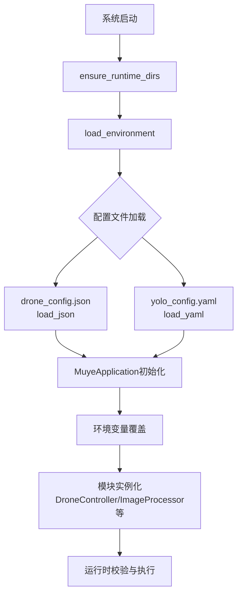

牧野智能农业系统采用**分层配置架构**，通过配置文件定义系统运行参数，环境变量提供敏感信息和运行时覆盖能力，实现安全与灵活性的平衡。系统核心配置包含三大文件：`drone_config.json` 定义无人机作业场景参数，`yolo_config.yaml` 控制害虫识别模型行为，`.env` 文件管理 API 密钥等敏感凭证。配置加载遵循"文件定义基准值 → 环境变量覆盖 → 运行时校验"的优先级链条，确保开发调试便捷性与生产环境安全性的双重需求。

## 配置文件概览与加载机制

系统启动时通过 `modules/common.py` 提供的工具函数加载配置文件，配置路径基于项目根目录自动解析。`load_json()` 函数负责解析 JSON 格式的无人机配置文件，`load_yaml()` 函数处理 YAML 格式的 YOLO 配置文件，两者均返回字典对象供后续模块使用。配置文件位于项目根目录的 `config/` 目录下，通过 `CONFIG_DIR` 常量统一管理路径访问。

配置加载流程中，`MuyeApplication` 类在初始化时集中加载所有配置文件，并通过参数传递给各个功能模块。这种设计确保配置来源单一化，避免多个模块重复读取文件造成资源浪费，同时为后续的配置热更新预留扩展空间。

Sources: [main.py](main.py#L202-L228), [common.py](modules/common.py#L14-L42)

## 无人机配置文件详解

`config/drone_config.json` 文件定义无人机作业场景的核心参数，包含监控策略、地理信息、飞行约束、网络访问控制及执行模式五大配置块。该文件采用 JSON 格式存储，便于程序解析的同时保持良好的可读性，配置值在系统启动时一次性加载，运行期间不可修改。

### 监控配置块

监控配置块定义图像采集的调度策略，决定系统如何启动和执行无人机图像捕获任务。`capture_interval_hours` 参数设置定期采集的时间间隔（小时），`capture_on_startup` 控制系统启动时是否立即执行一次采集，`simulate_capture` 标志位决定是否使用模拟图像替代真实无人机拍摄。`capture_endpoint` 和 `http_method` 预留用于真实无人机 API 集成，当前版本在模拟模式下可为空值。

| 配置项 | 类型 | 默认值 | 说明 |
|--------|------|--------|------|
| capture_interval_hours | number | 24 | 定期采集间隔（小时） |
| capture_on_startup | boolean | true | 启动时立即采集 |
| simulate_capture | boolean | true | 使用模拟图像 |
| capture_endpoint | string | "" | 真实无人机 API 端点 |
| http_method | string | "GET" | HTTP 请求方法 |

Sources: [drone_config.json](config/drone_config.json#L2-L8), [data_collector.py](modules/data_collector.py#L1-L50)

### 地理信息与围栏配置

地理信息配置块定义作业区域的基础信息，包括字段名称、城市位置及地理坐标，用于天气数据获取和区域定位。`location` 对象包含城市名称、经纬度坐标，为天气 API 调用提供地理参数。`geofence` 数组定义安全飞行区域的边界多边形，采用 `[经度, 纬度]` 二元数组格式，至少需要三个坐标点构成闭合区域。

地理围栏在无人机任务执行前进行校验，确保飞行路径和喷洒区域完全位于安全边界内。`point_in_polygon()` 函数实现射线法判定点是否在多边形内部，所有飞行航点和覆盖区域坐标都必须通过围栏校验，否则任务将被拒绝执行。围栏坐标采用 WGS84 坐标系，经度范围 [-180, 180]，纬度范围 [-90, 90]。

Sources: [drone_config.json](config/drone_config.json#L9-L23), [common.py](modules/common.py#L99-L115), [drone_controller.py](modules/drone_controller.py#L271-L281)

### 飞行约束配置

飞行约束配置块定义无人机作业的安全参数范围，所有任务指令必须在约束范围内才能执行。`altitude_range_m` 设置允许的飞行高度区间（米），`speed_range_mps` 限制飞行速度范围（米/秒），`spray_rate_range_lpm` 定义喷洒速率范围（升/分钟），`max_safe_wind_speed_mps` 设置最大安全风速阈值。

| 配置项 | 类型 | 单位 | 说明 |
|--------|------|------|------|
| altitude_range_m | [min, max] | 米 | 飞行高度区间 [2.0, 8.0] |
| speed_range_mps | [min, max] | 米/秒 | 飞行速度区间 [1.0, 6.0] |
| spray_rate_range_lpm | [min, max] | 升/分钟 | 喷洒速率区间 [0.3, 3.0] |
| max_safe_wind_speed_mps | number | 米/秒 | 最大安全风速 8.0 |

约束校验在 `DroneController.validate_decision()` 方法中执行，通过 `_validate_instruction_format()` 检查飞行参数是否在允许范围内，通过 `_validate_weather_constraints()` 验证当前气象条件是否满足安全要求。风速校验采用决策限制与配置阈值的较小值，确保双重安全防护。

Sources: [drone_config.json](config/drone_config.json#L24-L29), [drone_controller.py](modules/drone_controller.py#L232-L269)

### 网络与执行配置

网络配置块管理客户端访问控制，`client_ip` 定义服务客户端的默认 IP 地址，`ip_whitelist` 数组列出允许访问无人机控制接口的 IP 地址或网段。IP 白名单支持单 IP 地址（如 `127.0.0.1`）和 CIDR 网段（如 `192.168.1.0/24`）两种格式，通过 `ipaddress` 标准库进行匹配校验。

执行配置块控制系统运行模式，`simulate_only` 标志位决定是否仅模拟无人机任务而不实际执行，`request_timeout_seconds` 设置 HTTP 请求超时时间（秒）。模拟模式下，系统通过事件总线发布虚拟的任务进度事件，便于开发调试和演示验证，无需连接真实无人机硬件。

Sources: [drone_config.json](config/drone_config.json#L30-L38), [drone_controller.py](modules/drone_controller.py#L214-L230)

## YOLO 配置文件详解

`config/yolo_config.yaml` 文件控制害虫识别模型的推理行为和服务部署参数，采用 YAML 格式存储，支持注释和层次化结构。配置文件定义全局推理参数、请求头设置及本地 API 服务配置，环境变量可覆盖部分关键参数。

### 全局推理参数

全局推理参数控制 YOLO 模型的基础推理行为。`confidence_threshold` 设置检测置信度阈值（默认 0.25），低于该阈值的检测结果将被过滤。`timeout_seconds` 定义推理请求超时时间（默认 20 秒），适用于远程 API 调用场景。`batch_size` 设置单次推理的图片批量大小（默认 4），影响推理效率和内存占用。`tensorrt_enabled` 标志位预留用于 TensorRT 加速（当前版本未启用）。

| 配置项 | 类型 | 默认值 | 说明 |
|--------|------|--------|------|
| confidence_threshold | float | 0.25 | 检测置信度阈值 |
| timeout_seconds | int | 20 | 请求超时时间（秒） |
| batch_size | int | 4 | 批量推理大小 |
| tensorrt_enabled | bool | false | TensorRT 加速开关 |
| request_headers | dict | - | 自定义请求头 |

Sources: [yolo_config.yaml](config/yolo_config.yaml#L1-L6), [main.py](main.py#L214-L228)

### 本地 API 服务配置

`local_api` 配置块定义内嵌 YOLO API 服务的部署参数。`host` 设置服务监听地址（默认 `127.0.0.1`），`port` 定义服务端口号（默认 8010），`model_path` 指定模型文件路径（默认 `models/best.pt`），`device` 设置推理设备（`auto` 自动选择，可选 `cpu`、`cuda`、`mps`），`max_batch_size` 定义服务端最大批量大小（默认 4）。

模型路径支持相对路径和绝对路径，相对路径基于项目根目录解析。设备选择逻辑：`auto` 模式下优先使用 GPU（CUDA 或 MPS），不可用时回退至 CPU。配置加载函数 `load_local_yolo_settings()` 合并配置文件和环境变量，环境变量优先级高于配置文件，便于容器化部署时动态调整参数。

Sources: [yolo_config.yaml](config/yolo_config.yaml#L7-L12), [local_yolo_api.py](modules/local_yolo_api.py#L234-L259)

## 环境变量配置详解

`.env` 文件管理敏感凭证和运行时覆盖参数，通过 `python-dotenv` 库加载至进程环境变量。`.env.example` 提供配置模板，包含所有支持的环境变量名称和示例值，实际部署时应复制为 `.env` 或 `config/api_keys.env` 并填入真实凭证。

### YOLO API 配置

YOLO API 环境变量控制图像识别服务的连接和本地服务部署。`YOLO_API_URL` 定义检测服务端点地址，`YOLO_API_KEY` 设置访问凭证，`YOLO_CONFIDENCE_THRESHOLD` 覆盖配置文件的置信度阈值。本地服务相关变量包括：`YOLO_LOCAL_MODEL_PATH` 指定模型路径，`YOLO_LOCAL_HOST` 和 `YOLO_LOCAL_PORT` 定义服务监听地址，`YOLO_ALLOWED_IPS` 设置 IP 白名单（逗号分隔），`YOLO_RATE_LIMIT_PER_MINUTE` 控制访问频率限制。

| 环境变量 | 示例值 | 说明 |
|----------|--------|------|
| YOLO_API_URL | http://127.0.0.1:8010/detect | 检测服务端点 |
| YOLO_API_KEY | muye-local-yolo-token | API 访问密钥 |
| YOLO_CONFIDENCE_THRESHOLD | 0.25 | 置信度阈值覆盖 |
| YOLO_LOCAL_MODEL_PATH | models/best.pt | 本地模型路径 |
| YOLO_LOCAL_HOST | 127.0.0.1 | 本地服务地址 |
| YOLO_LOCAL_PORT | 8010 | 本地服务端口 |
| YOLO_ALLOWED_IPS | 127.0.0.1,::1 | IP 白名单 |
| YOLO_RATE_LIMIT_PER_MINUTE | 120 | 频率限制（次/分钟） |

Sources: [.env.example](.env.example#L1-L8), [local_yolo_api.py](modules/local_yolo_api.py#L244-L258)

### 千问 AI 配置

千问 AI 环境变量控制决策引擎的连接参数和运行模式。`QWEN_API_URL` 设置千问 API 端点地址，`QWEN_API_KEY` 填入申请获得的 API 密钥，`QWEN_MODEL` 指定使用的模型版本（如 `qwen-max`）。`QWEN_USE_MOCK` 开启模拟模式，用于无网络环境下的功能测试，模拟模式下决策引擎返回预设的模板决策。

Sources: [.env.example](.env.example#L10-L13), [ai_decision.py](modules/ai_decision.py#L1-L50)

### 和风天气配置

和风天气环境变量管理天气数据服务的访问凭证和模拟模式。`QWEATHER_API_KEY` 填入和风天气开发者密钥，`QWEATHER_GEO_URL` 和 `QWEATHER_WEATHER_URL` 定义地理位置查询和天气查询 API 端点。`QWEATHER_USE_MOCK` 开启模拟天气模式，模拟数据通过 `QWEATHER_MOCK_*` 系列变量定义，包括温度、湿度、天气状况、风向、风力和风速。

| 环境变量 | 示例值 | 说明 |
|----------|--------|------|
| QWEATHER_API_KEY | 你的API_KEY | 和风天气密钥 |
| QWEATHER_GEO_URL | https://api.qweather.com/geo/v2/city/lookup | 地理查询端点 |
| QWEATHER_WEATHER_URL | https://api.qweather.com/v7/weather/now | 天气查询端点 |
| QWEATHER_USE_MOCK | false | 模拟模式开关 |
| QWEATHER_MOCK_TEMPERATURE | 26 | 模拟温度（℃） |
| QWEATHER_MOCK_HUMIDITY | 58 | 模拟湿度（%） |
| QWEATHER_MOCK_WIND_SPEED | 3.3 | 模拟风速（m/s） |

Sources: [.env.example](.env.example#L15-L26), [weather_integration.py](modules/weather_integration.py#L1-L50)

### 无人机 API 配置

无人机 API 环境变量控制真实无人机服务的连接和虚拟无人机服务部署。`DRONE_API_URL` 定义无人机任务提交端点，`DRONE_API_KEY` 设置访问凭证。虚拟无人机服务相关变量包括：`VIRTUAL_DRONE_HOST` 和 `VIRTUAL_DRONE_PORT` 定义服务监听地址，`VIRTUAL_DRONE_ALLOWED_IPS` 设置访问白名单，`SERVICE_CLIENT_IP` 标识服务客户端 IP 地址。

Sources: [.env.example](.env.example#L27-L33), [virtual_drone_api.py](modules/virtual_drone_api.py#L17-L23)

## 配置优先级与覆盖规则

系统采用"配置文件基准值 → 环境变量覆盖 → 代码默认值"的三层配置优先级机制。配置文件定义系统运行的基准参数，环境变量提供敏感信息和运行时覆盖能力，代码中的默认值作为最终兜底策略。这种设计既保证了配置的可追溯性，又支持灵活的部署时参数调整。

环境变量覆盖遵循明确规则：字符串类型变量直接替换，数值类型变量需类型转换，布尔类型变量支持 `true/false/1/0/yes/no/on/off` 多种格式。IP 白名单等列表类型变量采用逗号分隔格式，加载时自动解析为数组。路径类型变量支持相对路径和绝对路径，相对路径基于项目根目录 `PROJECT_ROOT` 解析。

`load_local_yolo_settings()` 函数展示了典型的配置加载模式：首先调用 `load_environment()` 加载环境变量，然后通过 `load_yaml()` 读取配置文件，最后按优先级合并参数并构建设置对象。这种模式确保配置来源清晰、优先级明确、错误易于排查。

Sources: [local_yolo_api.py](modules/local_yolo_api.py#L234-L259), [main.py](main.py#L200-L228)

## 下一步学习

掌握配置文件结构后，建议深入理解环境变量的安全管理机制。环境变量管理页面将详细介绍敏感凭证的保护策略、多环境配置切换方法及容器化部署的配置注入实践。继续阅读：[环境变量管理](18-huan-jing-bian-liang-guan-li)。