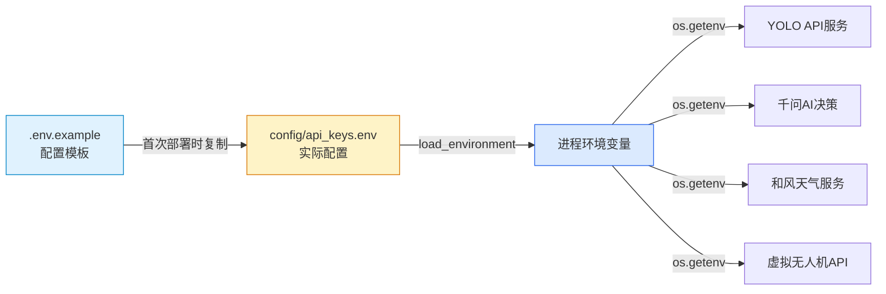

本系统采用环境变量驱动的配置管理模式，将敏感凭证与运行时参数从代码库中分离，遵循12-Factor应用方法论的核心原则。环境变量管理机制为YOLO害虫识别、千问AI决策、和风天气数据接入以及无人机控制等核心服务提供统一的配置入口，支持生产环境与开发环境的灵活切换，并通过Mock模式降低外部服务依赖风险。

## 环境变量文件架构

系统使用双层环境变量文件结构，`.env.example`作为配置模板存在于版本控制中，记录所有可配置项及其默认值；实际的环境变量文件`config/api_keys.env`存放真实的API密钥与运行时参数，被`.gitignore`排除在版本控制之外以保护敏感信息。应用启动时通过`load_environment()`函数加载环境变量，该函数首先确保运行时目录存在，然后从`config/api_keys.env`读取配置并注入进程环境。

Sources: [.env.example](.env.example#L1-L33), [modules/common.py](modules/common.py#L36-L42)

## 环境变量分类体系

系统定义的环境变量按照服务模块划分为四大类别，每类变量负责特定服务的连接参数、认证凭证与行为控制。**YOLO服务配置**包含本地YOLO API的监听地址、模型路径、认证令牌、IP白名单与速率限制，支持将图像识别服务嵌入主进程或连接外部独立服务。**千问AI决策配置**定义了大语言模型API的端点地址、认证密钥、模型名称与Mock模式开关，使决策引擎能够在真实AI服务与模拟响应之间切换。**和风天气配置**提供了天气数据接入所需的API密钥、地理编码URL、天气查询URL以及完整的Mock数据集，包括温度、湿度、天气概况、风向风速等字段。**无人机控制配置**设定了虚拟无人机API的监听参数、认证令牌、允许访问的客户端IP地址，确保无人机指令服务的安全隔离。

| 配置类别 | 核心变量 | 用途说明 | 默认值示例 |
|---------|---------|---------|-----------|
| YOLO服务 | `YOLO_API_URL` | 图像识别API端点 | `http://127.0.0.1:8010/detect` |
| YOLO服务 | `YOLO_API_KEY` | API认证令牌 | `muye-local-yolo-token` |
| YOLO服务 | `YOLO_LOCAL_MODEL_PATH` | 本地模型文件路径 | `models/best.pt` |
| YOLO服务 | `YOLO_RATE_LIMIT_PER_MINUTE` | 每分钟请求限制 | `120` |
| 千问AI | `QWEN_API_URL` | 决策API端点 | `https://your-qwen-endpoint/v1/chat/completions` |
| 千问AI | `QWEN_API_KEY` | 千问API密钥 | 需用户填写 |
| 千问AI | `QWEN_USE_MOCK` | 启用模拟模式 | `false` |
| 和风天气 | `QWEATHER_API_KEY` | 天气API密钥 | 需用户填写 |
| 和风天气 | `QWEATHER_USE_MOCK` | 启用模拟天气数据 | `false` |
| 和风天气 | `QWEATHER_MOCK_TEMPERATURE` | 模拟温度值 | `26` |
| 无人机控制 | `DRONE_API_URL` | 无人机任务API | `http://127.0.0.1:9010/missions` |
| 无人机控制 | `VIRTUAL_DRONE_ALLOWED_IPS` | 允许访问的IP列表 | `127.0.0.1,::1` |

Sources: [.env.example](.env.example#L1-L33)

## 环境变量加载机制

`load_environment()`函数实现了环境变量的延迟加载与安全覆盖策略，该函数接受可选的`env_file`参数用于指定自定义配置文件路径，默认使用`config/api_keys.env`。加载过程中调用`python-dotenv`库的`load_dotenv()`函数，将文件中的键值对解析后注入`os.environ`字典，`override=False`参数确保已存在的环境变量不会被覆盖，这一设计允许通过系统环境变量优先级覆盖文件配置。函数返回实际加载的配置文件路径，便于日志记录与调试追踪。

主应用初始化时通过`MuyeApplication.__init__()`调用`load_environment()`，确保所有服务组件启动前环境变量已就绪。各模块通过`os.getenv()`函数按需读取配置项，例如`local_yolo_api.py`中的`load_local_yolo_settings()`函数从环境变量读取YOLO服务的完整配置并构造`LocalYoloSettings`数据类实例，将字符串类型的环境变量转换为强类型的Python对象，包括路径转换、整数解析、IP地址列表分割等操作。

Sources: [modules/common.py](modules/common.py#L36-L42), [main.py](main.py#L192), [modules/local_yolo_api.py](modules/local_yolo_api.py#L1-L45)

## Mock模式与服务解耦

系统为千问AI决策引擎与和风天气服务设计了Mock模式，通过`QWEN_USE_MOCK`与`QWEATHER_USE_MOCK`环境变量控制，使开发与测试过程摆脱对外部API的依赖。当Mock模式启用时，`DecisionEngine`与`WeatherClient`组件跳过真实的HTTP请求，直接返回预定义的响应数据。天气Mock数据通过一组环境变量配置，包括`QWEATHER_MOCK_TEMPERATURE`、`QWEATHER_MOCK_HUMIDITY`、`QWEATHER_MOCK_SUMMARY`等字段，允许开发者模拟不同的气象条件以测试决策逻辑的边界情况。

Mock模式的价值在于降低开发环境搭建成本，避免测试过程中消耗真实的API调用配额，并使自动化测试能够在无网络连接环境下稳定运行。生产部署时只需将Mock开关设置为`false`并填入真实的API密钥，系统即可无缝切换至真实服务。这一设计体现了配置管理与业务逻辑的清晰分离，环境变量成为控制服务行为的关键开关。

Sources: [.env.example](.env.example#L10-L32), [modules/ai_decision.py](modules/ai_decision.py#L95-L100), [modules/weather_integration.py](modules/weather_integration.py#L46-L55)

## 安全访问控制配置

环境变量管理机制承担了服务间访问控制的安全职责，`YOLO_ALLOWED_IPS`与`VIRTUAL_DRONE_ALLOWED_IPS`变量定义了允许访问本地API服务的IP地址白名单，支持IPv4与IPv6地址的逗号分隔列表。API服务启动时解析这些配置，在请求处理中间件中验证客户端IP是否在白名单内，拒绝未授权的访问请求。`YOLO_API_KEY`与`DRONE_API_KEY`变量定义了API认证令牌，客户端必须在请求头中携带正确的令牌才能调用服务接口，双重验证机制确保了内嵌API服务的安全性。

速率限制配置`YOLO_RATE_LIMIT_PER_MINUTE`防止恶意或异常的请求洪泛攻击，内存中的速率限制器基于滑动窗口算法跟踪每个客户端的请求频率，超过阈值的请求将被拒绝并返回HTTP 429状态码。这些安全配置通过环境变量暴露，允许运维人员根据实际部署环境灵活调整，无需修改代码即可增强或放宽访问控制策略。

Sources: [.env.example](.env.example#L7-L9), [.env.example](.env.example#L25-L30), [modules/local_yolo_api.py](modules/local_yolo_api.py#L38-L48)

## 部署配置实践

首次部署时需将`.env.example`复制为`config/api_keys.env`，然后根据实际环境填写必要的API密钥。千问AI服务的`QWEN_API_KEY`需从阿里云百炼平台获取，和风天气的`QWEATHER_API_KEY`需在和风天气开发平台申请。开发环境建议启用Mock模式以快速启动系统，生产环境则需禁用Mock并配置真实的服务端点。本地开发时各服务使用默认的回环地址与端口，生产部署时需根据网络拓扑调整`YOLO_LOCAL_HOST`、`VIRTUAL_DRONE_HOST`等监听地址配置。

环境变量的命名遵循`服务名_配置项`的统一前缀规范，例如所有YOLO相关变量以`YOLO_`开头，千问相关变量以`QWEN_`开头，这种命名约定降低了配置项的认知负担，也便于自动化工具批量读取特定服务的配置。配置文件中的注释说明了每个变量的用途与格式，新加入项目的开发者能够快速理解配置体系并正确设置运行环境。

Sources: [.env.example](.env.example#L1-L33)

## 后续学习路径

完成环境变量配置后，建议继续阅读[配置文件详解](17-pei-zhi-wen-jian-xiang-jie)了解JSON与YAML配置文件的结构设计，或直接进入[安全鉴权与访问控制](19-an-quan-jian-quan-yu-fang-wen-kong-zhi)深入学习IP白名单与API令牌的验证机制。若需快速启动系统验证配置正确性，可参考[快速启动指南](2-kuai-su-qi-dong-zhi-nan)中的环境检查步骤。