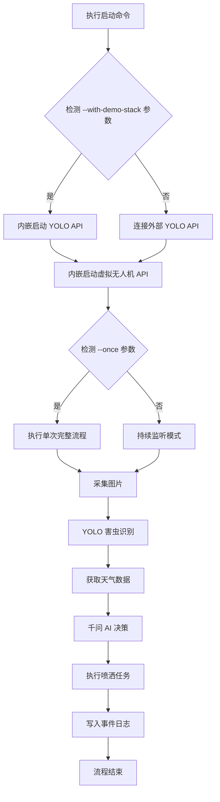

本指南帮助开发者在 10 分钟内完成牧野智能农业害虫防治系统的本地部署与首次运行。文档涵盖环境准备、核心配置、启动验证三个关键阶段,采用渐进式引导策略:从最小可运行配置开始,逐步激活完整功能模块。

Sources: [README.md](README.md#L1-L10), [main.py](main.py#L1-L50)

## 前置条件检查清单

在开始安装之前,请确认以下环境要求已满足。表格列出了必需项与可选项,以及获取途径:

| 检查项 | 必需性 | 版本要求 | 获取途径 | 验证命令 |
|--------|--------|----------|----------|----------|
| Python 运行时 | **必需** | ≥ 3.9 (异步特性支持) | python.org 或 Anaconda | `python --version` |
| pip 包管理器 | **必需** | 最新稳定版 | Python 安装时自带 | `pip --version` |
| YOLO 模型文件 | **必需** | best.pt 权重文件 | 项目组提供或自行训练 | 放置到 `models/best.pt` |
| 和风天气 API Key | **推荐** | 免费版即可 | console.qweather.com | 配置后可获取实时天气 |
| 千问 AI API Key | **可选** | Qwen 系列模型 | 阿里云百炼平台 | 不配置可使用 Mock 模式 |
| Git 版本控制 | 可选 | 最新版 | git-scm.com | 用于克隆仓库 |

**特别说明**:
- YOLO 模型文件是核心推理组件,缺失将导致害虫识别功能不可用
- API Key 缺失时,系统可通过 Mock 模式运行演示流程,详见 [环境配置与依赖安装](3-huan-jing-pei-zhi-yu-yi-lai-an-zhuang)

Sources: [requirements.txt](requirements.txt#L1-L14), [models/README.md](models/README.md#L1-L14)

## 安装依赖与项目初始化

### 步骤一:克隆项目仓库

```bash
# 从版本控制系统获取源码
git clone <repository-url>
cd muye
```

### 步骤二:创建虚拟环境(推荐)

虚拟环境隔离项目依赖,避免版本冲突。Windows 系统执行以下命令:

```bash
# 创建虚拟环境
python -m venv .venv

# 激活虚拟环境
.venv\Scripts\activate

# 验证激活成功(命令行前缀应显示 .venv)
where python
```

### 步骤三:安装项目依赖

使用 requirements.txt 批量安装所有 Python 包:

```bash
pip install -r requirements.txt
```

依赖包说明:

| 包名称 | 用途 | 关联模块 |
|--------|------|----------|
| httpx | 异步 HTTP 客户端 | 天气/决策/YOLO API 调用 |
| fastapi + uvicorn | 高性能 Web 框架 | 本地 YOLO API/虚拟无人机 API |
| ultralytics | YOLOv8 推理引擎 | 害虫识别核心 |
| streamlit | 可视化演示面板 | 交互式监控界面 |
| watchdog | 文件系统监听 | 图片采集触发机制 |
| jsonschema | JSON 结构校验 | AI 决策输出验证 |

安装完成后,验证关键模块导入正常:

```bash
python -c "import fastapi, ultralytics, streamlit; print('依赖安装成功')"
```

Sources: [README.md](README.md#L123-L135), [requirements.txt](requirements.txt#L1-L14)

## 最小化配置

项目采用分层配置策略:环境变量控制敏感密钥,JSON/YAML 文件控制业务参数。首次运行仅需配置三项核心内容。

### 配置一:准备模型文件

将训练好的 YOLO 权重文件放置到固定位置:

```
muye/models/best.pt
```

此文件是害虫识别的核心,缺失时本地 YOLO API 将无法启动。详细说明参考 [models/README.md](models/README.md#L1-L14)。

### 配置二:创建环境变量文件

项目提供模板文件 `.env.example`,需复制为实际配置文件:

```bash
# 在项目根目录创建配置目录
mkdir config

# 复制环境变量模板
copy .env.example config\api_keys.env
```

编辑 `config\api_keys.env`,填写以下必需配置项:

```env
# YOLO 本地 API 配置(保持默认即可)
YOLO_API_URL="http://127.0.0.1:8010/detect"
YOLO_API_KEY="muye-local-yolo-token"
YOLO_LOCAL_MODEL_PATH="models/best.pt"

# 和风天气 API(替换为你的真实 Key)
QWEATHER_API_KEY="你的和风天气API_KEY"

# 千问 AI 配置(首次运行可使用 Mock 模式)
QWEN_API_URL="https://your-qwen-endpoint/v1/chat/completions"
QWEN_API_KEY="你的千问API_KEY"
QWEN_USE_MOCK="true"
```

**配置策略说明**:
- `QWEN_USE_MOCK="true"` 启用模拟决策,无需真实 API Key 即可运行
- `QWEATHER_API_KEY` 需真实 Key,否则天气数据将使用默认模拟值
- 完整配置项解释参考 [环境变量管理](18-huan-jing-bian-liang-guan-li)

Sources: [.env.example](.env.example#L1-L33), [config/drone_config.json](config/drone_config.json#L1-L39)

### 配置三:确认业务参数

系统默认配置已针对演示场景优化,初次运行无需修改。关键参数说明:

| 配置文件 | 核心参数 | 默认值 | 影响范围 |
|----------|----------|--------|----------|
| config/drone_config.json | simulate_capture | true | 自动生成模拟图片 |
| config/drone_config.json | weather_location | 上海 | 和风天气查询城市 |
| config/drone_config.json | simulate_only | true | 虚拟无人机任务模拟 |
| config/yolo_config.yaml | confidence_threshold | 0.25 | 害虫识别置信度阈值 |

配置文件详细解读参考 [配置文件详解](17-pei-zhi-wen-jian-xiang-jie)。

Sources: [config/drone_config.json](config/drone_config.json#L1-L39), [config/yolo_config.yaml](config/yolo_config.yaml#L1-L13)

## 首次启动与验证

### 快速启动流程图

以下流程图展示一键启动模式的完整执行链路:



### 命令一:一键启动演示系统

**推荐首次使用**此命令,它会自动启动所有必需服务:

```bash
python main.py --with-demo-stack --once
```

命令参数解析:

| 参数 | 作用 | 执行效果 |
|------|------|----------|
| --with-demo-stack | 一键模式 | 内嵌启动 YOLO API + 虚拟无人机 API + 主系统 |
| --once | 单次执行 | 完成一次采集-识别-决策-执行流程后自动退出 |

**预期输出**:
```
INFO:muye:内嵌 YOLO API 已启动 (detect_url=http://127.0.0.1:8010/detect)
INFO:muye:内嵌虚拟无人机 API 已启动 (api_url=http://127.0.0.1:9010/missions)
INFO:muye:采集图片已保存: data/images/20250426-143025.jpg
INFO:muye:YOLO 识别完成, 发现 2 个害虫目标
INFO:muye:天气数据获取成功: 上海, 多云, 26°C
INFO:muye:AI 决策完成: 建议喷洒作业
INFO:muye:虚拟无人机任务已创建: mission_001
INFO:muye:整条处理链执行成功
```

Sources: [main.py](main.py#L516-L566)

### 命令二:启动可视化面板

系统提供 Streamlit 交互式演示界面,实时展示处理流程:

```bash
streamlit run app.py
```

浏览器自动打开 `http://localhost:8501`,界面功能包括:

| 面板区域 | 功能说明 |
|----------|----------|
| 左侧边栏 | 图片上传、手动触发采集 |
| 主视图 | 原图与识别结果对比展示 |
| 决策卡片 | 天气数据、AI 决策结果、喷洒参数 |
| 任务进度 | 虚拟无人机任务状态可视化 |
| 实时日志 | 事件总线 JSONL 文件滚动展示 |

可视化面板详细使用参考 [Streamlit演示面板](20-streamlityan-shi-mian-ban)。

Sources: [app.py](app.py#L1-L50)

### 命令三:分步启动独立服务

如果需要调试单个服务,可采用分步启动方式:

```bash
# 终端 1: 启动 YOLO API
python yolo_api.py

# 终端 2: 启动虚拟无人机 API
python drone_api.py

# 终端 3: 启动主系统
python main.py --once
```

此模式便于观察各服务日志输出,定位问题更直观。各服务端点:

| 服务名称 | 监听地址 | 核心接口 |
|----------|----------|----------|
| 本地 YOLO API | http://127.0.0.1:8010 | /detect, /health |
| 虚拟无人机 API | http://127.0.0.1:9010 | /missions, /health |

Sources: [README.md](README.md#L195-L210), [main.py](main.py#L192-L220)

## 验证安装成功

### 检查点一:服务健康检测

使用 curl 或浏览器访问健康检查接口:

```bash
# 检测 YOLO API
curl http://127.0.0.1:8010/health

# 检测虚拟无人机 API
curl http://127.0.0.1:9010/health
```

预期返回: `{"status": "healthy", "service": "yolo-api"}`

### 检查点二:事件日志确认

查看事件总线文件,确认流程节点已记录:

```bash
type data\logs\events.jsonl
```

每行 JSON 记录一次关键事件,包含时间戳、阶段、状态等字段:

```json
{"timestamp": "2025-04-26T14:30:25", "stage": "pipeline", "status": "completed", "message": "整条处理链执行成功"}
```

事件日志分析参考 [事件日志与状态追踪](21-shi-jian-ri-zhi-yu-zhuang-tai-zhui-zong)。

### 检查点三:图片文件生成

确认图片采集功能正常:

```bash
dir data\images
```

应看到类似 `20250426-143025.jpg` 的文件,格式为 `YYYYMMDD-HHMMSS.jpg`。

Sources: [modules/event_bus.py](modules/event_bus.py#L1-L50), [modules/data_collector.py](modules/data_collector.py#L1-L50)

## 常见问题排查

| 问题现象 | 可能原因 | 解决方案 | 验证方法 |
|----------|----------|----------|----------|
| ModuleNotFoundError: No module named 'fastapi' | 依赖未安装或虚拟环境未激活 | 执行 `pip install -r requirements.txt` | `pip list \| findstr fastapi` |
| FileNotFoundError: models/best.pt not found | YOLO 模型文件缺失 | 将 best.pt 复制到 models 目录 | `dir models\best.pt` |
| ConnectionError: YOLO API 连接失败 | YOLO API 未启动或端口冲突 | 使用 `--with-yolo-api` 参数或检查 8010 端口占用 | `netstat -ano \| findstr 8010` |
| QWEATHER_API_KEY 无效 | 和风天气 Key 错误或过期 | 访问 console.qweather.com 重新获取 | 查看和风天气控制台状态 |
| 千问 API 调用超时 | 网络问题或 API 地址错误 | 启用 Mock 模式: `QWEN_USE_MOCK=true` | 检查环境变量文件配置 |
| 虚拟无人机任务状态卡住 | API 服务异常重启 | 重启虚拟无人机 API 服务 | 访问 /health 接口确认 |

更多问题诊断参考 [单元测试框架](22-dan-yuan-ce-shi-kuang-jia) 和 [集成测试与端到端测试](23-ji-cheng-ce-shi-yu-duan-dao-duan-ce-shi)。

Sources: [tests/test_main.py](tests/test_main.py#L1-L31)

## 下一步学习路径

完成本指南后,建议按以下顺序深入学习系统架构:

1. **理解运行模式**: 阅读 [运行模式与演示流程](4-yun-xing-mo-shi-yu-yan-shi-liu-cheng),掌握真实/模拟模式切换机制

2. **掌握系统架构**: 学习 [系统架构设计](5-xi-tong-jia-gou-she-ji),理解异步任务流与模块交互

3. **配置生产环境**: 参考 [环境配置与依赖安装](3-huan-jing-pei-zhi-yu-yi-lai-an-zhuang),配置真实 API Key 与生产参数

4. **深入核心流程**: 
   - [YOLO害虫识别流程](9-yolohai-chong-shi-bie-liu-cheng)
   - [千问AI决策引擎](12-qian-wen-aijue-ce-yin-qing)
   - [无人机指令校验与执行](14-wu-ren-ji-zhi-ling-xiao-yan-yu-zhi-xing)

5. **扩展开发能力**:
   - [模块化设计与职责划分](7-mo-kuai-hua-she-ji-yu-zhi-ze-hua-fen)
   - [单元测试框架](22-dan-yuan-ce-shi-kuang-jia)

项目采用清晰的分层架构与渐进式复杂度设计,初学者可快速上手演示,进阶者可深入定制核心算法与业务逻辑。整个代码库遵循 Python 最佳实践,异步编程、类型提示、模块化设计等技术点在项目中均有体现,是学习现代 Python 工程实践的优质案例。