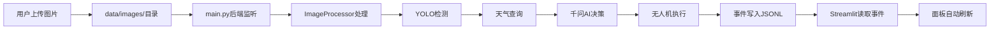

Streamlit演示面板是牧野智能农业系统的可视化窗口，为初学者提供直观的实时监控界面。该面板采用森林绿主题设计，通过自动刷新机制实时展示虫情识别、天气感知、AI决策和虚拟无人机执行的完整演示闭环，让开发者无需深入代码即可理解系统运行机制。

## 界面架构与布局设计

演示面板采用经典的两栏布局结构：左侧边栏提供运行模式指示器和图片上传功能，右侧主区域展示系统运行的实时数据流。整个界面通过自定义CSS样式表实现毛玻璃效果、渐变背景和卡片式布局，营造现代化的视觉体验。核心布局分为英雄区域、指标概览、图像对比、害虫识别、天气信息、AI决策、无人机状态和事件日志八个功能模块，每个模块通过卡片容器组织相关数据，实现信息的层次化呈现。

Sources: [app.py](app.py#L1-L200)

### 核心界面模块

| 模块名称 | 功能描述 | 数据来源 |
|---------|---------|---------|
| 英雄区域 | 显示系统标题、当前请求ID、阶段和状态 | `FileEventBus`事件流 |
| 指标概览 | 四列指标卡片展示关键统计信息 | `build_task_views()`聚合 |
| 图像对比 | 左右并排显示原始图片与YOLO标注结果 | `data/images/`目录 |
| 害虫识别 | 统计害虫种类与数量，生成可视化标签 | YOLO检测数据 |
| 天气信息 | 温度、湿度、风向等气象数据卡片 | 和风天气API |
| AI决策 | 农药名称、浓度、配比及安全提示 | 千问AI引擎 |
| 无人机状态 | 任务进度条、航线地图、遥测数据 | 虚拟无人机API |
| 事件日志 | 滚动显示最近80条系统事件 | JSONL事件文件 |

Sources: [app.py](app.py#L680-L888)

## 实时数据刷新机制

面板通过`streamlit-autorefresh`组件实现每1.5秒的自动刷新，确保用户能够实时观察系统处理进度。刷新机制从JSONL格式的事件日志文件读取最新事件流，通过`build_task_views()`函数按请求ID聚合任务视图，提取每个任务的当前阶段、检测结果、天气数据、决策内容和无人机状态。这种基于文件系统的通信方式避免了数据库依赖，使演示环境部署更加轻量化。



Sources: [app.py](app.py#L934-L940), [modules/event_bus.py](modules/event_bus.py#L57-L78)

## 图片上传与标注可视化

侧边栏的图片上传功能支持JPG、JPEG和PNG三种格式，上传后文件被重命名并保存到`data/images/`目录，触发后端的文件监听机制。面板同时显示原始图片与标注结果：标注图片通过PIL的`ImageDraw`模块绘制边界框，橙色矩形框标注害虫位置，左上角标签显示害虫类型与置信度。标注函数根据图片尺寸动态计算线宽，确保在不同分辨率下都能清晰显示检测结果。

### 图片标注流程

1. **文件上传**：用户通过侧边栏`file_uploader`组件选择图片文件
2. **文件保存**：添加时间戳前缀后写入`data/images/`目录
3. **后端处理**：`main.py`监听目录变化并触发处理流程
4. **检测标注**：YOLO返回检测结果后，`annotate_image()`绘制边界框
5. **结果展示**：面板右侧显示带标注的图片和害虫统计

Sources: [app.py](app.py#L485-L527), [app.py](app.py#L918-L931)

## 事件总线与任务视图构建

事件总线采用JSONL文件格式记录系统运行过程中的所有事件，每个事件包含唯一ID、时间戳、请求ID、阶段、状态、消息和负载七个字段。`FileEventBus`类通过文件锁机制确保并发写入的安全性，使用`fcntl.flock()`实现排他锁和共享锁。`build_task_views()`函数遍历所有事件，按请求ID分组并提取每个任务的最新状态、检测结果、天气数据、决策内容和无人机状态，构建完整的任务视图对象供面板展示。

```json
{
  "event_id": "a1b2c3d4e5f6...",
  "timestamp": "2024-01-15T10:30:45.123456+00:00",
  "request_id": "f0e1d2c3b4a5...",
  "stage": "yolo_detection",
  "status": "completed",
  "message": "YOLO检测完成，识别到3个目标",
  "payload": {"detections": [...]}
}
```

Sources: [modules/event_bus.py](modules/event_bus.py#L17-L55), [modules/event_bus.py](modules/event_bus.py#L81-L139)

## 航线地图SVG可视化

无人机状态模块通过`build_route_map_svg()`函数动态生成航线地图，使用SVG矢量图形展示飞行路径和覆盖区域。函数接收决策引擎返回的飞行指令，提取飞行路径坐标点和覆盖区域多边形，通过线性插值将经纬度坐标映射到520x250像素的画布坐标系。SVG图形包含网格背景、覆盖区域多边形（绿色半透明）、飞行航线折线（渐变色）和航点标记（带序号的圆圈），实现地理信息的直观可视化。

### 地图可视化要素

| 要素类型 | 视觉表现 | 数据来源 |
|---------|---------|---------|
| 覆盖区域 | 绿色半透明多边形 | `instruction['覆盖区域']['coordinates']` |
| 飞行航线 | 渐变色折线 | `instruction['飞行路径']` |
| 航点标记 | 白色圆圈+序号 | 飞行路径索引 |
| 网格线 | 灰色虚线 | 固定布局 |

Sources: [app.py](app.py#L576-L644), [app.py](app.py#L858-L883)

## 运行模式指示器

侧边栏顶部显示四个运行模式指示器，分别对应YOLO识别、天气查询、千问AI和无人机控制四个核心模块。模式标签通过读取环境变量判断当前运行模式：`QWEATHER_USE_MOCK`和`QWEN_USE_MOCK`控制是否使用模拟数据，YOLO始终使用真实检测，无人机始终使用虚拟API。每种模式使用不同的颜色主题：real模式显示绿色渐变，mock模式显示黄色渐变，virtual模式显示蓝色渐变，帮助开发者快速理解系统配置状态。

Sources: [app.py](app.py#L469-L476), [app.py](app.py#L890-L916)

## 自定义主题样式注入

`inject_styles()`函数通过`st.markdown()`注入超过440行的自定义CSS样式表，实现森林绿主题的视觉效果。样式系统定义了CSS变量（背景色、卡片色、强调色、文字色）、毛玻璃效果（backdrop-filter）、阴影系统（多层阴影）、动画效果（进度条流动动画）和响应式卡片布局。关键样式类包括`muye-hero`（英雄区域）、`muye-card-wrap`（卡片容器）、`muye-pest-banner`（害虫识别横幅）、`muye-progress-shell`（进度条容器）和`muye-telemetry`（遥测数据文本框），通过统一的命名前缀避免样式冲突。

### 核心样式类说明

| 样式类 | 应用场景 | 关键属性 |
|-------|---------|---------|
| `muye-hero` | 系统标题区域 | 渐变背景、毛玻璃、大阴影 |
| `muye-card-wrap` | 信息卡片容器 | 圆角、阴影、悬停变换 |
| `muye-pill` | 标签徽章 | 圆角药丸形状、彩色背景 |
| `muye-progress-fill` | 进度条填充 | 渐变色、流动动画 |
| `muye-telemetry` | 遥测数据框 | 深色背景、等宽字体 |

Sources: [app.py](app.py#L22-L445)

## 启动与运行方式

演示面板通过Streamlit命令行工具启动，需要确保后端服务已运行。完整的演示流程包括三个步骤：首先使用`python main.py --with-demo-stack`启动后端服务栈（包含YOLO API、虚拟无人机API和文件监听器），然后在另一个终端执行`streamlit run app.py`启动前端面板，最后通过侧边栏上传图片或等待后端自动捕获图片。面板会自动每1.5秒刷新一次，实时显示处理进度和结果。清空演示事件功能会删除事件日志文件并重置面板状态。

```bash
# 终端1：启动后端服务栈
python main.py --with-demo-stack

# 终端2：启动Streamlit面板
streamlit run app.py
```

Sources: [app.py](app.py#L925-L931), [requirements.txt](requirements.txt#L10-L11)

## 后续学习路径

完成演示面板的学习后，建议按照以下顺序深入理解系统架构：首先阅读[事件日志与状态追踪](21-shi-jian-ri-zhi-yu-zhuang-tai-zhui-zong)了解事件总线的详细实现，然后学习[异步任务流与事件总线](6-yi-bu-ren-wu-liu-yu-shi-jian-zong-xian)掌握后端与前端的数据通信机制，最后通过[系统架构设计](5-xi-tong-jia-gou-she-ji)建立完整的系统视图。这些知识将帮助开发者理解演示面板背后的技术原理，为二次开发奠定基础。