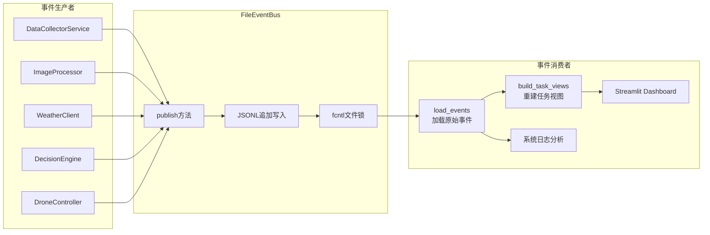
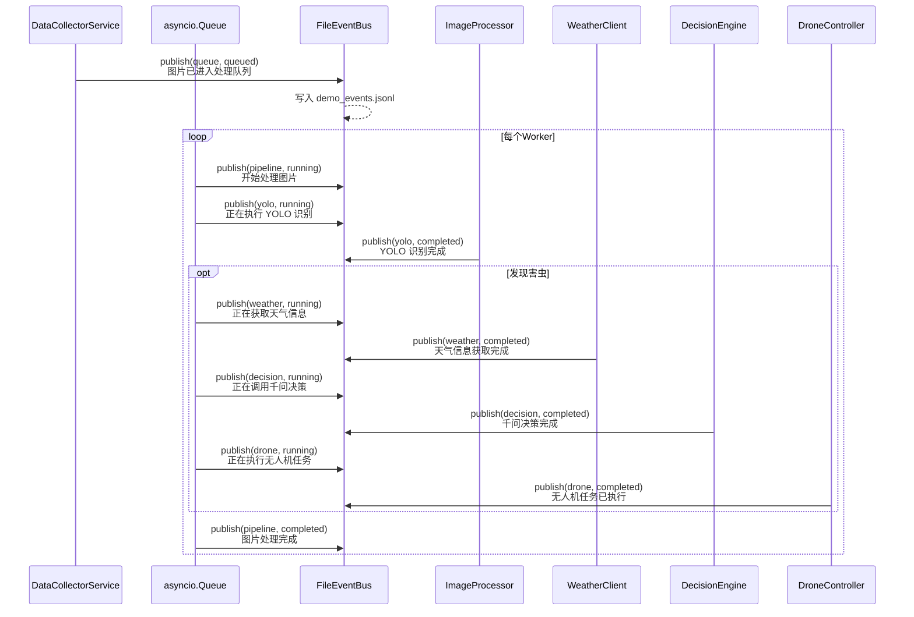

牧野系统通过**事件溯源架构**实现完整的状态追踪能力——每个业务操作都会生成不可变的事件记录，系统通过事件流重建任务状态，而非依赖易失的内存状态。这种设计使系统能够精确回溯每个请求的处理过程、调试异常场景，并为 Streamlit 演示面板提供实时数据源。

## 事件总线核心设计

系统的日志基础设施围绕 `FileEventBus` 类构建，它采用 **JSONL (JSON Lines)** 格式存储事件流。每个事件作为独立的一行 JSON 对象写入文件，这种追加写入模式保证了高性能和原子性，同时支持并发访问时的文件锁保护。



事件发布接口采用**关键字参数设计**，强制调用方显式声明每个字段：

```python
def publish(
    self,
    *,
    request_id: str,
    stage: str,
    status: str,
    message: str,
    payload: dict[str, Any] | None = None,
) -> dict[str, Any]:
```

每次调用会自动生成唯一的 `event_id` 和 UTC 时间戳，确保事件可追溯且全局唯一。`stage` 参数标识处理阶段（如 `queue`、`yolo`、`weather`、`decision`、`drone`），`status` 描述执行状态（`queued`、`running`、`completed`、`error`），`payload` 携带阶段特定的业务数据。

Sources: [event_bus.py](modules/event_bus.py#L1-L60)

## 事件结构与存储机制

单个事件的完整结构包含六个核心字段，以下是一个完整的 YOLO 识别完成事件示例：

```json
{
  "event_id": "a1b2c3d4e5f6g7h8",
  "timestamp": "2025-01-15T10:23:45.123456+00:00",
  "request_id": "f47ac10b58cc4372a56027b4c8d6ef09",
  "stage": "yolo",
  "status": "completed",
  "message": "YOLO 识别完成",
  "payload": {
    "image_path": "data/images/20250115-102345.jpg",
    "detections": [
      {"pest_type": "aphid", "confidence": 0.92, "position": {"x1": 120, "y1": 80, "x2": 280, "y2": 200}},
      {"pest_type": "aphid", "confidence": 0.87, "position": {"x1": 350, "y1": 150, "x2": 480, "y2": 280}}
    ]
  }
}
```

**文件锁机制**通过 `fcntl.flock()` 实现跨进程互斥——写入时使用排他锁（`LOCK_EX`），读取时使用共享锁（`LOCK_SH`），避免并发写入导致的数据损坏。事件文件默认存储在 `data/logs/demo_events.jsonl`，路径由 `EVENTS_FILE` 常量定义，测试环境可注入自定义路径。

Sources: [event_bus.py](modules/event_bus.py#L22-L46)

## 任务视图重建算法

`build_task_views()` 函数实现了**事件流聚合逻辑**，将扁平的事件序列转换为结构化的任务视图。该算法以 `request_id` 为分组键，按时间顺序遍历所有事件，逐步填充任务状态：

| 阶段 | payload 关键字段 | 任务视图更新 |
|------|-----------------|-------------|
| queue | image_path, filename | 初始化任务记录，设置 image_path |
| yolo | detections | 更新 detections 列表 |
| weather | weather | 更新 weather 对象 |
| decision | decision | 更新 decision 对象 |
| drone | 经纬度、高度等 | 更新 drone 状态 |

算法维护两个数据结构：`tasks` 字典存储以 `request_id` 为键的任务视图，`order` 列表记录任务首次出现的顺序。每个任务视图包含以下字段：

```python
{
    "request_id": "f47ac10b...",
    "created_at": "2025-01-15T10:23:44.000000+00:00",
    "updated_at": "2025-01-15T10:23:47.500000+00:00",
    "current_stage": "drone",
    "status": "completed",
    "message": "无人机任务已执行",
    "image_path": "data/images/20250115-102345.jpg",
    "detections": [...],
    "weather": {...},
    "decision": {...},
    "drone": {...},
    "events": [...],  # 原始事件列表，用于日志展示
    "error": None
}
```

最终返回的任务列表按**时间倒序排列**（最新任务在前），使 Streamlit 面板能优先展示最新状态。

Sources: [event_bus.py](modules/event_bus.py#L62-L139)

## 处理流水线集成

`MuyeApplication` 类将事件总线深度集成到图像处理流水线的每个环节。从图片入队开始，系统就为每个请求分配唯一的 `request_id`，并在整个生命周期中追踪状态变化：



**请求生命周期**从 `enqueue_image()` 方法开始，该方法在将图片放入队列的同时发布 `queue` 阶段的 `queued` 状态事件。Worker 线程从队列取出任务后，依次调用 `_process_image()` 内的各处理模块，每个模块执行前后都会发布相应阶段的事件。

Sources: [main.py](main.py#L260-L320)

## Streamlit 实时监控面板

Streamlit 应用通过 **自动刷新机制** 实现准实时监控。`render_dashboard()` 函数每 5 秒调用 `load_events(limit=500)` 加载最近 500 条事件，然后通过 `build_task_views()` 重建任务视图：

```python
count = st_autorefresh(interval=5000, limit=20, key="dashboard_refresh")
events = load_events(limit=500)
tasks = build_task_views(events)
latest_task = tasks[0] if tasks else None
```

面板顶部 Hero 区域展示四个关键指标：当前请求 ID（截取前 8 位）、当前阶段、任务状态、事件总数。中部左右分栏显示原始图片和 YOLO 标注后的结果图片。下方展示害虫识别摘要、天气信息、千问决策建议以及无人机航线地图。

**日志滚动窗口**通过 `render_log_box()` 函数渲染，它提取每个事件的 `timestamp`、`stage`、`status`、`message` 字段，拼接成单行日志格式，显示最近 80 条记录。使用 `<script>` 标签自动滚动到底部，确保运维人员始终看到最新日志：

```javascript
const box = document.getElementById("logbox");
if (box) {
  box.scrollTop = box.scrollHeight;
}
```

Sources: [app.py](app.py#L604-L640)

## 系统日志与事件日志的分工

牧野系统维护两套互补的日志系统，职责明确分离：

| 维度 | 事件日志 | 系统日志 |
|------|---------------------------|---------------------|
| 存储位置 | data/logs/demo_events.jsonl | data/logs/system.log |
| 结构化程度 | 高 | 低 |
| 主要用途 | 状态追踪、面板展示 | 运维调试、错误排查 |
| 保留策略 | 持久化 | 滚动覆盖（5 × 2MB） |
| 消费者 | Streamlit 面板、状态重建 API | 开发者、运维脚本 |

系统日志通过 `build_logger()` 函数创建，使用 `RotatingFileHandler` 实现日志轮转——单个文件最大 2MB，保留 5 个备份。`log_event()` 辅助函数提供结构化日志格式，将关键字段序列化为 `key=value` 对：

```python
# 日志输出示例：
# 2025-01-15 10:23:45 | muye | INFO | 无人机图像采集完成 | request_id=f47ac10b client_ip=127.0.0.1 duration_ms=152.34 image_path=data/images/20250115-102345.jpg simulate=True
```

Sources: [common.py](modules/common.py#L44-L102)

## 错误处理与异常追踪

当任意阶段发生异常时，系统发布 `status="error"` 事件，并在 payload 中记录错误详情。`build_task_views()` 算法检测到错误状态后，会将错误信息提升到任务视图的顶层 `error` 字段，使 Streamlit 面板能够突出显示失败任务：

```python
# 在 build_task_views() 中的错误提取逻辑
if event.get("status") == "error":
    task["error"] = payload.get("error") or event.get("message")
```

各个处理模块在捕获异常后，会同时调用 `log_event()` 记录到系统日志，并通过事件总线发布错误事件，确保双重可追溯性。例如 `DataCollectorService.capture_image()` 方法在采集失败时：

```python
except Exception as exc:
    log_event(
        self.logger,
        logging.ERROR,
        "无人机图像采集失败",
        request_id=request_id,
        client_ip=self.client_ip,
        duration_ms=(time.perf_counter() - started) * 1000,
        error=str(exc),
    )
    raise CollectorError(str(exc)) from exc
```

Sources: [data_collector.py](modules/data_collector.py#L130-L150)

## 测试策略与验证方法

事件总线单元测试覆盖了核心发布-订阅流程和边界条件。`test_file_event_bus_publishes_and_loads_events()` 验证多阶段事件的正确存储和任务视图重建，`test_file_event_bus_clear()` 验证事件清空功能。测试使用 `tmp_path` fixture 创建临时目录，确保测试隔离：

```python
def test_file_event_bus_publishes_and_loads_events(tmp_path) -> None:
    bus = FileEventBus(tmp_path / "events.jsonl")
    bus.publish(
        request_id="req-1",
        stage="queue",
        status="queued",
        message="图片已进入处理队列",
        payload={"image_path": "/tmp/a.jpg"},
    )
    bus.publish(
        request_id="req-1",
        stage="yolo",
        status="completed",
        message="YOLO 完成",
        payload={"detections": [{"pest_type": "aphid", "confidence": 0.88}]},
    )

    events = load_events(tmp_path / "events.jsonl")
    tasks = build_task_views(events)

    assert len(events) == 2
    assert tasks[0]["request_id"] == "req-1"
    assert tasks[0]["image_path"] == "/tmp/a.jpg"
    assert tasks[0]["detections"][0]["pest_type"] == "aphid"
```

Sources: [test_event_bus.py](tests/test_event_bus.py#L1-L45)

## 相关主题

要了解事件总线如何与整体架构协作，请参阅 [异步任务流与事件总线](6-yi-bu-ren-wu-liu-yu-shi-jian-zong-xian)。状态追踪依赖的各个处理阶段详见 [YOLO害虫识别流程](9-yolohai-chong-shi-bie-liu-cheng)、[和风天气数据接入](11-he-feng-tian-qi-shu-ju-jie-ru)、[千问AI决策引擎](12-qian-wen-aijue-ce-yin-qing)。完整面板实现参见 [Streamlit演示面板](20-streamlityan-shi-mian-ban)。