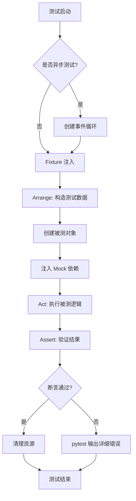
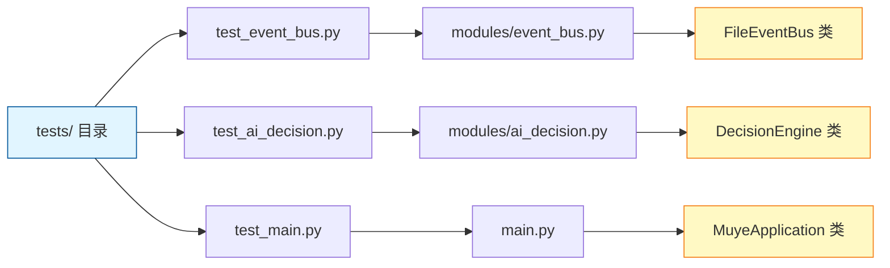

本项目采用 **pytest** 作为核心测试框架，结合 **pytest-asyncio** 扩展实现异步代码的测试支持。整体测试架构设计遵循 **模块化隔离原则**，每个测试文件对应一个业务模块，通过 fixture 机制、mock 策略和临时文件系统隔离，确保测试的独立性与可靠性。框架重点覆盖事件总线、异步决策引擎、HTTP 服务交互等关键路径，为系统的持续迭代提供质量保障。

Sources: [requirements.txt](requirements.txt#L13-L14)

## 测试框架技术栈

项目测试体系建立在两个核心依赖之上：**pytest 8.2.0+** 提供测试运行器、断言机制和丰富的 fixture 系统；**pytest-asyncio 0.23.7+** 则扩展了异步函数测试能力，使 `async def` 测试函数能够正确执行。这种组合既保持了 pytest 简洁优雅的测试风格，又完整支持项目中的异步代码路径。

Sources: [requirements.txt](requirements.txt#L13-L14)

## 测试文件组织结构

测试代码位于 `tests/` 目录，严格遵循 **一对一映射原则**：每个测试文件 `test_<module>.py` 对应 `modules/<module>.py`。当前测试覆盖包括事件总线、AI 决策引擎、YOLO API、虚拟无人机等核心模块，形成完整的模块级测试矩阵。

| 测试文件 | 目标模块 | 测试类型 | 关键测试点 |
|---------|---------|---------|-----------|
| test_event_bus.py | event_bus.py | 同步测试 | 事件发布、加载、清空 |
| test_ai_decision.py | ai_decision.py | 异步测试 | 决策生成、Schema 修复、HTTP Mock |
| test_main.py | main.py | 同步测试 | URL 构建、环境变量解析、应用初始化 |
| test_local_yolo_api.py | local_yolo_api.py | 异步测试 | 目标检测 API 调用 |
| test_virtual_drone_api.py | virtual_drone_api.py | 异步测试 | 虚拟无人机指令执行 |
| test_image_processor.py | image_processor.py | 同步测试 | 图像处理逻辑 |
| test_weather_integration.py | weather_integration.py | 异步测试 | 天气数据获取 |

Sources: [tests/test_event_bus.py](tests/test_event_bus.py#L1-L45), [tests/test_main.py](tests/test_main.py#L1-L31), [tests/test_ai_decision.py](tests/test_ai_decision.py#L1-L286)

## 核心测试模式

### 同步函数测试模式

同步测试采用最简洁的函数定义形式，直接构建被测对象、执行操作并使用 `assert` 语句验证结果。以事件总线测试为例，测试函数通过 `tmp_path` fixture 获取临时目录，构建独立的 `FileEventBus` 实例，确保测试间完全隔离。测试验证了事件发布、JSONL 格式持久化、任务视图构建等核心功能链路。

```python
def test_file_event_bus_publishes_and_loads_events(tmp_path) -> None:
    bus = FileEventBus(tmp_path / "events.jsonl")
    bus.publish(request_id="req-1", stage="queue", status="queued", ...)
    events = load_events(tmp_path / "events.jsonl")
    assert len(events) == 2
    assert tasks[0]["detections"][0]["pest_type"] == "aphid"
```

这种模式的优势在于 **零样板代码**，测试逻辑一目了然，pytest 的断言重写机制会在失败时提供详细上下文信息。

Sources: [tests/test_event_bus.py](tests/test_event_bus.py#L6-L27)

### 异步函数测试模式

异步测试通过 `@pytest.mark.asyncio` 装饰器标记，pytest-asyncio 会自动管理事件循环，使 `await` 调用在测试中正常运行。AI 决策引擎测试展示了复杂的异步测试场景：通过 `httpx.MockTransport` 注入自定义请求处理器，模拟 Qwen API 响应，验证决策生成流程的 JSON Schema 解析、天气数据融合、地理围栏计算等综合逻辑。

```python
@pytest.mark.asyncio
async def test_ai_decision_generates_valid_schema() -> None:
    def handler(request: httpx.Request) -> httpx.Response:
        return httpx.Response(200, json={"choices": [...]})
    
    engine = DecisionEngine(..., transport=httpx.MockTransport(handler))
    result = await engine.generate_decision(...)
    assert result["decision"]["用药"]["农药名称"] == "吡虫啉"
```

异步测试的关键是资源清理：通过 `try/finally` 确保 `await engine.close()` 释放 HTTP 连接，避免测试间资源泄漏。

Sources: [tests/test_ai_decision.py](tests/test_ai_decision.py#L95-L166)

### Mock 与依赖隔离策略

测试框架采用多层次 Mock 策略，确保测试的 **确定性** 和 **隔离性**：

1. **Stub 对象替换依赖**：`StubWeatherClient` 实现最小化的天气客户端接口，返回固定天气数据，避免测试依赖外部 API。

2. **HTTP Mock 传输层**：`httpx.MockTransport` 在传输层拦截 HTTP 请求，根据请求路径返回预设响应，完全模拟真实 API 行为。

3. **环境变量控制**：通过 `monkeypatch.setenv()` 修改环境变量，测试配置读取逻辑，测试后自动恢复环境状态。

4. **临时文件系统**：`tmp_path` fixture 提供隔离的临时目录，测试文件操作后自动清理，避免测试污染。

Sources: [tests/test_ai_decision.py](tests/test_ai_decision.py#L9-L21), [tests/test_main.py](tests/test_main.py#L22-L31)

## 测试用例结构分析

典型的测试用例遵循 **Arrange-Act-Assert (AAA) 模式**，清晰分离准备、执行、验证三个阶段。以下流程图展示了完整测试生命周期：



以 `test_ai_decision_repairs_invalid_schema_with_fallback` 测试为例，该用例验证 AI 决策引擎的 **容错机制**：当 Qwen API 返回不完整的 JSON Schema 时，引擎应触发 fallback 逻辑，使用默认决策模板补全缺失字段。测试通过 Mock 传输层返回不完整响应，验证系统在异常输入下的健壮性。

Sources: [tests/test_ai_decision.py](tests/test_ai_decision.py#L202-L286)

## Fixture 机制深度应用

pytest 的 fixture 机制是测试框架的核心能力，本项目充分利用了 **内置 fixture** 和 **自定义 fixture** 两类资源：

**tmp_path fixture**：提供测试隔离的临时目录，在测试结束时自动清理。事件总线测试中，`tmp_path / "events.jsonl"` 作为事件存储路径，确保每个测试拥有独立的文件空间，避免并发测试的文件冲突。

**monkeypatch fixture**：动态修改系统环境，用于测试配置逻辑。在 `test_main_reads_qwen_mock_flag` 中，`monkeypatch.setenv("QWEN_USE_MOCK", "true")` 模拟真实环境配置，验证应用初始化逻辑正确读取环境变量，测试后自动恢复原值。

Sources: [tests/test_event_bus.py](tests/test_event_bus.py#L6), [tests/test_main.py](tests/test_main.py#L22-L31)

## 断言与错误验证

框架采用 **结构化断言策略**，验证多个层次的系统行为：

1. **值断言**：验证运算结果、配置解析、URL 构建等确定逻辑，如 `assert detect_url == "http://127.0.0.1:8010/detect"`。

2. **状态断言**：验证对象状态变化，如 `assert app.decision_engine.use_mock is True`。

3. **数据结构断言**：验证复杂数据的特定字段，支持链式访问如 `assert result["decision"]["用药"]["农药名称"] == "吡虫啉"`。

4. **副作用验证**：验证文件写入、事件发布等副作用，如 `assert load_events(target) == []` 验证清空操作。

pytest 的断言重写机制会在断言失败时自动提取中间变量值，输出详细错误上下文，大幅降低调试成本。

Sources: [tests/test_main.py](tests/test_main.py#L10-L20), [tests/test_ai_decision.py](tests/test_ai_decision.py#L162-L166)

## 测试命名与可读性规范

测试函数命名遵循 **test_<功能描述>_<场景条件>** 模式，从名称即可推断测试意图：

- `test_file_event_bus_publishes_and_loads_events`：测试事件发布与加载完整性
- `test_ai_decision_repairs_invalid_schema_with_fallback`：测试 Schema 修复的容错逻辑
- `test_main_reads_qwen_mock_flag`：测试环境变量读取行为

命名中融入被测方法名、业务场景、边界条件等关键信息，测试代码即文档，降低维护成本。测试函数添加 `-> None` 类型标注，提升代码静态分析能力。

Sources: [tests/test_event_bus.py](tests/test_event_bus.py#L6), [tests/test_ai_decision.py](tests/test_ai_decision.py#L95)

## 测试覆盖范围与架构辅助

当前测试框架覆盖了系统核心路径：事件总线的消息传递、AI 决策的异步交互、主程序的初始化流程。测试设计遵循 **模块边界测试原则**，每个测试文件聚焦单一模块的公共接口，不依赖其他模块的具体实现，确保测试的稳定性和可维护性。

测试与架构的关系通过以下概念图展示：



这种模块级测试为重构和扩展提供了安全网，任何破坏性变更都会触发测试失败，早期捕获缺陷。

Sources: [tests/](tests/) 目录结构

## 测试实践建议

基于项目现有测试模式，以下实践值得推广：

1. **资源清理优先**：所有异步测试使用 `try/finally` 确保 `await close()`，避免资源泄漏导致的测试脆弱性。

2. **Mock 策略显式化**：通过 `transport=httpx.MockTransport(handler)` 显式注入 Mock 对象，避免全局 Mock 导致测试耦合。

3. **边界条件覆盖**：测试完整的正常路径和异常路径，如无效 Schema 的 fallback、空事件列表的清空操作。

4. **类型标注一致**：测试函数添加 `-> None` 返回类型，配合 `from __future__ import annotations` 确保类型提示一致性。

Sources: [tests/test_ai_decision.py](tests/test_ai_decision.py#L95-L166), [tests/test_event_bus.py](tests/test_event_bus.py#L41-L45)

## 扩展学习路径

单元测试框架作为质量保障的基础层，建议接下来了解：

- **[集成测试与端到端测试](23-ji-cheng-ce-shi-yu-duan-dao-duan-ce-shi)**：多模块协作的集成测试策略与全链路验证
- **[异步任务流与事件总线](6-yi-bu-ren-wu-liu-yu-shi-jian-zong-xian)**：深入理解被测模块的异步架构设计
- **[模块化设计与职责划分](7-mo-kuai-hua-she-ji-yu-zhi-ze-hua-fen)**：理解模块边界，合理设计测试范围