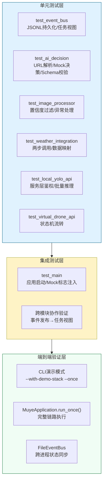
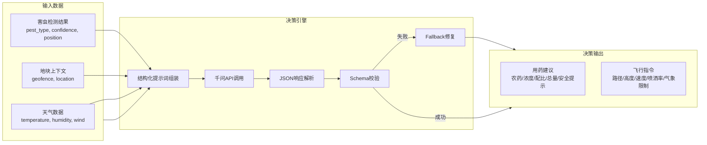

牧野系统采用分层测试策略验证从图像采集到无人机喷洒执行的完整数据流。测试体系以 `httpx.MockTransport` 为核心隔离外部依赖，通过 `pytest-asyncio` 支持异步场景验证，确保各模块在独立单元测试与集成场景下的行为一致性。

## 测试架构总览

项目的测试金字塔遵循"单元测试优先、集成测试聚焦关键路径"的原则。单元测试覆盖每个模块的核心业务逻辑（如置信度过滤、Schema校验、状态流转），而集成测试则验证跨模块协作与事件总线的状态传播。系统未引入端到端自动化测试框架，而是通过 `MuyeApplication` 的 `run_once` 模式与 `--with-demo-stack` 参数实现手动端到端演示验证。



Sources: [test_main.py](tests/test_main.py#L1-L31) [test_event_bus.py](tests/test_event_bus.py#L1-L45) [requirements.txt](requirements.txt#L13-L14)

## Mock策略与测试隔离

项目采用 **依赖注入模式** 与 **HTTP Mock Transport** 双重策略实现测试隔离。所有外部服务调用（千问API、和风天气API、YOLO API、无人机API）均通过 `httpx.AsyncClient` 的 `transport` 参数注入模拟响应，避免真实网络请求的同时保持完整的请求-响应契约验证。

### HTTP Mock Transport 模式

各模块在构造函数中暴露 `transport: httpx.AsyncBaseTransport | None = None` 参数，测试代码通过 `httpx.MockTransport(handler)` 注入自定义响应逻辑。Handler 函数接收 `httpx.Request` 对象，可断言请求路径、参数、头部与请求体，返回预设的 `httpx.Response`。

| 模块 | Mock Transport 使用场景 | 关键验证点 |
|------|------------------------|-----------|
| `ImageProcessor` | 模拟YOLO API返回检测结果 | 置信度过滤、位置坐标转换 |
| `WeatherClient` | 模拟和风天气两步调用流程 | Location ID查询、天气数据映射 |
| `DecisionEngine` | 模拟千问API返回JSON决策 | Schema校验、Fallback修复机制 |
| `DroneController` | 模拟虚拟无人机API任务提交 | 气象/围栏校验、任务状态轮询 |

```python
# 典型 Mock Transport 使用示例
def handler(request: httpx.Request) -> httpx.Response:
    if request.url.path.endswith("/v2/city/lookup"):
        assert request.url.params["location"] == "上海"
        return httpx.Response(200, json={"code": "200", "location": [{"id": "101020100"}]})
    return httpx.Response(200, json={"code": "200", "now": {...}})

client = WeatherClient(
    geo_api_url="https://geoapi.qweather.com/v2/city/lookup",
    weather_api_url="https://devapi.qweather.com/v7/weather/now",
    api_key="weather-key",
    transport=httpx.MockTransport(handler),  # 注入Mock
)
```

Sources: [test_image_processor.py](tests/test_image_processor.py#L14-L41) [test_weather_integration.py](tests/test_weather_integration.py#L46-L82) [test_ai_decision.py](tests/test_ai_decision.py#L80-L127) [modules/weather_integration.py](modules/weather_integration.py#L78-L82)

## 事件总线集成测试

`FileEventBus` 作为跨进程通信的核心组件，其集成测试验证了从事件发布到任务视图构建的完整数据流。测试使用 `tmp_path` fixture 创建隔离的临时文件系统，避免污染生产环境的事件日志。

### 事件持久化与任务视图构建

`test_file_event_bus_publishes_and_loads_events` 测试用例覆盖了三个关键场景：**多阶段事件发布**（queue → yolo）、**JSONL格式持久化**（每行一个JSON对象）、**任务视图聚合**（按 `request_id` 分组并提取最新状态）。`build_task_views` 函数将扁平的事件流转换为以任务为中心的结构化视图，供Streamlit面板消费。

```python
# 事件发布与任务视图构建流程
bus = FileEventBus(tmp_path / "events.jsonl")
bus.publish(request_id="req-1", stage="queue", status="queued", 
            message="图片已进入处理队列", payload={"image_path": "/tmp/a.jpg"})
bus.publish(request_id="req-1", stage="yolo", status="completed",
            message="YOLO 完成", payload={"detections": [...]})

events = load_events(tmp_path / "events.jsonl")
tasks = build_task_views(events)  # 按request_id聚合

assert tasks[0]["request_id"] == "req-1"
assert tasks[0]["detections"][0]["pest_type"] == "aphid"
```

### 并发安全机制

`FileEventBus` 使用 `fcntl.flock` 实现文件锁，确保多进程并发写入时不丢失事件或损坏文件。写入时获取排他锁（`LOCK_EX`），读取时获取共享锁（`LOCK_SH`），避免读写冲突。

Sources: [test_event_bus.py](tests/test_event_bus.py#L6-L44) [modules/event_bus.py](modules/event_bus.py#L42-L54) [modules/event_bus.py](modules/event_bus.py#L81-L138)

## 决策引擎Schema校验集成测试

`test_ai_decision_generates_valid_schema` 测试用例验证了 **完整决策流程**：构造害虫检测结果与地块上下文 → 注入Mock天气客户端 → 调用 `generate_decision` → 断言返回结构符合 `DECISION_SCHEMA`。该测试覆盖了千问API调用、响应解析、Schema校验、天气数据注入等多个环节的协作。

### JSON Schema 强制约束

`DECISION_SCHEMA` 定义了决策结果的完整结构规范，包含 **用药建议**（农药名称、浓度、配比、总量、安全提示）与 **飞行指令**（路径、高度、速度、喷洒速率、覆盖区域、气象限制）两大必填字段。Schema使用 `jsonschema.validate` 进行运行时校验，确保AI输出符合无人机执行接口的预期格式。



### 异常场景Fallback机制

`test_ai_decision_repairs_invalid_schema_with_fallback` 验证了当千问API返回不完整JSON时的修复逻辑。`DecisionEngine` 会尝试补全缺失的必填字段，确保最终输出始终符合Schema约束，避免下游无人机控制器因数据缺失而崩溃。

Sources: [test_ai_decision.py](tests/test_ai_decision.py#L79-L157) [test_ai_decision.py](tests/test_ai_decision.py#L159-L219) [modules/ai_decision.py](modules/ai_decision.py#L17-L88)

## 主应用集成测试

`test_main_reads_qwen_mock_flag` 是项目中少有的 **应用级集成测试**，其实例化完整的 `MuyeApplication` 对象，验证环境变量 `QWEN_USE_MOCK` 是否正确注入到 `DecisionEngine.use_mock` 属性。该测试覆盖了从配置加载到依赖注入的全链路。

### MuyeApplication 依赖图谱

`MuyeApplication` 在构造函数中完成所有依赖的初始化：从环境变量读取API地址与密钥 → 加载JSON/YAML配置文件 → 创建 `FileEventBus` 实例 → 初始化 `ImageProcessor`、`WeatherClient`、`DecisionEngine`、`DroneController` 等组件。测试通过 `monkeypatch.setenv` 注入环境变量，验证配置优先级逻辑。

```python
def test_main_reads_qwen_mock_flag(monkeypatch) -> None:
    monkeypatch.setenv("QWEN_USE_MOCK", "true")
    app = MuyeApplication()  # 实例化完整应用
    try:
        assert app.decision_engine.use_mock is True
    finally:
        asyncio.run(app.shutdown())  # 清理资源
    os.environ.pop("QWEN_USE_MOCK", None)
```

Sources: [test_main.py](tests/test_main.py#L21-L30) [main.py](main.py#L197-L278)

## 端到端演示验证流程

项目未实现自动化端到端测试，而是提供 **CLI演示模式** 进行手动验证。通过 `python main.py --with-demo-stack --once` 命令，系统会在单进程内启动 **本地YOLO API**（EmbeddedYoloApiRunner）与 **虚拟无人机API**（EmbeddedDroneApiRunner），然后执行一次完整的图像采集→识别→决策→执行流程。

### 一键演示架构

`EmbeddedYoloApiRunner` 与 `EmbeddedDroneApiRunner` 使用 `uvicorn.Server` 在后台异步任务中启动FastAPI服务，主流程通过 `httpx.AsyncClient` 以HTTP方式调用这些内嵌服务，模拟真实的分布式部署场景。服务启动后进行健康检查轮询（`_wait_until_ready`），确保API就绪后再开始处理流程。

| 演示模式参数 | 启动的内嵌服务 | 验证场景 |
|--------------|----------------|----------|
| `--with-yolo-api` | 本地YOLO API (8010端口) | YOLO推理服务集成 |
| `--with-virtual-drone-api` | 虚拟无人机API (9010端口) | 任务提交与状态轮询 |
| `--with-demo-stack` | 上述两者 | 完整端到端流程 |
| `--once` | - | 单次执行后退出 |

```python
# EmbeddedYoloApiRunner 启动流程
async def start(self) -> None:
    app = create_local_yolo_app(settings=self.settings, logger=self.logger)
    config = uvicorn.Config(app=app, host=self.settings.host, port=self.settings.port)
    server = uvicorn.Server(config)
    server.install_signal_handlers = lambda: None  # 禁用信号处理
    self.server_task = asyncio.create_task(server.serve())
    await self._wait_until_ready()  # 健康检查轮询
```

Sources: [main.py](main.py#L48-L121) [main.py](main.py#L493-L530) [README.md](README.md#L177-L189)

## 测试执行与运行时配置

项目使用 `pytest` 作为测试运行器，通过 `pytest-asyncio` 插件支持异步测试标记（`@pytest.mark.asyncio`）。测试依赖包括 `httpx`（HTTP客户端与Mock）、`pytest`（测试框架）、`pytest-asyncio`（异步支持），均已声明在 `requirements.txt` 中。

### 异步测试执行

所有异步测试函数均被 `@pytest.mark.asyncio` 装饰器标记，pytest会在事件循环中执行这些协程。测试代码需显式调用 `await client.close()` 或 `await engine.close()` 清理资源，避免资源泄漏警告。

```bash
# 执行所有测试
pytest tests/

# 执行特定模块测试
pytest tests/test_ai_decision.py -v

# 执行端到端演示
python main.py --with-demo-stack --once --timeout 120
```

Sources: [requirements.txt](requirements.txt#L13-L14) [tests/test_ai_decision.py](tests/test_ai_decision.py#L79) [README.md](README.md#L184-L189)

## 跨模块协作验证要点

集成测试的核心价值在于验证 **模块间契约** 的稳定性。牧野系统定义了以下关键协作接口：

1. **害虫检测结果格式**：`ImageProcessor.detect_pests` 返回 `list[dict]`，每个元素包含 `pest_type`、`confidence`、`position` 字段，`DecisionEngine.generate_decision` 依赖此格式构造提示词。

2. **天气数据格式**：`WeatherClient.fetch_current_weather` 返回包含 `temperature`、`humidity`、`wind_speed`、`wind_scale` 等字段的字典，`DroneController.validate_decision` 使用 `wind_speed` 校验气象限制。

3. **决策输出格式**：`DecisionEngine.generate_decision` 返回包含 `用药` 与 `指令` 键的字典，`DroneController.execute_spray_mission` 从中提取飞行路径与喷洒参数。

4. **事件总线契约**：每个阶段发布的事件需包含 `request_id`、`stage`、`status`、`message`、`payload` 字段，`build_task_views` 函数依赖这些字段聚合作业视图。

Sources: [main.py](main.py#L387-L443) [modules/ai_decision.py](modules/ai_decision.py#L17-L88) [modules/drone_controller.py](modules/drone_controller.py#L40-L99)

## 后续阅读建议

- 了解各模块单元测试详情，请参阅 [单元测试框架](22-dan-yuan-ce-shi-kuang-jia)
- 深入理解异步任务编排机制，请参阅 [异步任务流与事件总线](6-yi-bu-ren-wu-liu-yu-shi-jian-zong-xian)
- 查看完整系统架构设计，请参阅 [系统架构设计](5-xi-tong-jia-gou-she-ji)
- 了解演示模式启动参数，请参阅 [运行模式与演示流程](4-yun-xing-mo-shi-yu-yan-shi-liu-cheng)