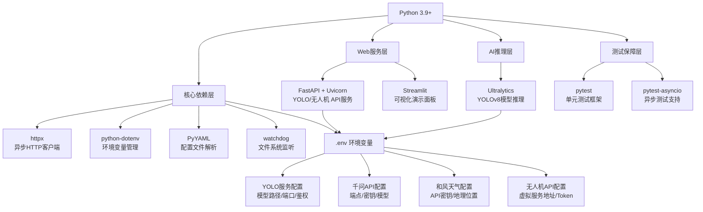
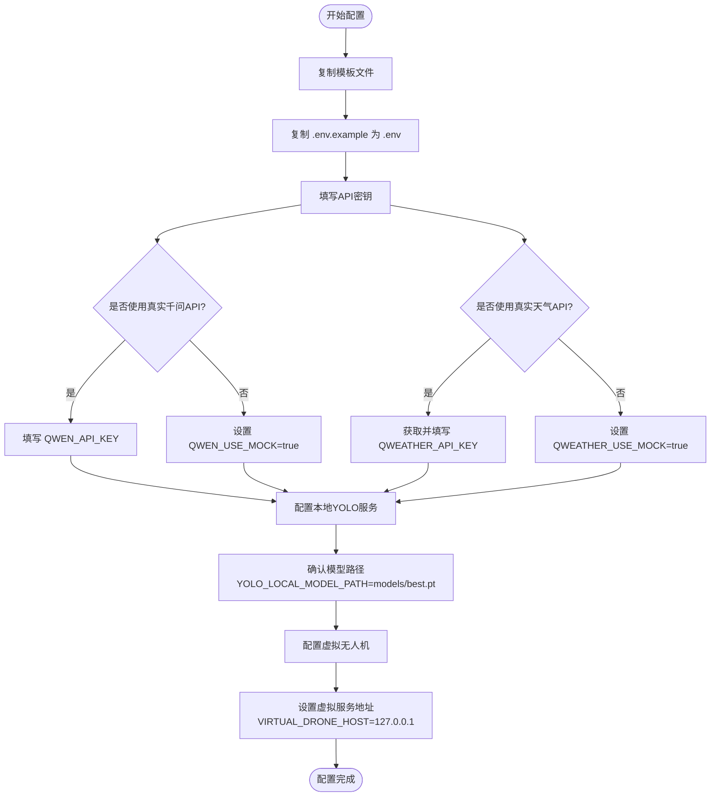

本文档将指导您从零开始搭建牧野智能农业害虫防治系统的运行环境，涵盖Python依赖安装、环境变量配置、模型文件准备等关键步骤。按照本指南完成配置后，您将能够启动系统的完整功能链路。

## 系统架构概览

牧野系统的环境配置采用**分层依赖管理**策略，将核心运行时库、Web框架、AI推理引擎和测试工具清晰分离，确保开发者可以按需安装。下方的架构图展示了各组件之间的依赖关系和配置流向：



Sources: [requirements.txt](requirements.txt#L1-L14), [.env.example](.env.example#L1-L33)

## 环境要求与依赖安装

### Python版本与核心依赖

牧野系统要求**Python 3.9或更高版本**，以满足Ultralytics的现代语法需求和异步资源管理特性。所有依赖包均已在`requirements.txt`中明确定义，并设置了最低版本号以保障接口稳定性。

下表列出了系统所需的核心依赖包及其功能定位：

| 依赖包 | 最低版本 | 功能分类 | 用途说明 |
|--------|----------|----------|----------|
| **httpx** | 0.27.0 | 网络通信 | 异步HTTP客户端，用于调用YOLO API、千问API、和风天气API等外部服务 |
| **PyYAML** | 6.0.1 | 配置管理 | 解析`yolo_config.yaml`等YAML格式配置文件 |
| **python-dotenv** | 1.0.1 | 环境管理 | 从`.env`文件加载环境变量，实现配置与代码分离 |
| **watchdog** | 4.0.0 | 文件监听 | 实时监控`data/images/`目录，检测无人机新采集的图片 |
| **jsonschema** | 4.22.0 | 数据校验 | 验证千问AI返回的JSON决策结构是否符合预期格式 |
| **FastAPI** | 0.115.0 | Web框架 | 构建本地YOLO API和虚拟无人机API的RESTful服务 |
| **Uvicorn** | 0.30.0 | ASGI服务器 | 运行FastAPI应用，支持高并发异步请求处理 |
| **Ultralytics** | 8.3.0 | AI推理 | 加载YOLOv8模型进行害虫识别推理 |
| **Streamlit** | 1.44.0 | 可视化 | 提供Web界面用于图片上传、识别结果展示和任务监控 |
| **pytest** | 8.2.0 | 测试框架 | 运行单元测试验证各模块功能正确性 |
| **pytest-asyncio** | 0.23.7 | 异步测试 | 支持测试异步函数和协程 |

Sources: [requirements.txt](requirements.txt#L1-L14)

### 一键安装依赖

使用以下命令在项目根目录下安装所有依赖：

```bash
cd E:\software\AAATools\MyRepos\muye
pip install -r requirements.txt
```

安装完成后，可通过以下命令验证关键模块是否安装成功：

```bash
python -c "import ultralytics; import fastapi; import streamlit; print('依赖验证通过')"
```

若输出`依赖验证通过`，说明核心库已正确安装。如果遇到网络问题导致安装缓慢，建议使用国内镜像源：

```bash
pip install -r requirements.txt -i https://pypi.tuna.tsinghua.edu.cn/simple
```

Sources: [README.md](README.md#L95-L99)

## 环境变量配置流程

### 配置文件创建与初始化

牧野系统采用**环境变量分层注入**机制，通过`.env`文件管理敏感配置项，避免将API密钥等敏感信息硬编码到源代码中。配置流程分为三个核心步骤，如下图所示：



首先，从项目提供的模板文件创建实际配置文件：

```bash
copy .env.example .env
```

使用文本编辑器打开`.env`文件，根据实际使用场景填写相应的API密钥和服务地址。

Sources: [.env.example](.env.example#L1-L33), [README.md](README.md#L102-L133)

### YOLO害虫识别服务配置

本地YOLO API服务需要配置**模型文件路径、服务端口、访问鉴权**等关键参数。以下是YOLO相关环境变量的详细说明：

| 环境变量 | 默认值 | 说明 |
|----------|--------|------|
| `YOLO_API_URL` | `http://127.0.0.1:8010/detect` | YOLO推理服务的检测接口地址 |
| `YOLO_API_KEY` | `muye-local-yolo-token` | 访问YOLO API的Bearer Token，需与本地服务保持一致 |
| `YOLO_CONFIDENCE_THRESHOLD` | `0.25` | 检测置信度阈值，低于此值的结果将被过滤 |
| `YOLO_LOCAL_MODEL_PATH` | `models/best.pt` | 本地YOLO模型文件的相对路径 |
| `YOLO_LOCAL_HOST` | `127.0.0.1` | 本地YOLO API监听地址 |
| `YOLO_LOCAL_PORT` | `8010` | 本地YOLO API监听端口 |
| `YOLO_ALLOWED_IPS` | `127.0.0.1,::1` | 允许访问YOLO API的IP白名单，逗号分隔 |
| `YOLO_RATE_LIMIT_PER_MINUTE` | `120` | 每分钟请求频率限制 |

**关键配置要点**：
1. **模型文件准备**：将训练好的YOLOv8权重文件命名为`best.pt`并放置到`models/`目录下，确保路径与`YOLO_LOCAL_MODEL_PATH`一致。
2. **端口冲突检查**：确认`8010`端口未被其他服务占用，可通过命令`netstat -ano | findstr :8010`检查端口状态。
3. **IP白名单配置**：在开发环境建议保持默认的本地回环地址，生产环境需添加实际客户端IP地址。

Sources: [.env.example](.env.example#L1-L8), [README.md](README.md#L114-L117)

### 千问AI决策引擎配置

千问API用于根据害虫检测结果和天气数据生成喷洒决策，支持**真实API调用**和**本地模拟模式**两种运行方式：

| 环境变量 | 默认值 | 说明 |
|----------|--------|------|
| `QWEN_API_URL` | `https://your-qwen-compatible-endpoint/v1/chat/completions` | 千问API的对话补全端点地址 |
| `QWEN_API_KEY` | - | 千问API访问密钥，从阿里云控制台获取 |
| `QWEN_MODEL` | `qwen-max` | 使用的模型名称，可选`qwen-max`、`qwen-plus`等 |
| `QWEN_USE_MOCK` | `false` | 是否启用模拟模式，`true`时返回假数据用于开发调试 |

**模拟模式使用场景**：当`QWEN_USE_MOCK=true`时，系统将跳过千问API调用，直接返回固定格式的决策结果，适用于网络受限环境或快速功能验证。初学者建议先开启模拟模式完成环境验证，再切换到真实API。

Sources: [.env.example](.env.example#L10-L13)

### 和风天气数据接入配置

和风天气API提供实况气象数据，系统采用**两步调用**方式：先查询城市Location ID，再获取具体天气信息。

| 环境变量 | 默认值 | 说明 |
|----------|--------|------|
| `QWEATHER_API_KEY` | - | 和风天气开发者API Key，从控制台获取 |
| `QWEATHER_GEO_URL` | `https://api.qweather.com/geo/v2/city/lookup` | 城市地理位置查询接口 |
| `QWEATHER_WEATHER_URL` | `https://api.qweather.com/v7/weather/now` | 实况天气查询接口 |
| `QWEATHER_USE_MOCK` | `false` | 是否启用天气模拟模式 |
| `QWEATHER_MOCK_TEMPERATURE` | `26` | 模拟模式的温度值（摄氏度） |
| `QWEATHER_MOCK_HUMIDITY` | `58` | 模拟模式的湿度值（百分比） |
| `QWEATHER_MOCK_SUMMARY` | `多云` | 模拟模式的天气概况 |

**API Key获取步骤**：
1. 浏览器访问`https://console.qweather.com`，注册并登录开发者平台。
2. 在控制台创建新项目，选择"Web API"产品类型。
3. 复制生成的API Key，填写到`.env`文件的`QWEATHER_API_KEY`变量中。
4. 确保`drone_config.json`中的`field.weather_location`或`field.location.city`与实际查询城市一致（如"上海"）。

Sources: [.env.example](.env.example#L15-L26), [README.md](README.md#L119-L122)

### 虚拟无人机API配置

虚拟无人机服务模拟真实无人机的任务执行流程，包括排队、起飞、前往作业区、喷洒、返航等状态转换：

| 环境变量 | 默认值 | 说明 |
|----------|--------|------|
| `DRONE_API_URL` | `http://127.0.0.1:9010/missions` | 虚拟无人机任务创建接口地址 |
| `DRONE_API_KEY` | `virtual-drone-token` | 访问虚拟无人机API的Bearer Token |
| `VIRTUAL_DRONE_HOST` | `127.0.0.1` | 虚拟无人机服务监听地址 |
| `VIRTUAL_DRONE_PORT` | `9010` | 虚拟无人机服务监听端口 |
| `VIRTUAL_DRONE_ALLOWED_IPS` | `127.0.0.1,::1` | 允许访问虚拟无人机API的IP白名单 |
| `SERVICE_CLIENT_IP` | `127.0.0.1` | 主系统作为客户端的IP标识 |

**端口冲突检查**：虚拟无人机服务默认使用`9010`端口，需确保该端口未被占用。可通过命令`netstat -ano | findstr :9010`验证端口可用性。

Sources: [.env.example](.env.example#L28-L33)

## 项目配置文件详解

除环境变量外，系统还使用两个JSON/YAML格式的配置文件管理无人机飞行参数和YOLO推理设置。

### 无人机飞行配置

配置文件`config/drone_config.json`定义了监控参数、地块信息、飞行限制和网络策略，具体结构如下表：

| 配置节点 | 关键参数 | 说明 |
|----------|----------|------|
| **monitoring** | `capture_interval_hours` | 自动采图间隔（小时），默认24小时 |
| | `capture_on_startup` | 启动时是否立即采图，推荐`true`用于快速验证 |
| | `simulate_capture` | 是否生成模拟图片，`true`时创建空白JPEG用于联调 |
| **field** | `weather_location` | 地块所在城市名称，用于和风天气查询 |
| | `location.latitude/longitude` | 地块地理坐标，用于地理围栏计算 |
| | `geofence` | 飞行围栏多边形顶点坐标数组 |
| **flight_constraints** | `altitude_range_m` | 允许飞行高度范围（米） |
| | `max_safe_wind_speed_mps` | 最大安全风速（米/秒），超过此值禁止喷洒 |
| **execution** | `simulate_only` | `true`时只在本地模拟执行，不调用虚拟无人机API |

初学者建议保持`simulate_capture=true`和`simulate_only=true`，在无需真实硬件的情况下完成完整流程演示。

Sources: [config/drone_config.json](config/drone_config.json#L1-L39)

### YOLO推理服务配置

配置文件`config/yolo_config.yaml`管理本地YOLO服务的推理参数和运行设置：

| 参数名 | 默认值 | 说明 |
|--------|--------|------|
| `confidence_threshold` | `0.25` | 全局置信度阈值，低于此值的检测结果被过滤 |
| `timeout_seconds` | `20` | 单次推理超时时间（秒） |
| `batch_size` | `4` | 批量推理时最大图片数量 |
| `tensorrt_enabled` | `false` | 是否启用TensorRT加速，需NVIDIA GPU支持 |
| `local_api.host` | `127.0.0.1` | 本地YOLO服务监听地址 |
| `local_api.port` | `8010` | 本地YOLO服务监听端口 |
| `local_api.model_path` | `models/best.pt` | 模型文件路径，需与`.env`中保持一致 |
| `local_api.device` | `auto` | 推理设备选择，可选`cpu`、`cuda:0`、`auto` |

**设备选择建议**：若计算机配备NVIDIA GPU且安装了CUDA驱动，将`device`设为`cuda:0`可显著提升推理速度；否则保持`auto`让系统自动检测最优设备。

Sources: [config/yolo_config.yaml](config/yolo_config.yaml#L1-L13)

## 模型文件与目录准备

### 模型文件放置规范

YOLO害虫识别模型文件需要放置在`models/best.pt`路径下。系统启动时会自动检查该文件是否存在，若缺失将导致本地YOLO API无法启动。按照以下步骤准备模型文件：

1. **获取训练好的模型**：从项目维护者或模型仓库获取已训练的YOLOv8权重文件（`.pt`格式）。
2. **放置到指定目录**：将权重文件重命名为`best.pt`，复制到`models/`目录。
3. **验证路径正确性**：确认完整路径为`E:\software\AAATools\MyRepos\muye\models\best.pt`。

如果暂时没有训练好的模型，可以使用Ultralytics官方提供的预训练模型作为替代：

```bash
cd E:\software\AAATools\MyRepos\muye\models
python -c "from ultralytics import YOLO; YOLO('yolov8n.pt')"
```

上述命令会自动下载YOLOv8 Nano模型（约6MB），用于基础功能验证。

Sources: [README.md](README.md#L114-L117), [models/README.md](models/README.md)

### 运行时数据目录结构

系统运行时会在`data/`目录下自动创建日志和图像存储子目录，初学者无需手动创建：

```
data/
├── images/          # 无人机采集图片存储目录
│   └── YYYYMMDD-HHMMSS.jpg  # 按时间戳命名的图片文件
└── logs/            # 系统日志与事件总线文件
    └── events.jsonl # JSONL格式的事件流记录
```

**目录权限检查**：确保当前用户对`data/`目录拥有读写权限，可通过右键点击文件夹 → 属性 → 安全标签页查看和修改权限。

Sources: [README.md](README.md#L33-L40)

## 环境验证与常见问题

### 环境配置验证清单

完成以上配置后，使用以下清单逐一验证环境就绪状态：

| 检查项 | 验证命令 | 预期结果 |
|--------|----------|----------|
| 依赖包安装 | `pip list \| findstr ultralytics` | 显示版本号如`ultralytics 8.3.0` |
| 环境变量加载 | `python -c "import dotenv; print('OK')"` | 输出`OK` |
| 模型文件存在 | `dir models\best.pt` | 显示文件信息，无"找不到文件"错误 |
| 端口8010可用 | `netstat -ano \| findstr :8010` | 无输出表示端口空闲 |
| 端口9010可用 | `netstat -ano \| findstr :9010` | 无输出表示端口空闲 |
| .env文件存在 | `dir .env` | 显示文件信息 |

所有检查项通过后，即可进入下一步的[运行模式与演示流程](4-yun-xing-mo-shi-yu-yan-shi-liu-cheng)学习系统启动方法。

Sources: [requirements.txt](requirements.txt#L1-L14)

### 常见配置问题排查

以下是初学者在环境配置过程中可能遇到的典型问题及解决方案：

| 问题现象 | 可能原因 | 解决方案 |
|----------|----------|----------|
| `ModuleNotFoundError: No module named 'ultralytics'` | 依赖未正确安装 | 重新执行`pip install -r requirements.txt`，检查是否有报错信息 |
| `FileNotFoundError: models\best.pt` | 模型文件路径错误 | 检查`config/yolo_config.yaml`中的`model_path`配置，确认文件存在 |
| `ConnectionError: [Errno 10061]` | YOLO服务未启动 | 先运行`python yolo_api.py`启动本地YOLO API服务 |
| `OSError: [Errno 10048] Address already in use` | 端口被占用 | 修改`.env`中的`YOLO_LOCAL_PORT`为其他端口，如`8011` |
| `KeyError: 'QWEATHER_API_KEY'` | 环境变量未加载 | 确认`.env`文件位于项目根目录，且内容格式正确（无双引号包裹） |
| `PermissionError: [Errno 13]` | data目录无写入权限 | 右键`data`文件夹 → 属性 → 安全 → 编辑当前用户权限为"完全控制" |

遇到其他问题时，建议查阅系统日志文件`data/logs/events.jsonl`，其中记录了详细的错误信息和异常堆栈。

Sources: [README.md](README.md#L102-L133)

## 下一步学习建议

完成环境配置后，建议按照以下顺序深入学习系统的运行机制：

1. **[运行模式与演示流程](4-yun-xing-mo-shi-yu-yan-shi-liu-cheng)**：掌握一键启动命令和各服务的启动顺序，运行完整的害虫识别与决策链路。
2. **[系统架构设计](5-xi-tong-jia-gou-she-ji)**：理解系统的整体架构设计，包括异步任务流、模块化分层和数据传递机制。
3. **[本地YOLO API服务](10-ben-di-yolo-apifu-wu)**：深入了解YOLO服务的实现原理、鉴权机制和性能优化策略。

通过本页的系统化配置，您已为牧野智能农业害虫防治系统的完整功能演示奠定了坚实基础。