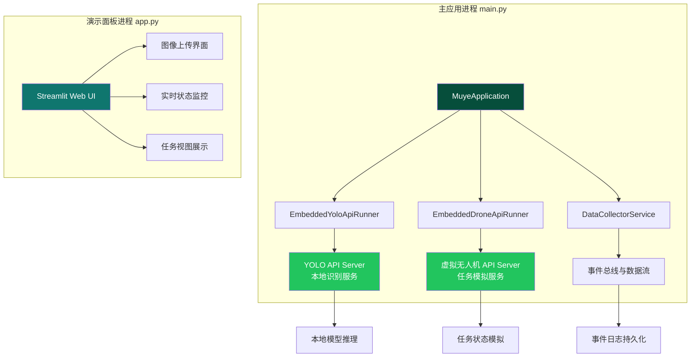
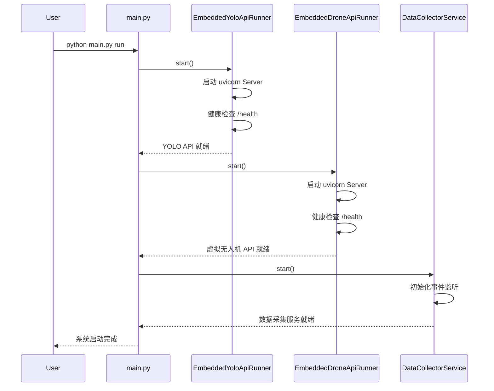
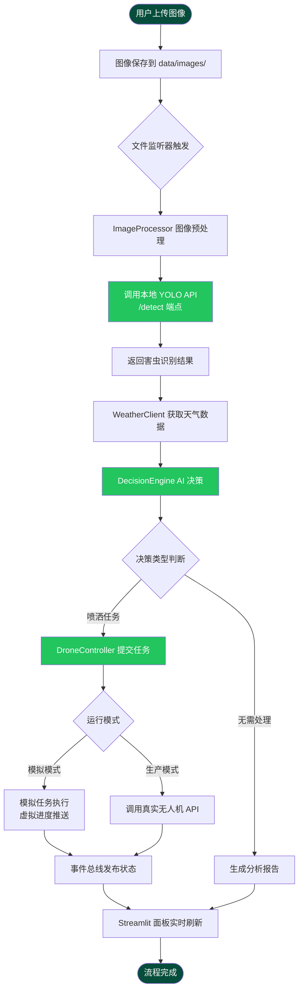

本文档详细阐述系统的运行模式架构与演示流程编排，帮助开发者理解如何在不同场景下启动和运行智慧农业害虫识别系统。系统支持**演示模式**与**生产模式**双轨运行，通过模块化的嵌入式服务架构实现灵活部署。

## 系统运行模式架构

系统采用**嵌入式微服务架构**，将核心服务（YOLO识别服务、虚拟无人机API）内嵌到主应用进程中运行，避免独立部署的复杂性。这种设计使得开发者能够通过单一命令启动完整系统，同时保持各模块的独立性和可测试性。

运行模式通过配置文件和环境变量进行区分，主要包含两种形态：**演示模式**侧重于可视化与交互体验，通过Streamlit面板提供完整的端到端流程演示；**生产模式**则面向实际部署场景，连接真实的无人机设备与外部API服务。

Sources: [main.py](main.py#L48-L121), [app.py](app.py#L1-L20)

## 启动流程详解

### 主应用启动流程

主应用启动过程遵循**依赖优先、渐进就绪**的原则，首先启动基础服务（YOLO API、虚拟无人机API），确保核心能力可用后再激活数据采集与决策引擎。整个启动过程采用异步健康检查机制，最长等待30秒确认服务就绪。

Sources: [main.py](main.py#L59-L88), [main.py](main.py#L133-L162)

### 演示面板启动流程

Streamlit演示面板独立运行，通过文件系统事件总线与主应用解耦通信。用户上传图像后，面板将图像保存到共享目录，主应用的文件监听器捕获变化后触发完整识别-决策-执行流程，结果通过事件总线写回文件系统，面板实时刷新展示状态更新。

| 启动方式 | 命令 | 服务端口 | 核心功能 |
|---------|------|---------|---------|
| 主应用 | `python main.py run` | YOLO:8001, Drone:8002 | 完整业务流程执行 |
| 演示面板 | `streamlit run app.py` | 8501 | 可视化交互与状态监控 |
| 后台服务 | `python main.py daemon` | 同主应用 | 守护进程模式运行 |

Sources: [main.py](main.py#L197-L200), [app.py](app.py#L19-L20)

## 演示流程编排

### 端到端演示流程

完整的演示流程模拟真实农业场景：用户通过界面上传农田图像 → 系统自动调用YOLO模型识别害虫 → 决策引擎根据识别结果与天气数据生成喷洒方案 → 虚拟无人机执行任务并实时反馈进度。整个流程通过事件总线串联，每个阶段的处理状态都会持久化到文件系统，确保流程可追溯、可中断恢复。

Sources: [modules/drone_controller.py](modules/drone_controller.py#L40-L73), [main.py](main.py#L1-L32)

### 模拟执行模式详解

在模拟模式下，DroneController 不连接真实无人机API，而是通过本地状态机生成虚拟任务进度。这种设计允许开发者在无硬件环境下完整验证业务逻辑，同时为演示场景提供稳定可靠的视觉反馈。

模拟执行将任务分解为四个阶段：**排队等待**（10%进度）、**起飞准备**（35%进度）、**喷洒作业**（75%进度）、**任务完成**（100%进度），每个阶段间隔0.25秒，模拟真实无人机的作业节奏。事件总线在每个阶段发布状态更新，Streamlit面板通过自动刷新机制捕获并渲染进度变化。

| 任务阶段 | 状态码 | 进度百分比 | 模拟延迟 |
|---------|-------|-----------|---------|
| 排队等待 | queued | 10% | 0.25s |
| 起飞准备 | takeoff | 35% | 0.25s |
| 喷洒作业 | spraying | 75% | 0.25s |
| 任务完成 | completed | 100% | 0.25s |

Sources: [modules/drone_controller.py](modules/drone_controller.py#L171-L200), [main.py](main.py#L48-L56)

## 配置控制与模式切换

### 运行模式配置项

系统的运行行为通过配置文件与环境变量双重控制。`config/drone_config.json` 中的 `execution.simulate_only` 字段决定无人机任务是否模拟执行；环境变量 `DRONE_API_URL` 与 `DRONE_API_KEY` 配置真实无人机API的连接信息，当这些变量为空时，系统自动降级到模拟模式。

这种设计实现了**配置驱动的模式切换**：演示环境无需配置外部依赖即可运行完整流程；生产环境只需注入正确的API凭证和端点地址，系统即可无缝切换到真实执行模式，无需修改代码或重新构建。

| 配置项 | 配置文件位置 | 环境变量 | 作用域 |
|-------|-------------|---------|-------|
| YOLO API 地址 | config/yolo_config.yaml | YOLO_API_URL | 图像识别服务 |
| 无人机 API 地址 | config/drone_config.json | DRONE_API_URL | 任务执行服务 |
| 模拟模式开关 | execution.simulate_only | - | 任务执行策略 |
| 天气 API 密钥 | - | QWEATHER_API_KEY | 天气数据获取 |

Sources: [modules/drone_controller.py](modules/drone_controller.py#L50-L73), [main.py](main.py#L14-L24)

### Streamlit 演示面板功能

Streamlit 演示面板提供**实时可视化监控**能力，通过文件系统事件总线与主应用解耦。面板左侧提供图像上传区域，用户拖拽或选择图像文件后，系统自动触发完整识别流程；面板右侧展示任务执行视图，以卡片形式呈现每个请求的阶段状态、处理时间、识别结果与决策详情。

面板采用**自动刷新机制**（通过 streamlit-autorefresh 组件），每秒轮询事件日志文件，捕获主应用发布的最新状态，实现近乎实时的进度更新。这种设计避免了前后端紧密耦合，演示面板可以独立启动、停止，不影响主应用的后台处理能力。

Sources: [app.py](app.py#L1-L20), [app.py](app.py#L118-L200)

## 下一步学习建议

完成运行模式理解后，建议按以下顺序深入探索系统架构：

- **[系统架构设计](5-xi-tong-jia-gou-she-ji)**：深入理解整体架构设计与模块分层
- **[异步任务流与事件总线](6-yi-bu-ren-wu-liu-yu-shi-jian-zong-xian)**：掌握事件驱动架构的实现细节
- **[Streamlit演示面板](20-streamlityan-shi-mian-ban)**：学习可视化界面的具体实现
- **[配置文件详解](17-pei-zhi-wen-jian-xiang-jie)**：了解完整的配置体系与参数说明