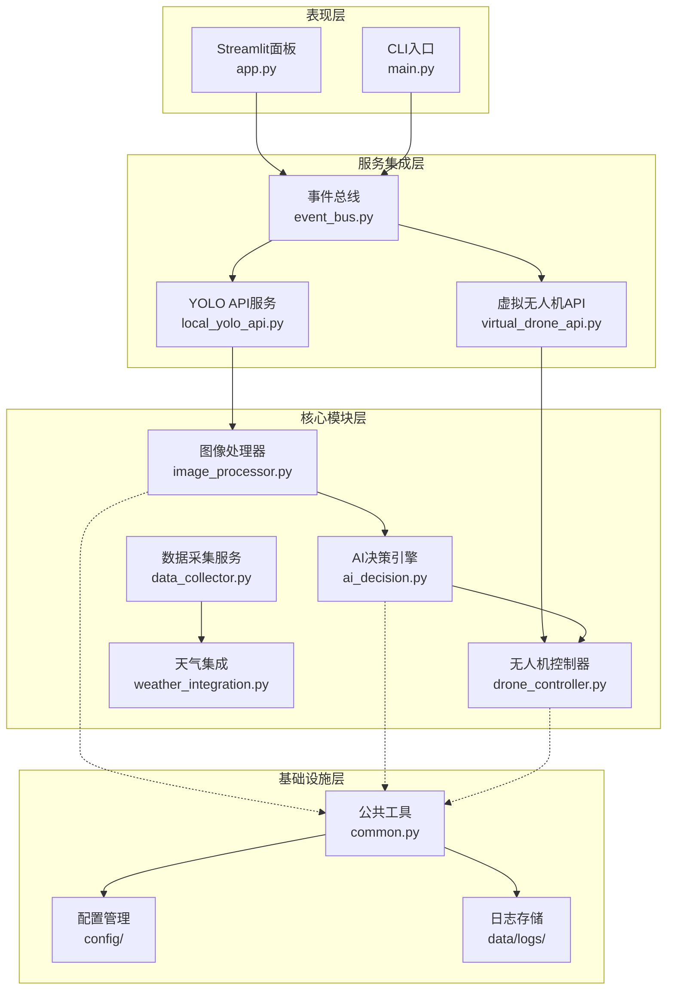
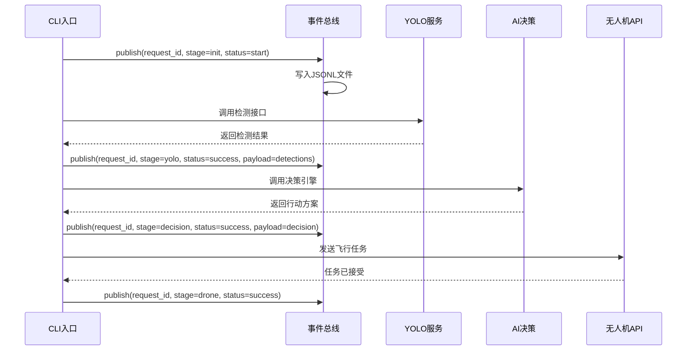
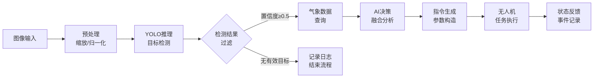

本页面向中级开发者深入解析 Muye 智能害虫监测系统的架构设计。系统采用**分层模块化架构**与**事件驱动模型**相结合的设计理念，通过内嵌微服务实现松耦合的功能解耦，支持异步任务处理与实时状态追踪。

## 整体架构层次

Muye 系统采用四层架构设计，从底层数据存储到上层应用服务逐层抽象，每层职责明确、边界清晰。**基础设施层**负责运行时环境初始化、配置加载与日志管理；**核心模块层**封装业务核心逻辑，包括图像处理、AI决策、无人机控制等独立模块；**服务集成层**通过内嵌API服务实现模块间的标准化通信；**应用表现层**提供Streamlit可视化面板与命令行交互入口。

核心架构特征体现在**异步任务编排**与**内嵌微服务模式**两个维度。`MuyeApplication`类通过asyncio协程管理多个并发任务，YOLO识别服务与虚拟无人机服务作为独立的uvicorn服务器在主进程内启动，通过HTTP协议实现服务间调用，既保证了模块边界清晰，又避免了多进程部署的复杂性。

Sources: [main.py](main.py#L122-L196), [app.py](app.py#L1-L50)

## 模块职责划分

系统核心功能被分解为八个独立模块，每个模块遵循单一职责原则，通过明确的接口协议协作。以下表格展示了各模块的核心职责与交互关系：

| 模块名称 | 核心职责 | 输入数据 | 输出数据 | 协作模块 |
|---------|---------|---------|---------|---------|
| **image_processor** | 图像预处理、YOLO推理调用、检测结果解析 | 原始图像路径 | 检测对象列表、置信度分数 | local_yolo_api |
| **ai_decision** | 千问大模型决策、多源数据融合、行动方案生成 | 检测结果、天气数据、地理信息 | 决策建议、行动指令 | weather_integration |
| **drone_controller** | 无人机指令构造、飞行参数校验、任务执行 | 决策指令、配置参数 | 任务ID、执行状态 | virtual_drone_api |
| **data_collector** | 定时任务调度、数据聚合、状态监控 | 配置时间间隔 | 聚合数据快照 | 所有业务模块 |
| **weather_integration** | 和风天气API调用、气象数据解析 | 地理位置、时间范围 | 温度、湿度、风力等气象参数 | ai_decision |
| **local_yolo_api** | YOLOv8模型加载、推理服务封装 | 图像二进制数据 | JSON格式检测结果 | image_processor |
| **virtual_drone_api** | 无人机行为模拟、状态机管理、任务队列 | 飞行指令 | 任务状态、虚拟位置 | drone_controller |
| **event_bus** | 事件持久化、任务视图构建、状态追踪 | 事件对象 | JSONL日志、任务列表 | 所有模块 |

模块间依赖通过`modules/common.py`提供的公共工具函数实现标准化，包括日志构建器`build_logger`、配置加载器`load_json/load_yaml`、运行时目录初始化`ensure_runtime_dirs`等基础设施能力，避免了重复代码与配置散落。

Sources: [modules/event_bus.py](modules/event_bus.py#L14-L85), [main.py](main.py#L1-L60)

## 事件驱动架构

系统采用**基于文件的事件总线**实现异步通信与状态追踪，所有业务流程状态变更通过事件对象持久化到`data/logs/demo_events.jsonl`文件。`FileEventBus`类提供事件发布与查询能力，每个事件包含唯一的`event_id`、关联的`request_id`、处理阶段`stage`、状态标识`status`以及可选的业务载荷`payload`。

事件总线的核心价值在于提供**端到端的任务追踪能力**，`build_task_views`函数将分散的事件按`request_id`聚合成任务视图对象，包含创建时间、当前阶段、处理状态、检测结果、天气数据、决策建议等完整信息链条。Streamlit面板通过轮询事件文件实现实时状态更新，无需额外的消息队列基础设施，降低了系统复杂度。

文件锁机制（`fcntl.flock`）确保多进程并发写入的安全性，采用排他锁（`LOCK_EX`）保护写操作，共享锁（`LOCK_SH`）优化读性能，这种设计在轻量级场景下比Redis等消息中间件更简洁高效。

Sources: [modules/event_bus.py](modules/event_bus.py#L87-L139)

## 内嵌微服务模式

Muye系统采用**内嵌微服务架构**，将YOLO推理服务与虚拟无人机服务作为独立的uvicorn服务器运行在主进程内，通过异步任务启动与健康检查实现服务编排。`EmbeddedYoloApiRunner`和`EmbeddedDroneApiRunner`两个类封装了服务生命周期管理，包括启动等待、健康检查、优雅停机等关键流程。

这种设计的优势在于：**开发环境零配置启动**，无需独立部署多个服务进程；**模块边界清晰**，服务间通过HTTP协议通信，保持API契约的稳定性；**资源隔离可控**，每个服务拥有独立的端口与配置，避免全局状态污染。代价是增加了启动时间（默认30秒超时等待）和内存占用，适合中小规模部署场景。

| 特性 | 内嵌模式 | 独立部署 |
|-----|---------|---------|
| 启动复杂度 | 单命令启动，自动编排 | 需手动启动多个进程 |
| 服务发现 | 固定端口，零配置 | 需配置注册中心或环境变量 |
| 故障隔离 | 进程内隔离，崩溃可能影响整体 | 进程级隔离，故障域更小 |
| 扩展能力 | 垂直扩展受限 | 可水平扩展，支持负载均衡 |
| 适用场景 | 开发测试、演示Demo、小规模生产 | 大规模生产、多租户环境 |

`_wait_until_ready`方法通过HTTP健康检查实现启动同步，采用指数退避重试策略（默认200毫秒间隔，30秒总超时），确保依赖服务完全就绪后再开始业务处理。服务停止时通过`should_exit`标志触发优雅停机，避免强制中断导致的资源泄漏。

Sources: [main.py](main.py#L64-L120), [main.py](main.py#L122-L183)

## 数据流向与处理管线

业务数据沿清晰的处理管线流动，从图像采集到无人机执行共经历六个关键阶段：**初始化**（参数解析、服务启动）→ **图像采集**（本地文件上传或模拟采集）→ **YOLO检测**（目标识别、置信度过滤）→ **天气获取**（气象数据查询、缓存优化）→ **AI决策**（多源数据融合、方案生成）→ **无人机执行**（指令校验、任务提交）。每个阶段的输出成为下一阶段的输入，形成完整的数据增值链。

`DataCollectorService`类实现定时采集调度，通过asyncio周期性触发完整处理管线，配置文件中可设置采集间隔、目标区域、模型参数等运行时参数。天气数据通过`WeatherClient`封装和风API调用，支持地理围栏内的气象条件实时获取，为AI决策提供环境上下文。AI决策引擎接收结构化的检测列表与气象数据，调用千问大模型生成包含防治建议、飞行参数、优先级的综合决策对象，最终由`DroneController`转换为符合无人机API规范的飞行指令。

关键设计决策是**将检测结果作为后续处理的门控条件**，当无有效害虫目标时提前终止流程，避免不必要的API调用与资源消耗。这种条件分支设计在`main.py`的主循环中通过状态判断实现，体现了务实高效的工程思维。

Sources: [main.py](main.py#L285-L400), [modules/data_collector.py](modules/data_collector.py#L1-L80)

## 配置管理与环境适配

系统采用**多层级配置加载策略**，从环境变量、JSON配置文件、YAML模型配置到代码内默认值，形成优先级明确的配置层次。`.env`文件通过`python-dotenv`加载，包含敏感凭据如API密钥、数据库连接串等；`config/drone_config.json`定义无人机硬件参数、飞行限制区域、默认航点等业务配置；`config/yolo_config.yaml`管理模型路径、推理参数、类别映射等AI相关配置。

`modules/common.py`中的`load_environment`函数在应用启动时统一初始化环境变量，`ensure_runtime_dirs`确保必需的运行时目录存在（images、logs等），`build_logger`提供标准化的日志记录器实例，包含请求ID追踪、JSON格式输出、文件轮转等企业级特性。这种集中式基础设施设计避免了每个模块重复实现配置解析、日志初始化等样板代码。

配置热更新通过文件监听机制实现（如Streamlit的自动重载），生产环境建议通过环境变量注入实现无重启更新，敏感信息如API密钥应通过环境变量或密钥管理服务传递，避免硬编码在配置文件中提交到版本控制。

Sources: [modules/common.py](modules/common.py#L1-L100), [config/drone_config.json](config/drone_config.json#L1-L50)

---

系统架构设计体现了**务实演进**的工程理念，在简洁性与扩展性间取得平衡。事件总线以文件存储替代消息队列降低了运维复杂度，内嵌微服务模式简化了开发环境配置，模块化边界为未来拆分为独立服务留出空间。建议读者继续阅读[异步任务流与事件总线](6-yi-bu-ren-wu-liu-yu-shi-jian-zong-xian)深入了解事件驱动细节，或查看[模块化设计与职责划分](7-mo-kuai-hua-she-ji-yu-zhi-ze-hua-fen)掌握各模块的具体实现。