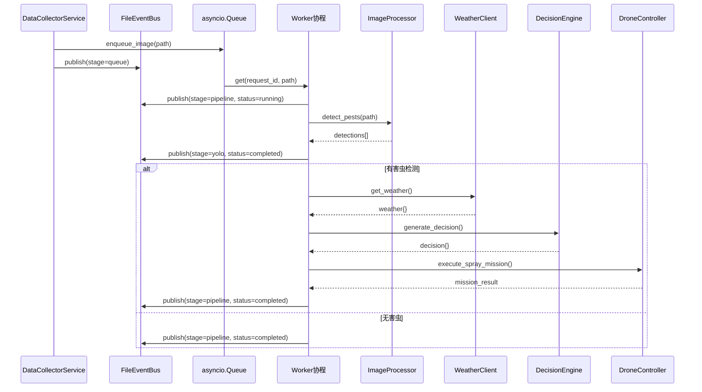

牧野系统采用**事件驱动架构**与**异步任务队列**相结合的设计模式，通过文件系统持久化事件流实现跨进程状态追踪，确保数据采集、害虫识别、天气查询、决策生成和无人机控制等环节的可靠执行与完整记录。事件总线作为系统的神经中枢，不仅解耦了模块间的依赖关系，还为 Streamlit 演示面板提供了实时状态数据源。

## 事件总线核心设计

**FileEventBus** 类实现了基于 JSONL 文件格式的事件持久化机制，采用文件锁（fcntl.flock）确保多进程并发写入的安全性。每个事件包含六个核心字段：event_id（全局唯一标识）、timestamp（UTC 时间戳）、request_id（请求链路标识）、stage（处理阶段）、status（执行状态）和 message（人类可读描述），payload 字段用于携带阶段相关的业务数据。

Sources: [event_bus.py](modules/event_bus.py#L17-L47)

事件持久化采用**追加写入**模式，避免文件重写带来的性能开销，配合文件锁实现原子性操作。publish 方法返回完整的事件字典，便于调用方进行日志记录或进一步处理。clear 方法通过文件截断（truncate）清空历史事件，适用于演示环境的重置场景。

Sources: [event_bus.py](modules/event_bus.py#L49-L54)

## 任务视图构建与状态聚合

**build_task_views** 函数实现了事件流到任务视图的转换逻辑，通过 request_id 将分散的事件聚合成完整的任务生命周期视图。该函数维护两个数据结构：tasks 字典存储按 request_id 索引的任务状态，order 列表记录任务创建的时间顺序，最终按最新优先原则返回任务列表。

Sources: [event_bus.py](modules/event_bus.py#L81-L138)

每个任务视图包含十一项状态字段：created_at（创建时间）、updated_at（最后更新时间）、current_stage（当前阶段）、status（当前状态）、message（最新消息）、image_path（图像路径）、detections（YOLO 检测结果）、weather（天气数据）、decision（AI 决策）、drone（无人机任务）和 events（完整事件列表）。错误信息通过 status="error" 的事件自动提取到 error 字段。

Sources: [event_bus.py](modules/event_bus.py#L88-L102)

**阶段特定的 payload 提取逻辑**确保业务数据正确归档：yolo 阶段提取 detections 数组、weather 阶段提取天气字典、decision 阶段提取决策结果、drone 阶段合并任务执行详情。这种设计使得单一事件流能够支撑多维度状态查询。

Sources: [event_bus.py](modules/event_bus.py#L118-L133)

| 处理阶段 | payload 关键字段 | 任务视图映射 | 业务含义 |
|---------|----------------|------------|---------|
| queue | image_path, filename | image_path | 图像入队记录 |
| yolo | detections | detections[] | 害虫检测结果 |
| weather | weather | weather{} | 实时天气数据 |
| decision | decision | decision{} | AI 喷洒决策 |
| drone | mission_id, waypoints | drone{} | 无人机任务执行 |
| pipeline | 综合数据 | 多字段更新 | 流程状态推进 |

## 异步任务队列架构

**MuyeApplication** 类构建了基于 asyncio.Queue 的生产者-消费者模式，主队列存储 (request_id, image_path) 元组，pending_images 集合防止重复入队。系统支持配置多个并发 worker 协程，每个 worker 通过 queue.get() 阻塞获取任务，处理完成后调用 queue.task_done() 释放信号。

Sources: [main.py](main.py#L210-L212)

**enqueue_image** 方法实现了智能入队逻辑：首先通过 _wait_until_ready 轮询等待文件写入完成（最多 10 次重试，每次间隔 0.2 秒），然后检查 pending_images 集合避免重复处理，最后生成 request_id 并发布 queue 阶段事件。该设计解决了文件监听与图像采集的竞态条件。

Sources: [main.py](main.py#L315-L350)

**worker 协程的异常隔离机制**确保单个任务失败不影响队列继续运行：_process_image 方法的所有异常被捕获并发布 error 状态事件，finally 块保证 pending_images 集合清理和 task_done() 调用。这种设计实现了故障隔离与资源释放的原子性保证。

Sources: [main.py](main.py#L361-L368)

## 事件驱动的处理流水线

**_process_image** 方法实现了完整的五阶段处理流程：pipeline（流程控制）、yolo（害虫识别）、weather（天气查询，仅当检测到害虫时触发）、decision（AI 决策生成）和 drone（无人机任务执行）。每个阶段的入口和出口都发布事件，形成完整的执行轨迹。

Sources: [main.py](main.py#L370-L474)

事件发布采用**声明式状态转换**模式：通过 stage 参数标识当前处理环节，status 参数表示执行状态（running/completed/error），message 参数提供人类可读的进度描述，payload 参数携带阶段特定的业务数据。这种设计使得事件流本身构成了完整的执行日志。

Sources: [main.py](main.py#L373-L398)

**条件分支的事件记录策略**体现了业务语义：当 YOLO 未检测到害虫时，流程提前结束并发布 "未发现超过阈值的害虫目标" 的 completed 事件，避免不必要的天气查询和决策生成。当检测到害虫时，通过 await 链式调用 weather_client、decision_engine 和 drone_controller，每个模块内部也通过 event_bus 发布子阶段事件。

Sources: [main.py](main.py#L399-L443)

## 并发安全与文件监听

**DataCollectorService** 采用 watchdog 库实现文件系统监听，_ImageCreatedHandler 在独立线程中捕获文件创建事件，通过 asyncio.run_coroutine_threadsafe 将回调调度到主事件循环。这种设计解决了 watchdog 线程与 asyncio 协程的跨线程协作问题。

Sources: [data_collector.py](modules/data_collector.py#L27-L70)

**文件就绪检测机制**防止处理不完整文件：_wait_until_ready 方法通过轮询文件大小判断写入是否完成，只有当文件大小连续两次相同且大于 0 时才认为文件就绪。该机制解决了大文件复制过程中的竞态条件，避免 YOLO API 接收到不完整的图像数据。

Sources: [main.py](main.py#L476-L490)

**双重入队保护策略**确保图像不被重复处理：pending_images 集合存储已入队的图像路径（resolve 后的绝对路径），在 enqueue_image 方法中检查集合成员资格，在 worker 的 finally 块中移除。该设计解决了文件监听回调与主动采集回调可能产生的重复入队问题。

Sources: [main.py](main.py#L328-L334)

## 测试验证与使用示例

单元测试验证了事件总线的核心功能：publish 方法成功写入事件，load_events 正确解析 JSONL 格式，build_task_views 准确聚合任务状态，clear 方法彻底清空事件文件。测试使用 tmp_path fixture 创建临时目录，避免污染生产环境的事件日志。

Sources: [test_event_bus.py](tests/test_event_bus.py#L6-L44)

**典型的事件发布模式**展示了 request_id 的链路追踪作用：同一个请求的多个阶段事件共享相同的 request_id，使得 build_task_views 能够重建完整的执行轨迹。payload 字段在每个阶段携带不同的业务数据，最终聚合到任务视图的对应字段中。

Sources: [test_event_bus.py](tests/test_event_bus.py#L8-L21)

## 架构优势与扩展性

**文件持久化的天然优势**在于跨进程共享与故障恢复：Streamlit 面板通过 load_events 读取最新状态，无需与主进程建立网络连接或共享内存；系统重启后可通过事件流重建历史任务状态，支持断点续处理和事后审计。JSONL 格式的追加写入特性也便于日志轮转和归档。

Sources: [event_bus.py](modules/event_bus.py#L57-L78)

**事件溯源模式**为系统提供了完整的状态变更历史：通过 events 字段存储完整事件列表，支持任意时刻的状态回放和问题诊断。这种设计也为未来引入事件回滚、时间旅行调试等高级功能奠定了基础。

Sources: [event_bus.py](modules/event_bus.py#L100-L112)

---

通过事件总线与异步队列的结合，牧野系统实现了**松耦合的模块协作**和**可追溯的执行流程**。下一节将深入探讨[模块化设计与职责划分](7-mo-kuai-hua-she-ji-yu-zhi-ze-hua-fen)，解析各功能模块的边界定义与接口契约。