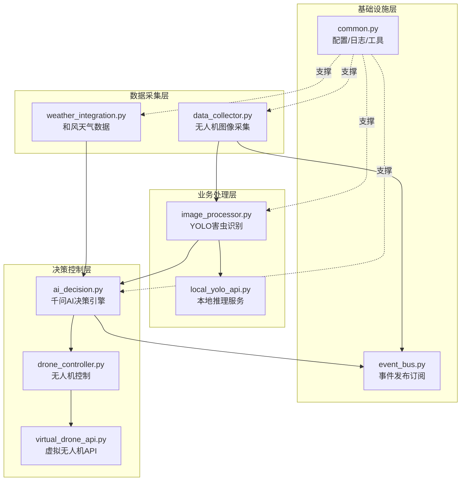
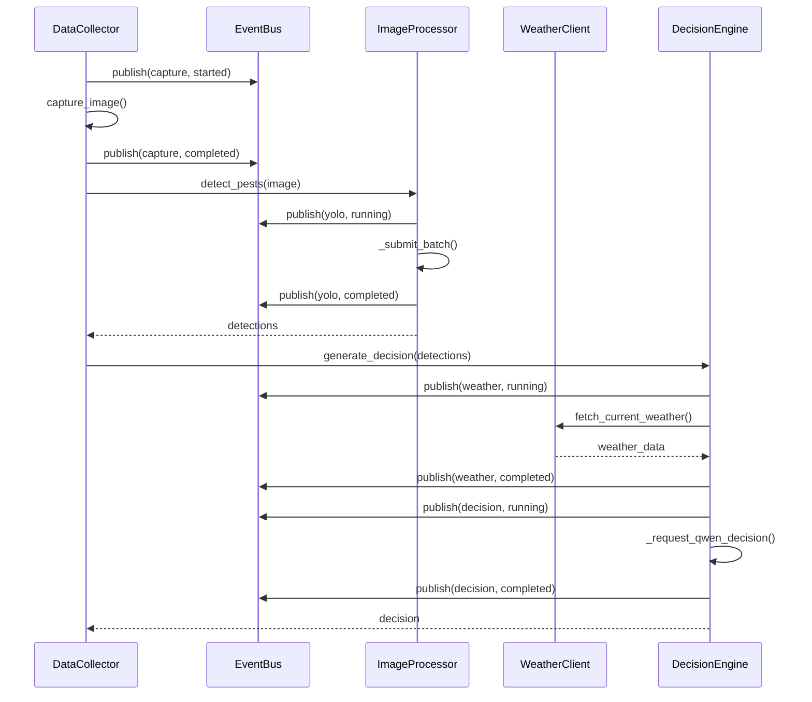

系统采用**六边形架构**思想构建，将核心业务逻辑与外部依赖解耦，通过模块化设计实现高内聚、低耦合的代码组织。每个模块遵循**单一职责原则**，拥有独立的错误处理、日志记录和生命周期管理，通过事件总线和依赖注入实现模块间协作。

## 架构分层与模块定位

系统按职责划分为四个层次：**基础设施层**提供通用能力支撑，**数据采集层**负责外部数据接入，**业务处理层**执行核心算法逻辑，**决策控制层**输出最终行动指令。这种分层设计使得各模块能够独立演进、测试和替换。

Sources: [common.py](modules/common.py#L1-L146), [event_bus.py](modules/event_bus.py#L1-L139), [data_collector.py](modules/data_collector.py#L1-L194), [image_processor.py](modules/image_processor.py#L1-L209), [local_yolo_api.py](modules/local_yolo_api.py#L1-L304), [weather_integration.py](modules/weather_integration.py#L1-L224), [ai_decision.py](modules/ai_decision.py#L1-L659)

## 基础设施层：通用能力抽象

基础设施层提供两大核心能力：**通用工具函数**和**事件发布订阅机制**。这一层不包含业务逻辑，而是为上层模块提供可复用的基础能力，确保整个系统具备统一的配置管理、日志格式和事件追踪机制。

### 通用工具模块设计

`common.py` 模块承担系统全局配置加载、运行时环境初始化、日志系统构建等基础职责。模块采用**函数式设计**而非类设计，所有函数均为纯函数或仅产生副作用的有状态函数，便于测试和组合使用。

模块定义了四个关键路径常量：`PROJECT_ROOT`、`CONFIG_DIR`、`DATA_DIR`、`IMAGES_DIR`、`LOGS_DIR`，通过 `Path` 对象实现跨平台路径处理。`ensure_runtime_dirs()` 函数在系统启动时自动创建所需目录结构，避免因目录缺失导致的运行时错误。

日志系统通过 `build_logger()` 构建，采用**双重输出策略**：文件处理器使用 `RotatingFileHandler` 实现日志轮转（最大 2MB，保留 5 个备份），流处理器输出到控制台。日志格式统一为 `时间戳 | 模块名 | 级别 | 消息`，便于后续日志分析工具解析。

`log_event()` 函数实现了**结构化日志输出**，将请求 ID、客户端 IP、执行时长、业务字段序列化为键值对格式，支持复杂数据结构的 JSON 序列化。这种设计使得日志既能被人阅读，也能被机器解析。

Sources: [common.py](modules/common.py#L1-L146)

### 事件总线机制

`event_bus.py` 实现基于文件的**事件溯源系统**，通过 JSONL（JSON Lines）格式追加写入事件记录，实现跨进程、跨重启的事件持久化。这种设计适合演示系统和单机部署场景，避免了引入 Redis 等外部消息队列的复杂性。

`FileEventBus` 类提供三个核心方法：`publish()` 发布事件并自动生成事件 ID 和时间戳，`clear()` 清空事件文件用于测试隔离，静态方法 `load_events()` 加载历史事件并支持数量限制。事件写入使用 `fcntl.flock()` 实现文件锁，确保多进程并发写入时的数据完整性。

`build_task_views()` 函数实现了**事件聚合逻辑**，将分散的事件记录按 `request_id` 聚合为任务视图对象。该函数遍历事件流，维护任务字典和顺序列表，根据事件阶段（`yolo`、`weather`、`decision`、`drone`）提取不同的载荷字段，构建包含完整任务生命周期的视图对象。这种设计使得前端能够高效展示任务状态，无需多次查询数据库。

Sources: [event_bus.py](modules/event_bus.py#L1-L139)

## 数据采集层：多源数据接入

数据采集层负责从物理世界获取两类关键数据：**无人机采集的图像**和**气象服务提供的天气信息**。这一层的模块设计注重**容错性**和**异步并发**，确保单一数据源失败不影响整体系统运行。

### 无人机图像采集服务

`data_collector.py` 模块实现双通道图像采集机制：**定时调度采集**和**文件系统监听**。`DataCollectorService` 类通过 `capture_interval_hours` 配置项设置采集间隔，启动时可选立即采集一次（`capture_on_startup`），之后通过 `asyncio.Event` 实现可中断的定时循环。

模块支持两种采集模式：**模拟采集**生成最小有效 JPEG 图片（通过 base64 解码内置字节数据），**真实采集**通过 HTTP 请求调用无人机 API。真实采集支持 GET 和 POST 方法，通过 `capture_method` 配置项切换。采集完成后主动触发回调函数 `on_new_image()`，避免文件监听可能存在的竞态条件。

文件监听通过 `_ImageCreatedHandler` 类实现，继承 `watchdog.FileSystemEventHandler`，在新图片创建时通过 `asyncio.run_coroutine_threadsafe()` 将同步回调转为异步任务。这种设计解决了 watchdog 线程与 asyncio 事件循环的桥接问题，同时通过 `future.add_done_callback()` 捕获异步异常，防止异常被吞噬。

Sources: [data_collector.py](modules/data_collector.py#L1-L194)

### 和风天气数据集成

`weather_integration.py` 模块封装和风天气 API 的两阶段调用流程：**地理位置查询**和**实况天气获取**。`WeatherClient` 类首先通过 `geo_api_url` 将地点名称（如"北京"）转换为和风天气的位置 ID，再通过 `weather_api_url` 获取实况天气数据。

模块实现了**多层容错机制**：API Key 缺失时抛出明确错误，地点查询失败时解析响应 code 并提示，响应数据缺失必要字段时中断处理。`_normalize_weather_payload()` 方法将和风天气的原始响应转换为系统内部统一格式，包含温度、湿度、天气现象、风向、风力等级和风速。

风力等级解析通过 `_parse_wind_scale()` 方法处理"3-4"这样的区间格式，取区间上限作为系统判断依据。风速通过 `_wind_scale_to_speed_mps()` 方法根据风力等级换算为米/秒，使用蒲福风级表的典型风速范围，为无人机飞行安全决策提供数据支撑。

模块还支持**模拟模式**（`use_mock=True`），通过配置文件提供模拟天气数据，用于无网络环境或演示场景。模拟数据同样需要经过字段完整性校验，确保测试环境与生产环境的一致性。

Sources: [weather_integration.py](modules/weather_integration.py#L1-L224)

## 业务处理层：核心算法执行

业务处理层承载系统的核心计算任务：**基于 YOLO 的害虫识别**。这一层采用**服务-客户端分离架构**，`image_processor.py` 作为客户端封装业务逻辑，`local_yolo_api.py` 作为服务端提供推理能力，两者通过 HTTP 协议解耦，支持独立部署和水平扩展。

### YOLO 图像处理客户端

`image_processor.py` 模块通过 `ImageProcessor` 类封装 YOLO API 调用，提供单图检测（`detect_pests()`）和批量检测（`detect_pests_batch()`）两种接口。批量检测通过 `chunked()` 工具函数将图片列表按 `batch_size` 分块，避免单次请求过大导致超时或内存溢出。

模块实现了**多格式响应适配**：`_normalize_payload()` 方法处理 YOLO API 可能返回的三种格式（包含 `results` 字段、直接返回列表、包含 `detections` 字段），通过 `_resolve_image_key()` 方法匹配图片路径，确保批处理结果的顺序正确性。

检测结果通过 `_validate_detections()` 方法进行**字段标准化**：支持 `pest_type`/`label`/`class_name`/`name` 四种害虫名称字段，支持 `confidence`/`score`/`conf` 三种置信度字段，支持 `position`/`bbox`/`box` 三种位置字段。位置格式通过 `_normalize_position()` 方法统一转换为 `x1, y1, x2, y2` 坐标系，支持 `x, y, w, h` 格式的自动转换。

Sources: [image_processor.py](modules/image_processor.py#L1-L209)

### 本地 YOLO 推理服务

`local_yolo_api.py` 模块提供基于 FastAPI 的本地推理服务，通过 `LocalYoloApiService` 类封装 Ultralytics YOLO 模型的加载和推理。模块采用**协议抽象**（`PredictorProtocol`），使得测试环境可以注入模拟预测器，避免依赖真实模型文件。

服务启动时通过 `LocalYoloSettings` 数据类加载配置，包括主机地址、端口、模型路径、设备类型（CPU/GPU）、API Key、IP 白名单、速率限制和批处理上限。`InMemoryRateLimiter` 类实现基于滑动窗口的速率限制，使用 `deque` 记录请求时间戳，超过 `rate_limit_per_minute` 时返回 HTTP 429 错误。

推理过程通过 `threading.Lock()` 实现串行化，避免 GPU 资源竞争。上传的图片通过 `tempfile.TemporaryDirectory()` 保存到临时目录，推理完成后自动清理。`UltralyticsPredictor` 类封装 YOLO 模型的 `predict()` 方法，将原始结果转换为标准格式，提取类别名称、置信度和边界框坐标。

服务端通过 `detect()` 方法接收 multipart/form-data 格式的图片上传，自动解析请求 ID 和客户端 IP，调用预测器执行推理并返回包含模型路径和检测结果的结构化响应。

Sources: [local_yolo_api.py](modules/local_yolo_api.py#L1-L304)

## 决策控制层：智能决策生成

决策控制层是系统的**大脑**，通过 `ai_decision.py` 模块实现多源数据融合和决策生成。该模块编排天气数据获取、千问 AI 决策生成、结果校验和指令输出完整流程，体现了**编排者模式**的应用。

### 千问 AI 决策引擎

`DecisionEngine` 类接收害虫检测结果、农田上下文配置和天气数据，通过千问 API 生成包含用药建议和飞行指令的结构化决策。模块定义了严格的 JSON Schema（`DECISION_SCHEMA`），规定决策结果必须包含 `用药` 和 `指令` 两个一级字段，每个字段包含多个必需子字段。

用药建议包含农药名称、浓度、配比、总量和安全提示数组；飞行指令包含飞行路径（坐标数组）、高度、速度、喷洒速率、覆盖区域（GeoJSON Polygon）和气象限制（风速、温度、湿度阈值）。这种设计确保决策结果能够被下游无人机控制系统直接执行。

模块实现了**两阶段数据融合**：首先通过 `WeatherClient` 获取实时天气数据并发布到事件总线，然后通过 `build_structured_input_text()` 方法将害虫检测结果、天气数据和农田配置格式化为结构化文本，作为千问 API 的输入。

千问 API 调用通过 `_request_qwen_decision()` 方法实现，支持模拟模式（`use_mock=True`）返回预设决策。真实调用时，通过 HTTP POST 请求发送结构化输入，解析响应中的 `content` 字段，去除代码围栏（`strip_code_fence()`），解析 JSON 并通过 `validate()` 方法校验 Schema 合规性。

决策生成完成后，通过 `_validate_weather_constraints()` 方法校验当前天气是否满足决策中的气象限制，若风速、温度或湿度超限则抛出 `DecisionEngineError`，阻止无人机执行危险任务。

Sources: [ai_decision.py](modules/ai_decision.py#L1-L659)

## 模块职责对比与设计模式

各模块在设计上遵循统一的模式，但在职责边界和依赖关系上各有侧重。下表对比了核心模块的设计特征：

| 模块 | 核心职责 | 设计模式 | 异步策略 | 错误处理 | 可测试性 |
|------|---------|---------|---------|---------|---------|
| **common.py** | 基础设施 | 工具函数集 | 同步函数 | 返回值/异常 | 高（纯函数） |
| **event_bus.py** | 事件溯源 | 发布-订阅 | 同步文件 IO | 文件锁保护 | 中（依赖文件系统） |
| **data_collector.py** | 图像采集 | 观察者模式 | 异步+线程池 | 自定义异常 | 高（依赖注入） |
| **image_processor.py** | YOLO 客户端 | 适配器模式 | 异步 HTTP | 自定义异常 | 高（Transport 注入） |
| **local_yolo_api.py** | YOLO 服务端 | 服务层模式 | 异步 FastAPI | HTTPException | 高（Protocol 抽象） |
| **weather_integration.py** | 天气集成 | 外观模式 | 异步 HTTP | 自定义异常 | 高（模拟模式） |
| **ai_decision.py** | 决策编排 | 编排者模式 | 异步链式调用 | Schema 校验 | 高（依赖注入） |

### 依赖注入与可测试性设计

所有业务模块采用**构造函数注入**模式，通过参数接收外部依赖（如 `httpx.AsyncClient` 的 `transport` 参数、`logger` 对象、`event_bus` 实例）。这种设计使得测试环境可以注入模拟对象，避免真实网络请求和文件系统操作。

例如，`ImageProcessor` 类通过 `transport` 参数支持 `httpx.MockTransport`，使得测试无需启动真实 YOLO 服务；`DecisionEngine` 类通过 `weather_client` 参数注入 `WeatherClient` 实例，可以在测试中注入返回预设天气数据的模拟客户端；`DataCollectorService` 类通过 `on_new_image` 参数注入回调函数，可以在测试中验证回调是否被正确触发。

模块还通过**自定义异常类**实现错误隔离：每个模块定义专属异常（`CollectorError`、`ImageProcessingError`、`WeatherIntegrationError`、`DecisionEngineError`），便于上层调用者根据异常类型执行不同的恢复策略。

Sources: [common.py](modules/common.py#L1-L146), [event_bus.py](modules/event_bus.py#L1-L139), [data_collector.py](modules/data_collector.py#L1-L194), [image_processor.py](modules/image_processor.py#L1-L209), [local_yolo_api.py](modules/local_yolo_api.py#L1-L304), [weather_integration.py](modules/weather_integration.py#L1-L224), [ai_decision.py](modules/ai_decision.py#L1-L659)

## 模块间协作与数据流

系统的模块协作遵循**单向数据流**原则：数据采集层获取原始数据，业务处理层提取特征信息，决策控制层输出行动指令。事件总线作为辅助通道，记录各阶段的执行状态，供前端展示和日志分析使用。

这种设计使得每个模块都能独立测试和替换。例如，在生产环境中使用真实无人机 API 和千问服务，在演示环境中使用模拟数据和预设决策，在测试环境中使用模拟网络响应，三种场景只需切换配置和依赖注入对象，无需修改业务代码。

## 扩展性考虑

当前架构支持三类扩展场景：**新增数据源**时，实现与 `WeatherClient` 类似的客户端类，通过依赖注入集成到 `DecisionEngine`；**新增处理能力**时，创建新模块并通过事件总线发布处理状态；**替换决策引擎**时，实现与 `DecisionEngine` 相同接口的新类，在主程序中切换实现。

模块化设计的核心价值在于**降低认知负载**：开发者只需理解单一模块的职责和接口，即可进行功能扩展或问题排查，无需理解整个系统的复杂度。这种设计也便于团队协作，不同开发者可以并行开发不同模块，通过明确的接口契约集成测试。

---

**相关阅读**：
- 模块间的异步任务流和事件总线机制详见 [异步任务流与事件总线](6-yi-bu-ren-wu-liu-yu-shi-jian-zong-xian)
- 数据采集与处理的完整流程参见 [无人机图像采集机制](8-wu-ren-ji-tu-xiang-cai-ji-ji-zhi) 和 [YOLO害虫识别流程](9-yolohai-chong-shi-bie-liu-cheng)
- 决策生成与多源数据融合策略参见 [千问AI决策引擎](12-qian-wen-aijue-ce-yin-qing) 和 [多源数据融合策略](13-duo-yuan-shu-ju-rong-he-ce-lue)