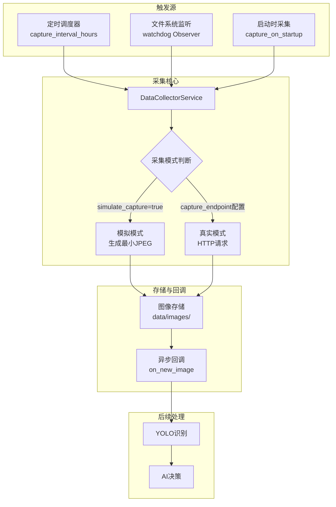
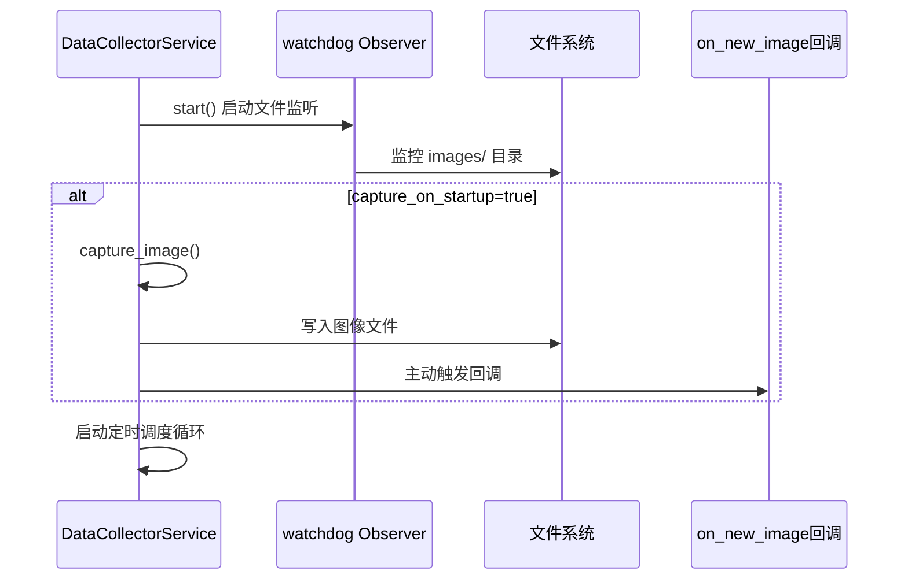

无人机图像采集机制是牧野智能农业系统的感知入口，负责从无人机设备获取农田实时图像数据并触发后续处理流水线。该机制采用**双重触发架构**——定时调度主动采集与文件系统被动监听相结合，既支持真实无人机设备的HTTP接口集成，又提供模拟模式用于开发测试，确保系统在不同部署场景下的灵活性与可靠性。

## 架构设计

图像采集服务采用异步事件驱动架构，通过`DataCollectorService`统一管理采集生命周期。核心设计遵循**关注点分离原则**：文件系统监听、HTTP请求处理、定时调度三个维度独立运作，通过异步回调机制解耦图像获取与后续处理逻辑，形成清晰的数据流向管道。



Sources: [data_collector.py](modules/data_collector.py#L78-L194)

## 核心组件解析

### DataCollectorService 服务主类

`DataCollectorService`是图像采集机制的核心控制器，封装了三种采集触发方式的协调逻辑。服务启动时初始化文件系统观察者、可选的定时调度任务，并根据配置决定是否立即执行首次采集。关键配置参数通过`drone_config.json`的`monitoring`节点注入，支持运行时动态调整采集间隔、超时阈值等策略参数。

| 配置项 | 类型 | 默认值 | 功能说明 |
|--------|------|--------|----------|
| `capture_interval_hours` | float | 24.0 | 定时采集间隔（小时），最小值60秒 |
| `capture_on_startup` | bool | true | 服务启动时是否立即采集 |
| `simulate_capture` | bool | true | 是否使用模拟模式生成测试图像 |
| `capture_endpoint` | string | "" | 真实无人机图像采集HTTP端点 |
| `http_method` | string | "GET" | HTTP请求方法（GET/POST） |

Sources: [data_collector.py](modules/data_collector.py#L78-L107), [drone_config.json](config/drone_config.json#L2-L7)

### 文件系统监听机制

系统通过`watchdog`库实现对图像目录的实时监控，`_ImageCreatedHandler`事件处理器在检测到新图像文件创建时，自动触发异步回调链。这种被动监听模式解决了定时采集可能遗漏临时性图像的问题，同时支持外部程序或手动放置图像文件的场景。事件处理器通过`asyncio.run_coroutine_threadsafe`将同步文件事件转换为异步任务，确保与主事件循环的正确集成。

```python
class _ImageCreatedHandler(FileSystemEventHandler):
    def on_created(self, event: FileCreatedEvent) -> None:
        if event.is_directory:
            return
        path = Path(event.src_path)
        if path.suffix.lower() not in {".jpg", ".jpeg", ".png"}:
            return
        # 跨线程调度异步回调
        future = asyncio.run_coroutine_threadsafe(
            self._dispatch(path), self.loop
        )
```

Sources: [data_collector.py](modules/data_collector.py#L27-L65)

### HTTP端点集成模式

当`capture_endpoint`配置为有效URL且`simulate_capture=false`时，采集服务通过`httpx.AsyncClient`向真实无人机API发起HTTP请求。系统支持GET和POST两种请求方法，响应内容直接写入本地存储路径。请求超时由`execution.request_timeout_seconds`参数控制，默认15秒，确保网络异常不会阻塞整个采集流程。

Sources: [data_collector.py](modules/data_collector.py#L136-L159)

## 采集流程详解

### 启动阶段初始化

服务启动流程遵循**先监听后采集**的原则：首先初始化文件系统观察者监控图像目录，然后根据`capture_on_startup`参数决定是否立即执行首次采集，最后启动定时调度循环。这种顺序设计确保启动阶段生成的图像不会被遗漏，同时避免了文件监听与主动采集之间的竞态条件。



Sources: [data_collector.py](modules/data_collector.py#L109-L123)

### 定时调度循环机制

调度循环使用`asyncio.wait_for`配合`_stop_event`事件对象实现可中断的定时等待。循环间隔由`capture_interval_hours`转换为秒数，最小值限制为60秒以防止频繁请求。每次超时后调用`capture_image()`执行采集任务，异常不会中断循环，确保服务持续运行。

Sources: [data_collector.py](modules/data_collector.py#L178-L194)

### 图像文件命名规范

采集的图像文件按时间戳命名，格式为`YYYYMMDD-HHMMSS.jpg`，例如`20250115-143022.jpg`。这种命名方式确保文件名的唯一性和可读性，便于后续日志追踪和问题排查。文件存储在`data/images/`目录下，目录不存在时自动创建。

Sources: [data_collector.py](modules/data_collector.py#L126-L132)

## 双重保障策略

### 主动采集与被动监听协同

系统采用双重保障策略确保图像数据不丢失：定时调度器按固定间隔主动触发采集，同时文件系统监听器持续监控目录变化。主动采集适合常规巡检场景，被动监听支持临时性、外部触发的图像注入。两种模式产生的图像最终都通过统一的`on_new_image`回调进入后续处理流水线，保证处理逻辑的一致性。

Sources: [data_collector.py](modules/data_collector.py#L109-L123), [data_collector.py](modules/data_collector.py#L165-L176)

### 错误处理与日志追踪

采集过程封装在try-except块中，捕获所有异常并转换为`CollectorError`向上传播。每次采集操作记录详细的结构化日志，包括请求ID、客户端IP、执行耗时、图像路径、是否模拟模式等关键信息。日志通过`log_event`函数统一格式化，便于后续通过事件总线追踪完整的处理链路。

Sources: [data_collector.py](modules/data_collector.py#L136-L163)

## 模拟模式设计

### 最小化JPEG生成

模拟模式下，系统使用预定义的最小化JPEG字节数据（通过base64解码生成）作为测试图像。这个约1KB的图像文件包含最基本的JPEG文件头和元数据，足以触发后续YOLO识别和AI决策流程，同时避免占用过多存储空间。模拟图像的生成通过`asyncio.to_thread`在后台线程执行，避免阻塞主事件循环。

Sources: [data_collector.py](modules/data_collector.py#L13-L21), [data_collector.py](modules/data_collector.py#L136-L140)

### 开发测试场景支持

模拟模式极大简化了开发测试流程：无需真实无人机设备即可验证从图像采集、YOLO识别、AI决策到无人机控制的完整链路。通过`drone_config.json`中的`monitoring.simulate_capture`参数一键切换模拟/真实模式，实现开发环境与生产环境的无缝迁移。

Sources: [drone_config.json](config/drone_config.json#L4)

## 配置实践建议

### 生产环境配置要点

生产环境部署时，需配置真实的`capture_endpoint`URL指向无人机图像采集API，将`simulate_capture`设为`false`。根据农田监测需求调整`capture_interval_hours`：病虫害高发期可缩短至2-4小时，常规监测可保持12-24小时。建议设置`capture_on_startup=true`确保服务重启后立即获取最新图像。

Sources: [drone_config.json](config/drone_config.json#L2-L7)

### 开发环境快速启动

开发环境使用默认配置即可：`simulate_capture=true`生成测试图像，`capture_interval_hours=24`避免频繁采集，`capture_on_startup=true`在启动时立即触发处理流程。如需测试定时调度逻辑，可临时将间隔调整为0.1小时（6分钟）以加快验证周期。

Sources: [drone_config.json](config/drone_config.json#L2-L7)

## 与后续流程的集成

图像采集完成后，系统通过`on_new_image`回调将图像路径传递给下一处理阶段。典型集成模式为：采集服务初始化时接收外部传入的回调函数，该函数内部依次调用YOLO识别服务、天气数据融合、AI决策引擎，最终触发无人机控制指令。这种回调驱动的设计使得图像采集模块与后续处理逻辑保持松耦合，便于独立测试和模块替换。

Sources: [data_collector.py](modules/data_collector.py#L96-L100)

了解图像采集机制后，建议继续阅读 [YOLO害虫识别流程](9-yolohai-chong-shi-bie-liu-cheng) 了解图像数据的后续处理方法，或查看 [虚拟无人机API服务](15-xu-ni-wu-ren-ji-apifu-wu) 掌握无人机控制端的实现细节。