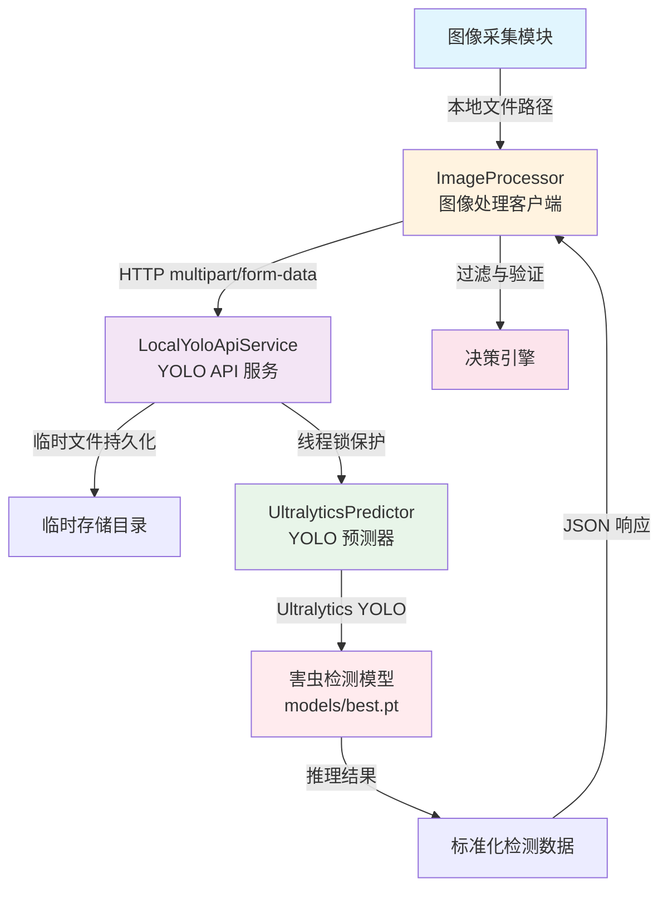
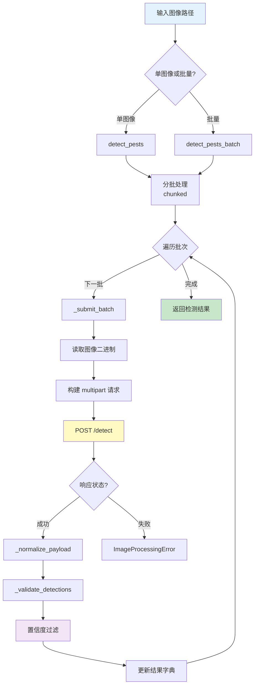
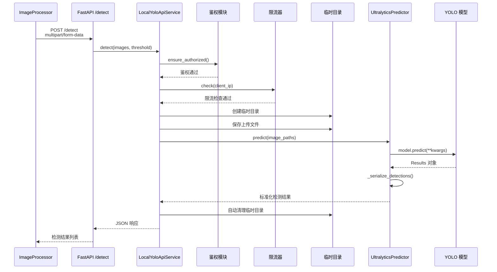

本文档详细阐述牧野系统中基于 YOLO 的害虫识别流程，涵盖从图像输入到检测结果输出的完整处理链路。系统采用**客户端-服务端分离架构**，通过 FastAPI 提供本地 YOLO 推理服务，支持批量处理、置信度过滤、IP 白名单访问控制等企业级特性，实现高效可靠的农业害虫智能识别能力。

## 整体架构设计

YOLO 害虫识别系统由三个核心组件构成：**图像处理客户端**负责将采集的图像提交至 YOLO API，**本地 YOLO API 服务**封装 Ultralytics YOLO 模型执行推理，**预测器组件**实现模型加载与结果序列化。这种分层设计使得系统既可独立部署 YOLO 服务，也能将其嵌入主应用程序内部运行，适配不同的部署场景。



图像处理客户端通过 `ImageProcessor` 类实现，负责与 YOLO API 通信、结果标准化以及低置信度过滤。服务端通过 `LocalYoloApiService` 类实现，管理模型推理、鉴权验证、限流控制等核心功能。UltralyticsPredictor 组件封装 YOLO 模型的加载与推理逻辑，将原始模型输出转换为标准化的检测数据结构，包含害虫类型、置信度和边界框坐标等信息。

Sources: [modules/image_processor.py](modules/image_processor.py#L1-L209), [modules/local_yolo_api.py](modules/local_yolo_api.py#L1-L304), [config/yolo_config.yaml](config/yolo_config.yaml#L1-L13)

## 图像处理客户端流程

`ImageProcessor` 作为 YOLO 服务的客户端，实现了从图像文件到检测结果的完整处理流程。该组件采用异步 HTTP 通信机制，通过 `httpx.AsyncClient` 发送 multipart/form-data 请求，支持单图像和批量图像两种检测模式。客户端初始化时配置 YOLO API 地址、置信度阈值、批处理大小、超时时间以及可选的 API 密钥等参数，确保与不同部署环境下的 YOLO 服务无缝对接。

单图像检测方法 `detect_pests` 通过调用批量方法 `detect_pests_batch` 实现，后者根据配置的 `batch_size` 将输入图像列表分批处理，避免一次性提交过多图像导致服务端过载。每批图像在 `_submit_batch` 方法中读取二进制内容并构建 multipart/form-data 请求，请求头包含 `Accept: application/json`、`Authorization: Bearer {api_key}` 以及 `X-Request-ID`、`X-Client-IP` 等追踪标识。YOLO API 的响应经过 `_normalize_payload` 方法标准化后，统一转换为以文件路径为键、检测列表为值的字典结构。



检测结果验证方法 `_validate_detections` 对每条检测记录执行字段映射和置信度过滤，支持 `pest_type`、`label`、`class_name` 等多种害虫类型字段名，兼容不同版本 YOLO 模型的输出格式。置信度低于配置阈值的检测结果将被过滤，确保下游决策引擎仅处理高质量识别结果。位置坐标通过 `_normalize_position` 方法标准化为统一的 `x1, y1, x2, y2` 格式，支持从 `(x, y, w, h)` 格式自动转换，增强系统对不同标注工具输出的兼容性。

Sources: [modules/image_processor.py](modules/image_processor.py#L20-L209), [modules/image_processor.py](modules/image_processor.py#L100-L140)

## 本地 YOLO API 服务实现

本地 YOLO API 服务通过 FastAPI 框架实现，提供 `/detect` 和 `/health` 两个核心端点，支持图像上传、害虫检测和健康检查功能。服务启动时加载 Ultralytics YOLO 模型，模型路径从配置文件或环境变量 `YOLO_LOCAL_MODEL_PATH` 获取，支持相对路径自动转换为项目根目录下的绝对路径。服务配置包括监听地址、端口、推理设备（CPU/GPU）、API 密钥、IP 白名单、限流阈值和最大批处理数量等参数，通过 `LocalYoloSettings` 数据类统一管理。



`/detect` 端点接收 `images`、`confidence_threshold`、`authorization`、`x_api_key` 等参数，首先执行鉴权验证 `ensure_authorized`，支持 Bearer Token 和 X-API-Key 两种认证方式。IP 白名单验证 `ensure_ip_allowed` 通过 `ipaddress` 模块解析 CIDR 格式的网段配置，允许仅特定 IP 地址或网段访问服务。内存限流器 `InMemoryRateLimiter` 使用双端队列维护每个客户端 IP 的请求时间戳，60 秒滑动窗口内的请求数超过配置阈值时返回 429 状态码，防止服务被恶意请求压垮。

检测方法 `detect` 在临时目录中保存上传的图像文件，避免内存中缓存大量图像数据。临时目录使用 `tempfile.TemporaryDirectory` 创建，作用域结束后自动清理，确保系统磁盘空间不被占满。图像保存后调用 `_predict_serialized` 方法执行推理，该方法通过线程锁 `predict_lock` 保护模型推理过程，避免多线程并发调用导致 Ultralytics 内部状态冲突。预测器 `UltralyticsPredictor` 封装 YOLO 模型的加载和推理逻辑，自动检测模型文件是否存在，缺失时抛出 `FileNotFoundError` 异常，导入 Ultralytics 库失败时抛出 `RuntimeError` 提示安装依赖。

Sources: [modules/local_yolo_api.py](modules/local_yolo_api.py#L200-L304), [modules/local_yolo_api.py](modules/local_yolo_api.py#L100-L170)

## 检测结果标准化与过滤

YOLO 模型推理返回的原始结果通过 `_serialize_detections` 方法转换为标准化的 JSON 结构，每条检测记录包含 `pest_type`（害虫类型）、`confidence`（置信度）和 `position`（边界框坐标）三个必填字段。害虫类型从 YOLO 结果对象的 `names` 字典中根据类别 ID 映射获取，支持训练模型时定义的任意害虫类别名称。置信度保留四位小数，避免浮点数精度误差影响后续处理。边界框坐标统一使用左上角和右下角坐标表示，字段名为 `x1, y1, x2, y2`，便于后续可视化和坐标计算。

| 字段名 | 数据类型 | 说明 | 示例值 |
|--------|----------|------|--------|
| pest_type | string | 害虫类型标识，来自模型训练标签 | "rice-planthopper" |
| confidence | float | 检测置信度，范围 0-1 | 0.9123 |
| position.x1 | float | 边界框左上角 X 坐标 | 125.5 |
| position.y1 | float | 边界框左上角 Y 坐标 | 230.8 |
| position.x2 | float | 边界框右下角 X 坐标 | 310.2 |
| position.y2 | float | 边界框右下角 Y 坐标 | 420.6 |

检测结果过滤在客户端 `ImageProcessor._validate_detections` 方法中执行，所有置信度低于配置阈值的检测记录将被剔除，默认阈值为 0.25。这种设计将过滤逻辑置于客户端而非服务端，使得不同客户端可以根据应用场景使用不同的置信度阈值，提升系统灵活性。例如，精确识别场景可设置较高阈值（如 0.5），而广泛筛查场景可降低阈值（如 0.15）以捕获更多潜在害虫目标。过滤后的检测结果通过日志记录检测数量、处理时长、批次大小等关键指标，便于性能分析和问题排查。

Sources: [modules/local_yolo_api.py](modules/local_yolo_api.py#L170-L190), [modules/image_processor.py](modules/image_processor.py#L150-L190)

## 服务配置与部署选项

YOLO 服务配置通过 `config/yolo_config.yaml` 文件管理，包含置信度阈值、超时时间、批处理大小、请求头等全局参数，以及本地 API 的监听地址、端口、模型路径、推理设备、最大批处理数量等专用配置。环境变量支持覆盖配置文件中的参数，例如 `YOLO_LOCAL_HOST`、`YOLO_LOCAL_PORT`、`YOLO_LOCAL_MODEL_PATH`、`YOLO_LOCAL_DEVICE` 等，便于在不同部署环境中灵活调整配置。IP 白名单通过环境变量 `YOLO_ALLOWED_IPS` 配置，多个 IP 地址或 CIDR 网段用逗号分隔，空值表示允许所有 IP 访问。

```yaml
# config/yolo_config.yaml 核心配置项
confidence_threshold: 0.25          # 检测置信度阈值
timeout_seconds: 20                 # API 请求超时时间
batch_size: 4                       # 批处理图像数量
tensorrt_enabled: false             # TensorRT 加速开关（预留）
request_headers:                    # 自定义请求头
  X-Source-System: muye
local_api:                          # 本地 YOLO API 配置
  host: 127.0.0.1                   # 监听地址
  port: 8010                        # 监听端口
  model_path: models/best.pt        # 模型文件路径
  device: auto                      # 推理设备（auto/cpu/0/0,1）
  max_batch_size: 4                 # 单次请求最大图像数
```

服务部署支持两种模式：独立服务进程和嵌入式部署。独立服务进程通过 `python yolo_api.py` 命令启动，使用 Uvicorn 作为 ASGI 服务器，适合需要独立扩展和管理 YOLO 服务的场景。嵌入式部署通过 `EmbeddedYoloApiRunner` 类实现，在主应用程序启动时自动创建 YOLO 服务进程，通过共享内存或本地回环地址通信，适合单机部署和演示环境。嵌入式部署的服务就绪检查通过轮询 `/health` 端点实现，默认等待 30 秒，超时则抛出 `TimeoutError` 异常，确保主程序在 YOLO 服务完全就绪后才开始处理图像。

Sources: [config/yolo_config.yaml](config/yolo_config.yaml#L1-L13), [main.py](main.py#L1-L200), [yolo_api.py](yolo_api.py#L1-L26)

## 主应用集成流程

主应用程序 `MuyeApplication` 在初始化时创建 `ImageProcessor` 实例，配置 YOLO API 地址、API 密钥、置信度阈值、超时时间等参数，并将其注册到图像处理工作流中。图像通过 `enqueue_image` 方法加入处理队列后，工作线程从队列中取出图像路径，调用 `_process_image` 方法执行完整的处理流程。该方法首先通过事件总线发布 YOLO 识别开始事件，然后调用 `image_processor.detect_pests` 方法提交检测请求，最后将检测结果发布到事件总线供决策引擎消费。

事件总线记录每个请求的处理阶段、状态和详细信息，便于追踪从图像入队到决策输出的完整链路。YOLO 识别阶段的事件包括 `yolo.running`（开始识别）、`yolo.completed`（识别完成）和 `yolo.failed`（识别失败），事件载荷包含图像路径、检测结果数组、错误信息等关键字段。检测结果为空时跳过后续的天气数据获取和 AI 决策步骤，直接发布 `pipeline.completed` 事件结束本次处理，避免无效的网络请求和计算开销。

Sources: [main.py](main.py#L200-L399), [modules/common.py](modules/common.py#L70-L100)

## 相关文档

继续深入了解 YOLO 相关技术实现：
- **[本地YOLO API服务](10-ben-di-yolo-apifu-wu)** — 详细介绍 YOLO API 的端点定义、请求格式和响应结构
- **[无人机图像采集机制](8-wu-ren-ji-tu-xiang-cai-ji-ji-zhi)** — 了解图像如何从无人机传输到系统并触发 YOLO 识别
- **[多源数据融合策略](13-duo-yuan-shu-ju-rong-he-ce-lue)** — 探索 YOLO 检测结果如何与天气数据结合用于决策