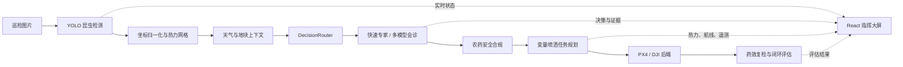

<div align="center">

# 牧野智农 · Muye

### 从昆虫识别到变量喷洒的智能农业作业闭环

基于 YOLO、气象数据、多模型 AI 会诊与无人机任务规划，构建可运行、可追溯、可扩展的植保指挥系统。


[](https://github.com/NblScript/muye/actions/workflows/ci.yml)

[快速开始](#快速开始) · [系统架构](#系统架构) · [真实数据边界](#真实数据边界) · [项目文档](#项目文档)

</div>

## 项目是什么

牧野面向大田植保场景，将巡检图像接入、害虫识别、天气融合、AI 用药决策、安全合规检查、无人机变量喷洒和药效复检串成一条完整工作流。

项目首页不是行政区地图，而是一块与业务数据绑定的虚拟田地：展示 YOLO 昆虫相对热值、喷洒航线、无人机状态、气象条件、AI 决策与闭环评估。演示数据和真实检测数据具有明确来源标记，不在前端随机生成虫情。

## 核心能力

| 能力 | 当前实现 |
|---|---|
| 昆虫检测 | 本地 Ultralytics YOLO API，支持模型热切换、批量检测和结果校验 |
| 热力地图 | 检测框按图像尺寸归一化，生成田块相对热值网格与变量喷洒计划 |
| AI 决策 | Qwen 快速专家路径，或 Qwen / DeepSeek / Xiaomi 多智能体并行会诊与加权投票 |
| 知识增强 | LangChain + ChromaDB，融合农药目录、农业知识和历史决策案例 |
| 安全合规 | 用药规则检查、阻断原因、替代方案和自动/人工起飞策略 |
| 无人机执行 | PX4 SITL + MAVSDK；保留 DJI OSDK 后端接口与仿真适配 |
| 闭环评估 | 喷洒后复检、杀灭率评估与未达标任务重试 |
| 指挥大屏 | React + Three.js 虚拟田地、稳定热力层、航线、任务流程和历史追溯 |
| 数据存储 | SQLite 结构化任务数据 + JSONL 事件流 + Chroma 向量库 |
| 工程质量 | 领域模块化、API 数据校验、速率限制、SLO、前后端自动化测试 |

## 系统架构



主要目录：

```text
muye/
├── app/                 # FastAPI 应用、路由与工作流编排
├── modules/
│   ├── detection/       # YOLO 服务、图像处理与数据采集
│   ├── decision/        # AI 决策、路由、多智能体、RAG 与合规检查
│   ├── drone/           # 密度网格、任务规划、PX4 与 DJI 后端
│   └── infra/           # SQLite、天气、事件总线与公共基础设施
├── frontend/            # React + TypeScript + Three.js 指挥大屏
├── models/              # API Schema 与农业数据模型
├── config/              # YOLO、无人机和模型配置
├── data/                # 示例图片、种子数据和运行时数据
├── scripts/             # 环境准备、演示、生产运行和质量检查
└── docs/                # 架构、产品、API、数据模型和农业知识文档
```

## 快速开始

### 1. 获取代码并安装依赖

```bash
git clone git@github.com:NblScript/muye.git
cd muye

python3 -m venv .venv
.venv/bin/pip install -r requirements.txt

cd frontend
npm ci
cd ..
```

### 2. 检查本地环境

```bash
./scripts/prepare.sh --check-only
```

### 3. 启动确定性演示

```bash
cp .env.demo.example .env.demo
./scripts/demo.sh
```

启动后访问：

- 指挥大屏：<http://localhost:5173/?demo=1>
- 后端 API：<http://127.0.0.1:18000>
- 健康检查：<http://127.0.0.1:18000/health>

演示模式使用固定的阶段数据、模拟天气和模拟 AI 决策，适合界面体验与流程讲解；它不会被标记为真实 YOLO 虫情。

## 接入真实服务

1. 将训练好的模型放到 `models/best.pt`，或在环境变量中指定其他模型路径。
2. 从 `.env.production.example` 创建 `.env.production`，配置 Qwen、和风天气、可选的 DeepSeek/Xiaomi 和 PX4 参数。
3. 启动 PX4 SITL 或连接真机；两者均通过 `PX4_EXECUTION_MODE=real` 的 MAVSDK 执行链路接入。
4. 运行生产入口：

```bash
cp .env.production.example .env.production
./scripts/prepare.sh --production
./scripts/run.sh
```

常用服务端口：

| 服务 | 默认地址 |
|---|---|
| React 前端 | `127.0.0.1:5173` |
| FastAPI | `127.0.0.1:18000` |
| 本地 YOLO API | `127.0.0.1:8010` |
| PX4 MAVSDK | `udpin://0.0.0.0:14540` |

API 密钥只应写入本地环境文件，不要提交到仓库。生产运行参数和安全边界参见 [安全说明](SECURITY.md) 与 [演示流程规范](docs/product-specs/demo-pipeline.md)。

### Docker 本地联调

Docker Compose 使用真实本地 YOLO 模型、固定 mock AI/天气和动画无人机，适合确定性联调，不会连接真机：

```bash
# 先将模型放到 models/best.pt
docker compose up --build
```

启动后访问前端 <http://localhost:5173> 和 API <http://localhost:18000>。端口默认只绑定宿主机回环地址；YOLO API 仅在后端容器内监听，不对宿主机暴露。Compose readiness 会同时检查真实模型、内嵌 YOLO 和跨进程处理链标记，而不只判断 API 进程存活。

准备好权重后，可用专用验收栈完成一次真实图片推理并自动清理：

```bash
./scripts/docker_real_smoke.sh
```

该脚本使用 `docker-compose.real-smoke.yml`，默认在 `18081` / `5175` 启动独立数据卷环境，验证前端代理、上传监听、真实 YOLO 检测以及像素框原图尺寸契约。它不会设置 `MUYE_CONTAINER_SMOKE`，样本无检测或返回模拟标记都会失败。

若只需验证镜像、Nginx 代理、图片监听和完整处理链，可运行不依赖模型权重的隔离冒烟栈：

```bash
./scripts/docker_smoke.sh
```

该脚本使用 `docker-compose.smoke.yml`，默认只在回环地址暴露前端 `5174`、API `18080` 和模拟 YOLO `18010`，并使用独立命名数据卷。它会上传真实图片、等待工作流产生固定 `aphid` 检测，然后自动删除测试容器和数据卷。模拟响应显式标记 `mode=smoke_fake` 和 `is_simulated=true`，不得用于模型精度或生产验收。

## 真实数据边界

为了避免“好看但不真实”，项目对热力数据做了以下约束：

- Ultralytics `xyxy` 检测框按像素处理，并携带原图宽高；归一化框使用明确的 `image_normalized` 坐标空间。
- 缺少图像尺寸的像素框不会进入真实密度网格，也不会被强行放到田块边缘。
- `density_grid[].density` 是本次任务内按检测置信度累计并归一化的**相对热值**，不是每亩虫口数或经济防治阈值。
- 当前 `image_frame_to_geofence_bbox` 投影假定图像覆盖田块且图像顶部对应北侧；没有正射影像或相机位姿时，不宣称虫点具有测绘级 GPS 精度。
- 演示种子通过 `density_metadata.is_simulated` 明确标记，前端同步显示数据来源。

详细契约参见 [昆虫热力图产品规格](docs/product-specs/insect-heatmap.md)、[数据模型](docs/references/data-model.md) 和 [前端热力规则](FRONTEND.md#昆虫热力图规则)。

## 主要 API

| 方法 | 路径 | 用途 |
|---|---|---|
| `GET` | `/live` | 进程存活检查 |
| `GET` | `/health` | 依赖与运行状态检查 |
| `GET` | `/workflow/state` | 当前聚合工作流 |
| `GET` | `/heatmaps/latest` | 当前田地最新热力快照 |
| `GET` | `/heatmaps/snapshots` | 按虫种、时间和来源筛选历史快照 |
| `WS` | `/ws/enhanced-state` | 实时任务、遥测与热力状态 |
| `POST` | `/demo/upload-image` | 上传巡检图片并进入处理链 |
| `POST` | `/drone/confirm-takeoff` | 确认人工起飞 |
| `GET` | `/drone/density-map` | 查询任务密度网格与来源元数据 |

完整端点、请求体和响应示例见 [API 参考](docs/references/api.md)。

## 质量验证

```bash
# 竞赛关键路径
./scripts/check.sh

# 后端全量回归 + 前端测试/构建 + 文档校验
MUYE_FULL_CHECK=1 ./scripts/check.sh

# 单独检查固定图片、热力网格、航线和喷洒速率基线
python scripts/eval_fixed_set.py --output data/eval/latest_report.md

# 前端静态检查
cd frontend && npm run lint

# 1366×768、1920×1080 与 125% 缩放等效视口验收
cd frontend && npx playwright install --with-deps chromium && npm run build && npm run test:e2e
```

固定评测集包含 3 类 IP102 害虫正样本和空检测、缺少坐标、非法围栏 3 类降级场景。图片及算法输出均使用 SHA-256 锁定；清单、数据来源和标注边界见 [data/eval/README.md](data/eval/README.md)。

GitHub Actions 在每次 push、pull request、merge queue 和手动触发时并行执行：

- Python 3.11 后端全量回归、固定数据回归与文档契约校验。
- Node.js 22 前端依赖锁定安装、lint、单元测试、生产构建和 6 个 Chromium 多视口布局验收。
- Docker Compose 三套配置解析、后端/前端镜像构建，以及无权重隔离容器的 HTTP 端到端冒烟。

CI 保存固定评测报告、前端 `dist` 产物与 Playwright 视口截图/失败 trace 14 天。CI 不保存私有模型权重，因此只解析真实模型验收配置；完整推理验收需在提供 `models/best.pt` 的环境运行 `./scripts/docker_real_smoke.sh`。

## 项目文档

| 文档 | 内容 |
|---|---|
| [ARCHITECTURE.md](ARCHITECTURE.md) | 系统边界、模块依赖和关键数据流 |
| [FRONTEND.md](FRONTEND.md) | 指挥大屏架构、实时状态和热力规则 |
| [docs/product-specs/insect-heatmap.md](docs/product-specs/insect-heatmap.md) | 昆虫热力产品范围、数据语义和展示边界 |
| [docs/exec-plans/2026-08-04-insect-heatmap-productization.md](docs/exec-plans/2026-08-04-insect-heatmap-productization.md) | 下一阶段实施顺序与验收标准 |
| [docs/references/api.md](docs/references/api.md) | API 与 WebSocket 接口参考 |
| [docs/references/data-model.md](docs/references/data-model.md) | 检测框、密度网格和存储模型 |
| [docs/competition/demo-script.md](docs/competition/demo-script.md) | 演示操作说明 |
| [RELIABILITY.md](RELIABILITY.md) | 健康检查、SLO 和故障处理 |
| [SECURITY.md](SECURITY.md) | 密钥、网络与飞行安全约束 |
| [PLANS.md](PLANS.md) | 已完成能力与后续路线 |

## 当前阶段

牧野目前是一个可运行的智慧植保系统原型，适合竞赛展示、教学、算法联调和无人机任务流程验证。真实农田生产使用仍需要完成现场标定、正射影像或相机位姿接入、农艺阈值校准、药剂法规复核以及真实飞行安全认证。

项目会持续围绕真实虫情数据、精准变量喷洒、无人机硬件接入和可观测性演进。
